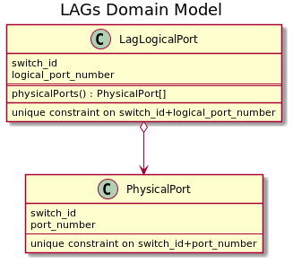

# LAG for ports

## Overview

Link aggregation provides ability to combine multiple physical connections into one logical connection to improve resiliency. Link aggregation group (LAG) is a group of ports associated with the logical port on the switch.

## API

* Get existing LAG logical ports on the switch `GET /v2/switches/{switch_id}/lags`. Response example:
~~~
[ 
    {
        "logical_port_number": 2001,
        "port_numbers": [1, 2, 3]
    },
...
]
~~~

* Create LAG logical port on the switch `POST /v2/switches/{switch_id}/lags` with body:
~~~
{
    "port_numbers": [1, 2, 3]
}
~~~
Response example:
~~~
{
    "logical_port_number": 2001,
    "port_numbers": [1, 2, 3]
}
~~~

* Delete LAG logical port on the switch `DELETE /v2/switches/{switch_id}/lags/{logical_port_number}`.

## Details
All logical port related commands are sent to the switches using gRPC speaker.

Open-kilda calculate logical port number using the following rule: 2000 + min of the physical ports number in the LAG. It is not allowed to have one physical port in two LAGs so this rule will provide unique logical port number for any correct port configuration. LAG logical port configuration should be validated before any create operation to avoid inconsistency. 

Currently, open-kilda doesn't have any port related information representation in database. We need to save LAG logical port configuration into database to have ability to restore configuration on the switch. Information about LAGs stored as a separate models in order to provide minimal impact on already existing data structures.

Open-kilda uses a switch-port pair to represent a flow endpoint. LAG ports created in this way may be used as a flow endpoint on one or both flow sides to provide flow resiliency.

## Additional changes

During switch/flow validate and sync LAG ports configuration should be checked and installed if required. 
