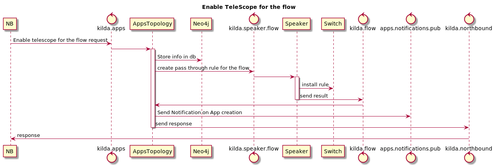
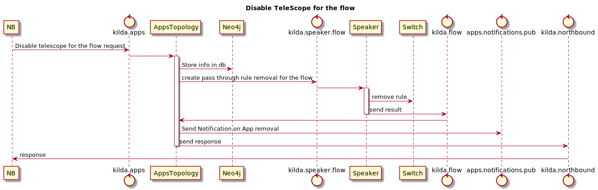

# Problem

OpenKilda as an SDN controller should be able to provide not only core functions but also support applications.
This design is initial proposal for integration of one the Telescope application with controller.

# Model

It should be possible to add/remove application for the single flow endpoint. From DB perspective  new fields will be 
added to `Flow` node
2 Applications on source endpoint:  

    {
      "flow_id": "string",
      "src_apps": {
          "endpoint_switch": "string",
          "applications": ["APP1", "APP2" ]
      },
      "dst_apps": {
          "endpoint_switch": "string",
          "applications": []
      }
    }
    
Application on source and destination endpoint:

    {
      "flow_id": "string",
      "src_apps": {
          "endpoint_switch": "string",
          "applications": ["APP1"]
      },
      "dst_apps": {
          "endpoint_switch": "string",
          "applications": ["APP2"]
      }
    }

From operations perspective this change requires DB migration.

# API

## NB API for Flows

Northbound will provide following endpoints for the flow applications.

* Returns list of all enabled applications for the flow:  
`GET /flows/:flowid/applications`

* Update list of enabled apps for the flow:  
`PATCH /flows/:flowid/applications/:appname`  
_with request body:_

      {
        "endpoint": {
            "switch_id": "string",
            "port_number": 0,
            "vlan": 0
        }
      }
   If you do not specify an endpoint, then the application will be added for both flow endpoints.

* Remove app for the flow:  
`DELETE /flows/:flowid/applications/:appname?switch={switch_id}&port={port_number}&vlan={vlan_id}`  
If you do not specify an endpoint, then the application will be removed for both flow endpoints.

## Kafka API

### Messaging
Command for the new exclusion on flow endpoint
    
    {
      "clazz": "org.openkilda.applications.command.CommandMessage",
      "payload": {
          "clazz": "org.openkilda.applications.command.apps.CreateExclusion",
          "flow_id": "string",
          "expiration_timeout": 0,
          "application": "telescope",
          "exclusion": {
              "src_ip": "string",
              "src_port": 0,
              "dst_ip": "string"
              "dst_port": 0,
              "proto": "string",
              "eth_type": "string"
          }
       },
      "timestamp": 0,
      "correlation_id": "string"
    }
       
Notification of the new exclusion addition result:

    {
      "clazz": "org.openkilda.applications.info.InfoMessage",
      "payload": {
          "clazz": "org.openkilda.applications.info.apps.CreateExclusionResult",
          "flow_id": "string",
          "application": "telescope",
          "expiration_timeout": 0,
          "exclusion": {
              "src_ip": "string",
              "src_port": 0,
              "dst_ip": "string"
              "dst_port": 0,
              "proto": "string",
              "eth_type": "string"
          },
          "success": true
      },
      "timestamp": 0,
      "correlation_id": "string"
    }
    
Command for exclusion removal:    
 
    {
      "clazz": "org.openkilda.applications.command.CommandMessage",
      "payload": {
          "clazz":"org.openkilda.applications.command.apps.RemoveExclusion",
          "flow_id": "string",
          "application": "telescope",
          "exclusion": {
           	  "src_ip": "string",
           	  "src_port": 0,
              "dst_ip": "string"
              "dst_port": 0,
              "proto": "string",
              "eth_type": "string"
           }
      },
      "timestamp": 0,
      "correlation_id": "string"
    }
        
Notification of the exclusion removal result:

    {
      "clazz": "org.openkilda.applications.info.InfoMessage",
      "payload": { 
          "clazz": "org.openkilda.applications.info.apps.RemoveExclusionResult",
          "flow_id": "string",
          "application": "telescope",
          "exclusion": {
              "src_ip": "string",
              "src_port": 0,
              "dst_ip": "string"
              "dst_port": 0,
              "proto": "string",
              "eth_type": "string"
          },
          success": true
      },
      "timestamp": 0,
      "correlation_id": "string"
    }              

Notification of the new flow endpoint to watch:

    {
      "clazz": "org.openkilda.applications.info.InfoMessage",
      "payload": {
          "clazz": "org.openkilda.applications.info.apps.FlowApplicationCreated",
          "flow_id": "string",
          "application": "telescope"
      },
      "timestamp": 0,
      "correlation_id": "string"
    }

Notification of the flow endpoint to stop watch:

    {
      "clazz": "org.openkilda.applications.info.InfoMessage",
      "payload": {
          "clazz": "org.openkilda.applications.info.apps.FlowApplicationRemoved",
          "flow_id": "string",
          "application": "telescope"
      },
      "timestamp": 0,
      "correlation_id": "string"
    }

### Stats

Port statistics:

    {
      "clazz": "org.openkilda.applications.info.InfoMessage",
      "payload": {
          "clazz": "org.openkilda.applications.info.stats.PortStatsData",
          "switch_id": "string",
          "stats": [
             {
                "clazz": "org.openkilda.applications.info.stats.PortStatsEntry",
                "port_no": 0,
                "rx_packets": 0,
                "tx_packets": 0,
                "rx_bytes": 0,
                "tx_bytes": 0,
                "rx_dropped": 0,
                "tx_dropped": 0,
                "rx_errors": 0,
                "tx_errors": 0,
                "rx_frame_err": 0,
                "rx_over_err": 0,
                "rx_crc_err": 0,
                "collisions": 0
             }
          ]
      },
      "timestamp": 0,
      "correlation_id": "string"
    }

Flow statistics:

    {
      "clazz": "org.openkilda.applications.info.InfoMessage",
      "payload": {
          "clazz": "org.openkilda.applications.info.stats.FlowStatsData",
          "switch_id": "string",
          "stats": [
             {
                "clazz": "org.openkilda.applications.info.stats.FlowStatsEntry",
                "table_id": 0,
                "cookie": 0,
                "packet_count": 0,
                "byte_count": 0,
                "in_port": 0,
                "out_port": 0
             }
          ]
      },
      "timestamp": 0,
      "correlation_id": "string"
    }

Table statistics:

    {
      "clazz": "org.openkilda.applications.info.InfoMessage",
      "payload": {
          "clazz": "org.openkilda.applications.info.stats.SwitchTableStatsData",
          "switch_id": "string",
          "table_stats_entries": [
             {
                "clazz": "org.openkilda.applications.info.stats.TableStatsEntry",
                "table_id": 0,
                "active_entries": 0,
                "lookup_count": 0,
                "matched_count": 0
             }
          ]
      },
      "timestamp": 0,
      "correlation_id": "string"
    }

Meter statistics:

    {
      "clazz": "org.openkilda.applications.info.InfoMessage",
      "payload": {
          "clazz": "org.openkilda.applications.info.stats.MeterStatsData",
          "switch_id": "string",
          "stats": [
             {
                "clazz": "org.openkilda.applications.info.stats.MeterStatsEntry",
                "meter_id": 0,
                "byte_in_count": 0,
                "packets_in_count": 0
             }
          ]
      },
      "timestamp": 0,
      "correlation_id": "string"
    }

### Topics

To communicate with application OpenKilda uses public kafka topics:
 - `kilda.apps.pub` - this topic should be used for adding/removing applications for the flow endpoint and
 actions originated by application itself.
 - `kilda.apps.notifications.pub` - this topic should be used for notifications of creation/removal apps for flow
  endpoint, result of execution app specific commands.
 - `kilda.stats.pub` - public feed for statistics
 
 

# WorkFlow

