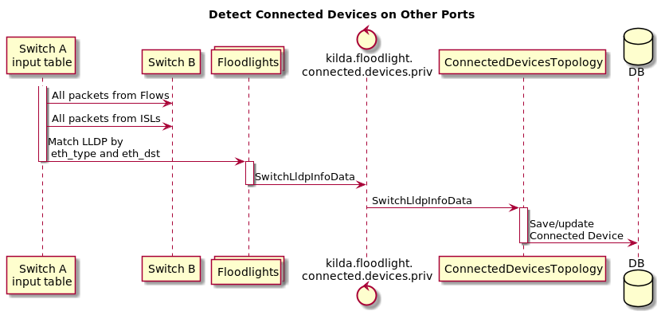

# Switch connected devices via LLDP 

## Summary

This feature allows to detect devices connected to particular switch
by catching LLDP packets. Design of the feature is based on multi-table feature design.

## API

New boolean field `switch_lldp` will be added to switch properties.
After setting it to `true` by API `PUT /{switch-id}/properties` several rules will be installed on the switch.
Description of these rules you can find in section `Detecting of connected devices via LLDP`.

As switch LLDP feature is based on multi-table feature user can't set `switch_lldp` property to `true`
without setting `multi_table` to `true`. Bad request will be returned otherwise.

New API will be created to get a list of devices connected to Switch: `GET /{switch_id}/devices?since={time}`

* `switch_id` - Switch ID
* `since` - Optional param. If specified only devices which were seen since this time will be returned.

This API returns following body:

~~~
{
  "ports": [
      {
         "port_number": int,
         "lldp": [{
            "vlan": int,
            "macAddress": string,
            "chassisId": string,
            "portId": string,
            "ttl": int,
            "portDescription": string,
            "systemName": string,
            "systemDescription": string,
            "systemCapabilities": string,
            "managementAddress": string,
            "flowId": string,
            "timeFirstSeen": string,
            "timeLastSeen": string
           },
           ***
         ],
      },
      ***
   ]
}

~~~

The following fields are optional:

* portDescription
* systemName
* systemDescription
* systemCapabilities
* managementAddress
* flowId

## Detecting of connected devices via LLDP

To detect connected devices via LLDP we will catch LLDP packets from each switch port
and send them to controller to analyze them in Connected Devices Storm Topology.

There are three types of switch ports:
1. Customer (port with created flow on it).
2. Isl
3. Other (port without ISL and without flows).
 
Rules will be different for each port type.

Full description of new rules you can find in
[this](https://drive.google.com/file/d/1u2uz4goMGhVhpcHRVXfLaP-8FuY2g5Es/view?usp=sharing) doc.

Short description:




## Switch rules

There are 7 types of new rules will be introduced:
* Flow (1 rule for each flow and 3 default rules)
* Isl (1 default rule)
* Other (2 default rule)

One Switch Flow rule will be changed to mark packets from one switch flow (by 0x0020 metadata)

#### Flow rules

Rule for each flow in Input Table:
```
[FLOW_ID0]
    ofp_version      = 4
    ControllerGroup  = Management
    [MATCHFIELDS]
        OFPXMT_OFB_ETH_DST = 01:80:C2:00:00:0E (LLDP packet mac address)
        OFPXMT_OFB_ETH_TYPE = 0x88CC (LLDP eth type) 
        OFPXMT_OFB_IN_PORT = XXX (flow input port) 
    [INSTRUCTIONS]
        [OFPIT_APPLY_ACTIONS]
             [ACTIONS]
                [OFPAT_WERITE_METADATA]
                    value = 0x0001 (mark packet as LLDP)
                    mask = 0x0001
                [OFPAT_GO_TO_TABLE]
                    table_id = 2 (ingress table)

```

Rule for one switch flows in Post Ingress table:
```
[FLOW_ID0]
    ofp_version      = 4
    ControllerGroup  = Management
    [MATCHFIELDS]
        OFPXMT_OFB_METADATA = 0x0003 (packet marked as LLDP and as One Switch Flow)
    [INSTRUCTIONS]
        [OFPIT_APPLY_ACTIONS]
             [ACTIONS]
                [OFPAT_OUTPUT] (sent to controller)
                    port = ctrl
                    mlen = 65535
```

Rule for vxlan flows in Post Ingress table:
```
[FLOW_ID0]
    ofp_version      = 4
    ControllerGroup  = Management
    [MATCHFIELDS]
        OFPXMT_OFB_METADATA = 0x0001 (packet marked as LLDP)
    [INSTRUCTIONS]
        [OFPIT_APPLY_ACTIONS]
             [ACTIONS]
                [OFPAT_POP_TUNELL_ID] (pop vxlan)
                [OFPAT_OUTPUT] (sent to controller)
                    port = ctrl
                    mlen = 65535
```

Rule for other flows in Post Ingress table:
```
[FLOW_ID0]
    ofp_version      = 4
    ControllerGroup  = Management
    [MATCHFIELDS]
        OFPXMT_OFB_METADATA = 0x0001 (packet marked as LLDP)
    [INSTRUCTIONS]
        [OFPIT_APPLY_ACTIONS]
             [ACTIONS]
                [OFPAT_OUTPUT] (sent to controller)
                    port = ctrl
                    mlen = 65535
```

#### ISL rules

One rule in Transit table:
```
[FLOW_ID0]
    ofp_version      = 4
    ControllerGroup  = Management
    [MATCHFIELDS]
        OFPXMT_OFB_ETH_DST = 01:80:C2:00:00:0E (LLDP packet mac address)
        OFPXMT_OFB_ETH_TYPE = 0x88CC (LLDP eth type) 
    [INSTRUCTIONS]
        [OFPIT_APPLY_ACTIONS]
             [ACTIONS]
                [OFPAT_OUTPUT] (sent to controller)
                    port = ctrl
                    mlen = 65535
```

#### Other rule

One rule in Input Table:
```
[FLOW_ID0]
    ofp_version      = 4
    ControllerGroup  = Management
    [MATCHFIELDS]
        OFPXMT_OFB_ETH_DST = 01:80:C2:00:00:0E (LLDP packet mac address)
        OFPXMT_OFB_ETH_TYPE = 0x88CC (LLDP eth type) 
    [INSTRUCTIONS]
        [OFPIT_APPLY_ACTIONS]
             [ACTIONS]
                [OFPAT_OUTPUT] (sent to controller)
                    port = ctrl
                    mlen = 65535

```

One rule in Ingress Table to catch LLDP from customer ports (only packets which are not belong to any flow):
```
[FLOW_ID0]
    ofp_version      = 4
    ControllerGroup  = Management
    [MATCHFIELDS]
        OFPXMT_OFB_ETH_DST = 01:80:C2:00:00:0E (LLDP packet mac address)
        OFPXMT_OFB_ETH_TYPE = 0x88CC (LLDP eth type) 
    [INSTRUCTIONS]
        [OFPIT_APPLY_ACTIONS]
             [ACTIONS]
                [OFPAT_OUTPUT] (sent to controller)
                    port = ctrl
                    mlen = 65535

```

## Rules By Table
### Input Table Rules


### Pre Ingress Table Rules


### Ingress Table Rules


### Post Ingress Table Rules


  
### Egress Table Rules


### Transit Table Rules


