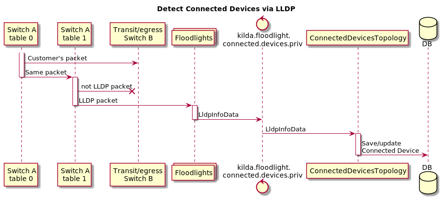

# Connected devices

## Ways to detect connected devices

There are 2 ways to detect devices connected to Flow endpoint:
1. LLDP packets
2. ARP packets

This document describes option 1.

## API

New field `detect-connected-devices` will be added to each Flow endpoint.
This field has two other fields `lldp` and `arc` to enable detecting of connected devices via LLDP and via ARP.
User can enable and disable them separately. 

Create Flow API `PUT /v1/flows` will look like: 

~~~
{
  "flowid": "f1",
  "source": {
    "port-id": 10,
    "detect-connected-devices": {
      "lldp": true,
      "arp": false,
    }
    "switch-id": "00:00:00:00:00:00:00:03",
    "vlan-id": 0
  },
  "destination": {
    "port-id": 10,
    "detect-connected-devices": {
      "lldp": true,
      "arp": true,
    }
    "switch-id": "00:00:00:00:00:00:00:04",
    "vlan-id": 0
  }
  ***
}

~~~

New API will be created to get a list of devices connected to Flow: `GET /{flow_id}/devices?since={time}`

`flow_id` - Flow ID
`since` - Optional param. If specified only devices which were seen since this time will be returned.

This API returns following body:

~~~
{
  "source": {
     "lldp": [{
         "macAddress": string,
         "chassisId": string,
         "portId": string,
         "ttl": int,
         "portDescription": string,
         "systemName": string,
         "systemDescription": string,
         "systemCapabilities": string,
         "managementAddress": string,
         "timeFirstSeen": string,
         "timeLastSeen": string
       },
       ***
     ]
  }
  "destination": {
     "lldp": [{
         "macAddress": string,
         "chassisId": string,
         "portId": string,
         "ttl": int,
         "portDescription": string,
         "systemName": string,
         "systemDescription": string,
         "systemCapabilities": string,
         "managementAddress": string,
         "timeFirstSeen": string,
         "timeLastSeen": string
       },
       ***
     ]
}

~~~

The following fields are optional:

* portDescription
* systemName
* systemDescription
* systemCapabilities
* managementAddress

Also `vlan` field will be added in future. This field will be used to understand with
what vlan we received LLDP/ARP packet.  

## Detecting of connected devices via LLDP 

To detect connected devices via LLDP we will catch LLDP packets from customer's traffic
and send them to controller to analyze it in new Storm Topology.

NOTE: `Table 0` and `Table 1` is just aliases for switch "ingress table" and "post ingress table".
Table numbers will changed when "Multy-table feature" will be implemented.
In Single Table case Table 0 and Table 1 will be used.  



## Switch rules

New action `go to table 1` will be added to ingress rule of Flow if detection of connected devices is enabled.
This action will send a copy of each customer's packet to switch table 1.
In this table only LLDP packets will be matched and sent to controller.
LLDP match rule will be look like:

```
[FLOW_ID0]
    ofp_version      = 4
    ControllerGroup  = Management
    [MATCHFIELDS]
        OFPXMT_OFB_ETH_DST = 01:80:C2:00:00:0E (LLDP packet mac address)
        OFPXMT_OFB_ETH_TYPE = 0x88CC (LLDP eth type) 
        OFPXMT_OFB_IN_PORT = XXX (import port) 
        OFPXMT_OFB_VLAD_ID = XXX (vlan id if has) 
    [INSTRUCTIONS]
        [OFPIT_APPLY_ACTIONS]
             [ACTIONS]
                [OFPAT_POP_VLAN] (if has vlan)
                [OFPAT_OUTPUT] (sent to controller)
                    port = ctrl
                    mlen = 65535

```
