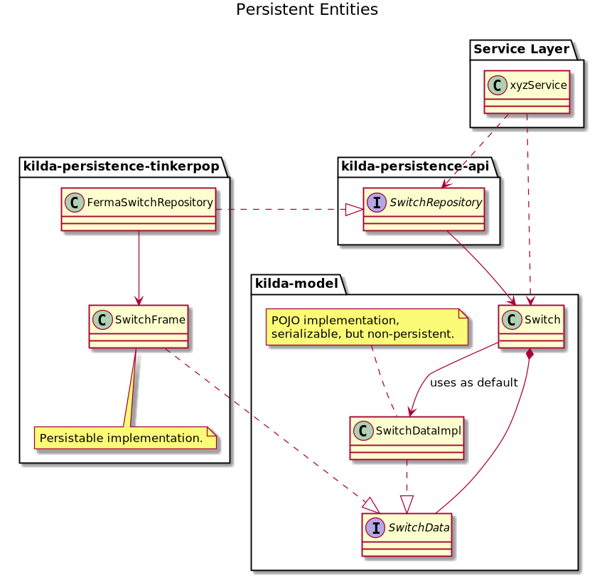
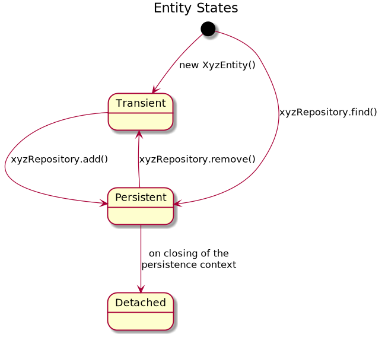
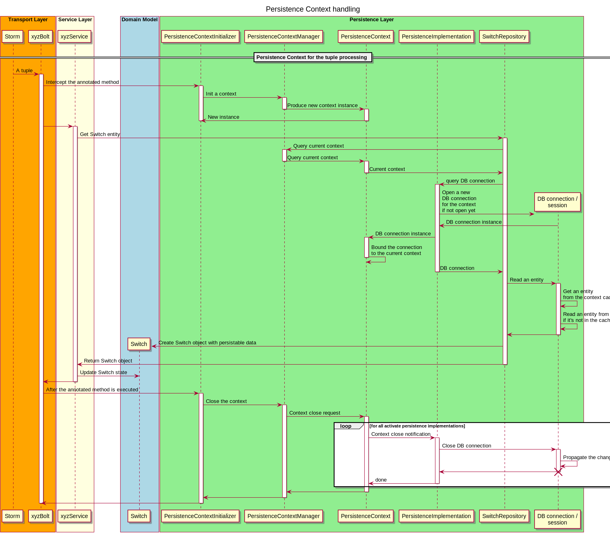
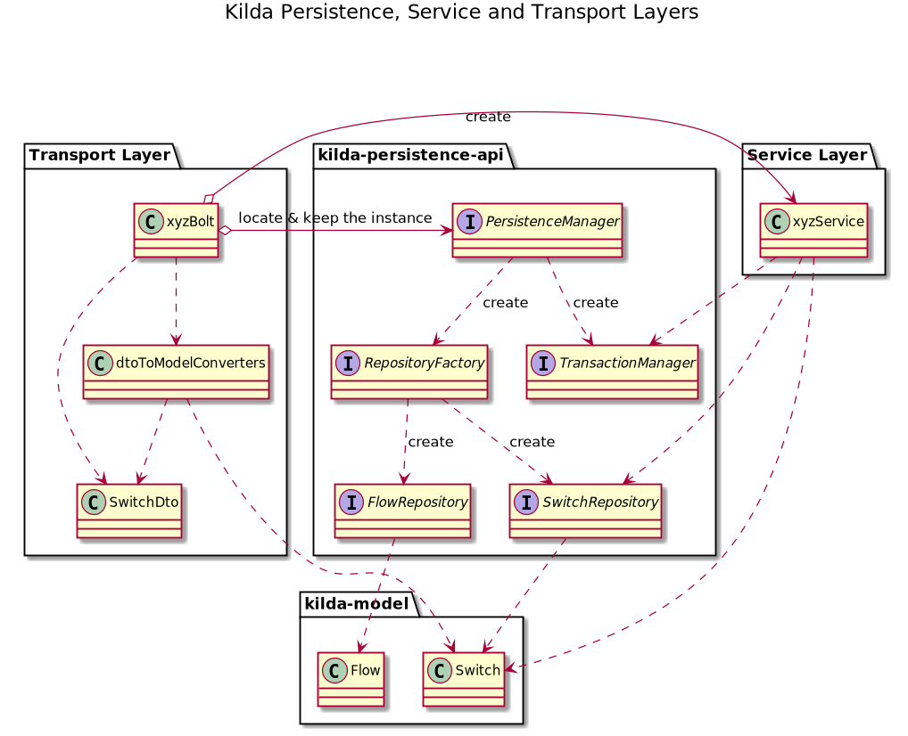
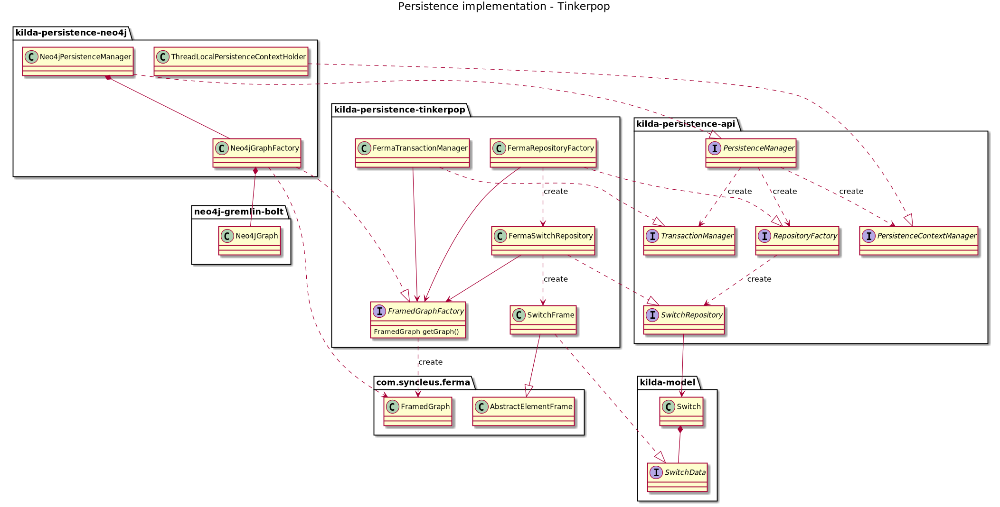

# Kilda Persistence Layer

## Overview
Kilda has a well-defined persistence layer, which provides access to the data in the system database / graph storage.
The layer consists of API and the actual implementation of its components (respositories, persistence context and transaction managers).

This doc describes the components, approaches and solutions used in the persistence layer.

## Entities
Persistent entities are classes whose instances can be stored in the database / graph storage. 
The entity interfaces are defined by Kilda Model, while Persistence Layer encapsulates the logic required to perform 
CRUD operations with the entity data.

Kilda Model and Persistence Layer utilize [Data Gateway](https://martinfowler.com/eaaCatalog/rowDataGateway.html) pattern
to separate the business logic from the code of data mapping, converting and persisting. This approach simplifies state transition 
for entities: from transient to managed, and back.  

Basically, there are 3 states of an entity:
- Transient - an entity has just been instantiated (by default or copying constructor, via a builder) 
and is not associated with a persistence context. Or when a persistent entity has been removed from a repository.
- Persistent - an entity is obtained from a repository or added to a repository.
- Detached - a persistent entity becomes detached on closing a persistence context associated with the entity. 

## Persistence Context
A Persistence Context defines boundaries between which Persistence Layer maintains the entity state.
When you get or add an entity via a repository, the entity is associated with the current Persistence Context, 
and Persistence Layer propagate the entity state changes to the database / storage. 

If two entity instances point to the same database / storage object, and they are both associated with the same Persistence Context, 
Persistence Layer guarantees that their states are synchronized. 

**Important points about Persistent Context:**
- Persistence Layer doesn't guarantee fetching of lazy-load relations / sub-entities for detached entity or beyond a Persistent Context scope.
- Persistence Layer doesn't synchronize any changes made to a detached entity or beyond a Persistent Context scope.

## Repositories
[Repositories](https://martinfowler.com/eaaCatalog/repository.html) encapsulate the data access functionality, 
providing better abstraction for the persistence layer implementation. 
They act like a collection of domain model objects in memory, perform the role of an intermediary between 
the domain model and the database / storage.

A repository allows you to fetch data from the database into memory in the form of the domain entities,
add new entities or remove existing. Once the entities are in memory, they can be changed and then persisted back 
to the database / storage.

## Transaction Management
A transaction in Persistence Layer represents a unit of work. The unit of work (UoW) isolates changes in a transaction scope
from other threads until it successfully commits the changes to the database / storage. If any persistence operation fails
or the UoW code throws an exception, the whole transaction fails. 

## Tinkerpop implementation
The current implementation of Persistence Layer is for [Tinkerpop-enabled](https://tinkerpop.apache.org/) storages, and relies on [Ferma frameworks](http://syncleus.com/Ferma/).

The persistable data in Ferma are annotated classes which provides a level of abstraction for interacting with the underlying graph. 
 

