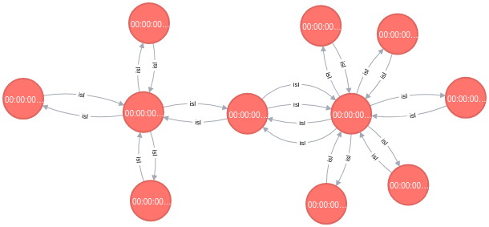
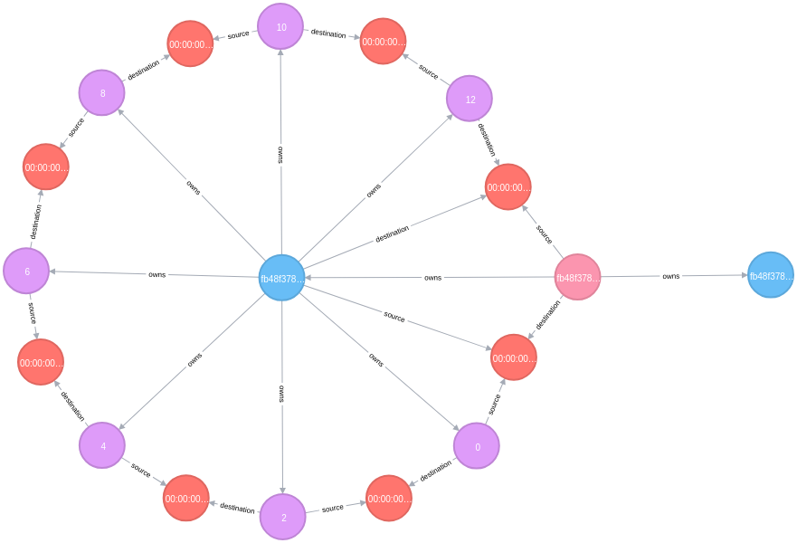
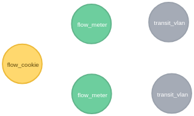
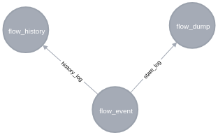
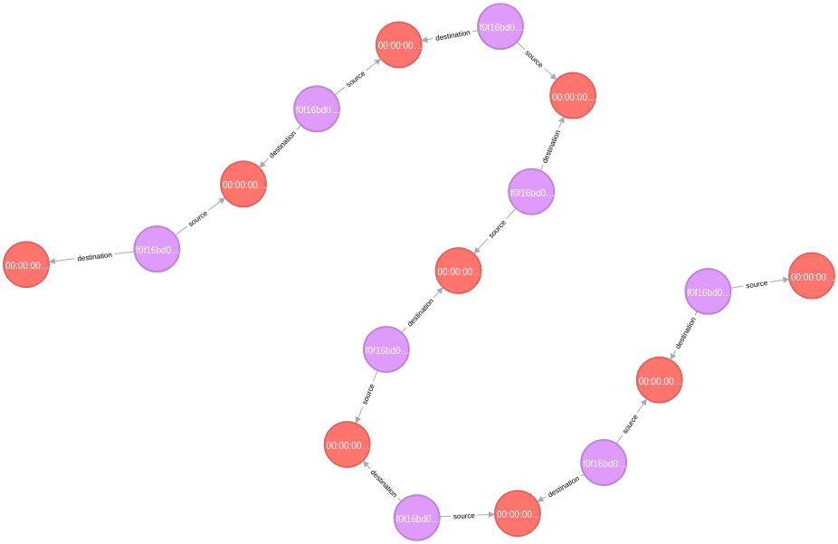

# Data storage

## Introduction

Kilda uses [Neo4j](https://neo4j.com/) as the persistent storage for its [data model](../domain-model/domain-model.md).
Network topology, flow and history information is retained there.

## What is Neo4j?

Neo4j is a database that stores data structures as graphs consisting of nodes, connected by relationships.

Nodes often represent entities, and relationships organize nodes into structures.

Properties are name-value pairs that are used to add qualities to nodes and relationships.

## Data schema

The data model entities which are mapped to Neo4j nodes can be split into several logical groups: 

### Network topology: switches and links (ISLs)



### Flows

A flow:


With forward and reverse paths:


Each flow path may have multiple segments:



### Flow encapsulation and resources

A flow has allocated resources: transit vlans and a meter per each flow path, a shared cookie per paired paths:



### Flow history

Flow events are represented as history entities:



## Neo4j cookbook

Useful recipes/queries to extract data from Neo4j

### Finding the shortest path between 2 switches

The cypher query:
```
MATCH p = shortestPath((start:switch {name: $start_switch})-[:isl*..10]->(end:switch {name: $end_switch}))
RETURN p
```

The result looks like:


### Showing a flow path

The cypher query:
```
MATCH (f:flow {flow_id: $flow_id})-[]-(:flow_path {path_id: f.forward_path_id})-[]-(ps:path_segment)-[r]-(s:switch) RETURN ps, r, s
```

The result looks like:



### Finding flows which go over a link

```
MATCH (src:switch {name: $src_switch})-[]-(ps:path_segment {src_port: $src_port, dst_port: $dst_port})-[]-(dst:switch {name: $dst_switch})
MATCH (ps)-[]-(:flow_path)-[]-(f:flow) RETURN f
```

### Finding flows which go over a switch

```
MATCH (:switch {name: $switch})-[]-(:path_segment)-[]-(:flow_path)-[]-(f:flow)
RETURN f
UNION ALL
MATCH (:switch {name: $switch})-[]-(:flow_path)-[]-(f:flow)
RETURN f
```

### Finding flows which terminate on a switch
```
MATCH (:switch {name: $switch})-[]-(f:flow)
RETURN f
```
