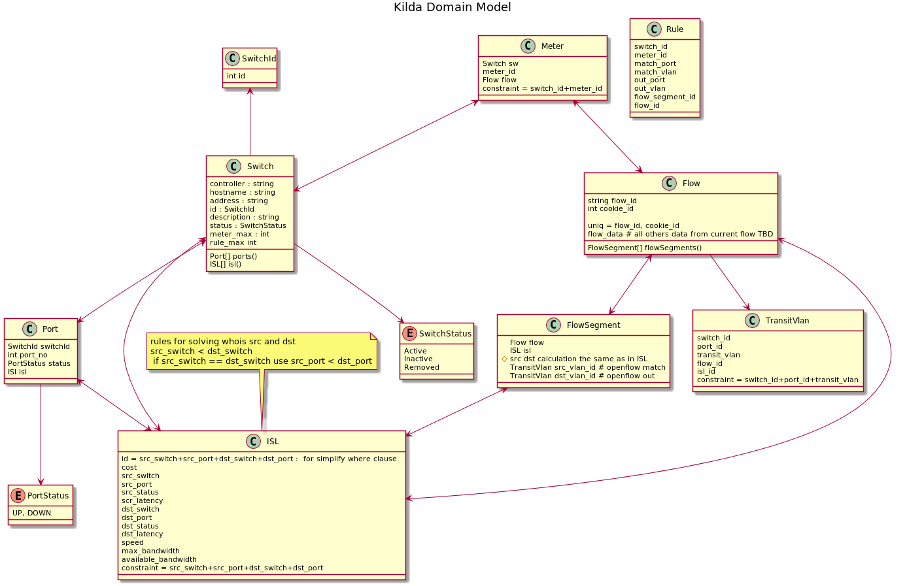
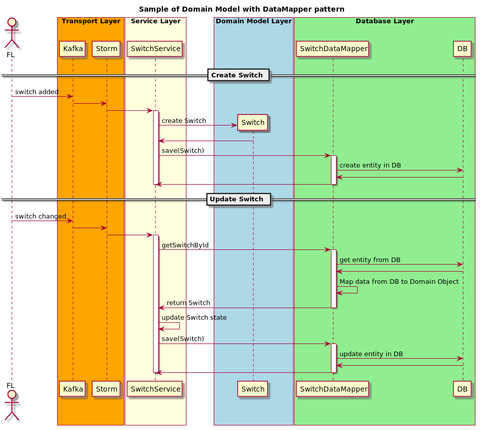
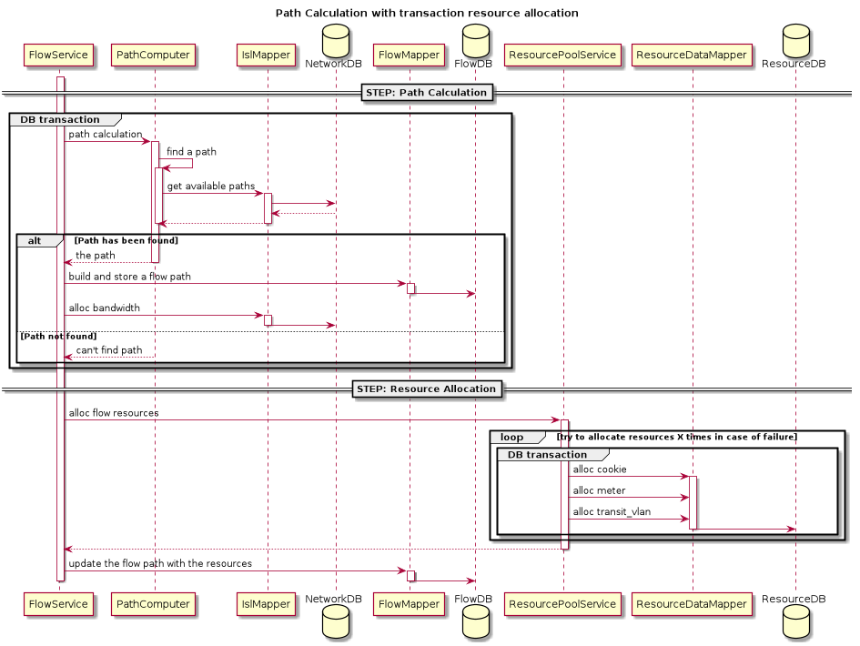

# Kilda Domain Model

Based on
[Data Mapper](https://martinfowler.com/eaaCatalog/dataMapper.html),
[Domain Model](https://martinfowler.com/eaaCatalog/domainModel.html),
[Service Layer](https://martinfowler.com/eaaCatalog/serviceLayer.html)
## Goals
- Create separate layers for domain and database representation.
- Remove direct calls to DB
- Have the ability to do project refactoring
- Remove code duplication

## The idea
Create a layer with domain objects which contains logic and data and
separate domain logic from DB and Transport layers.

## Diagrams

