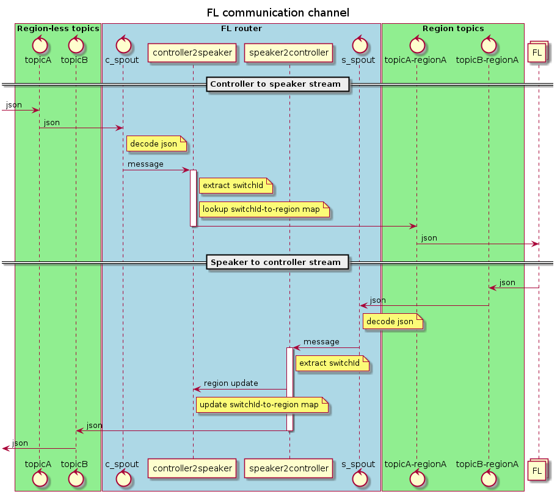
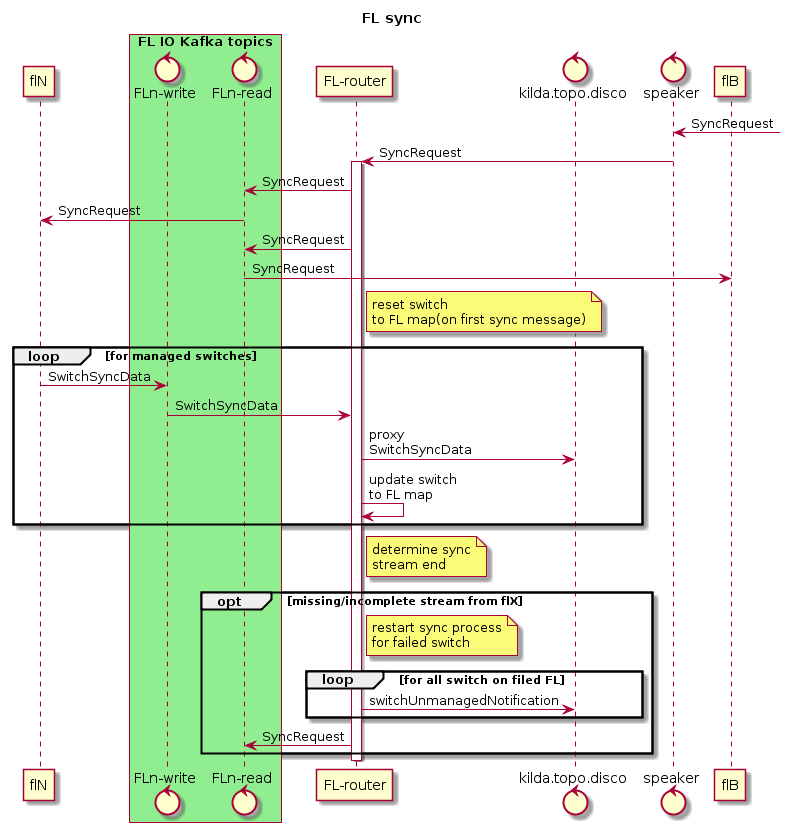
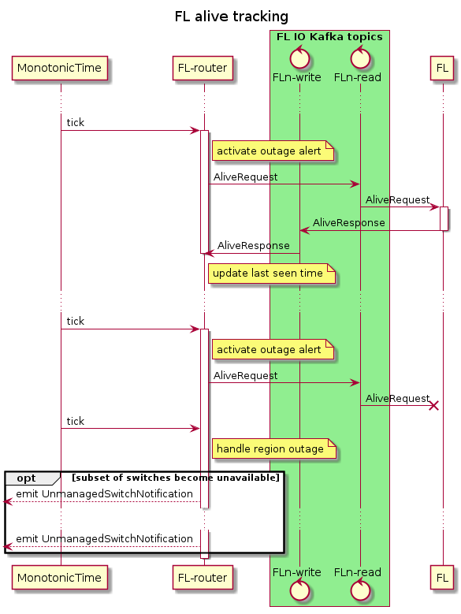
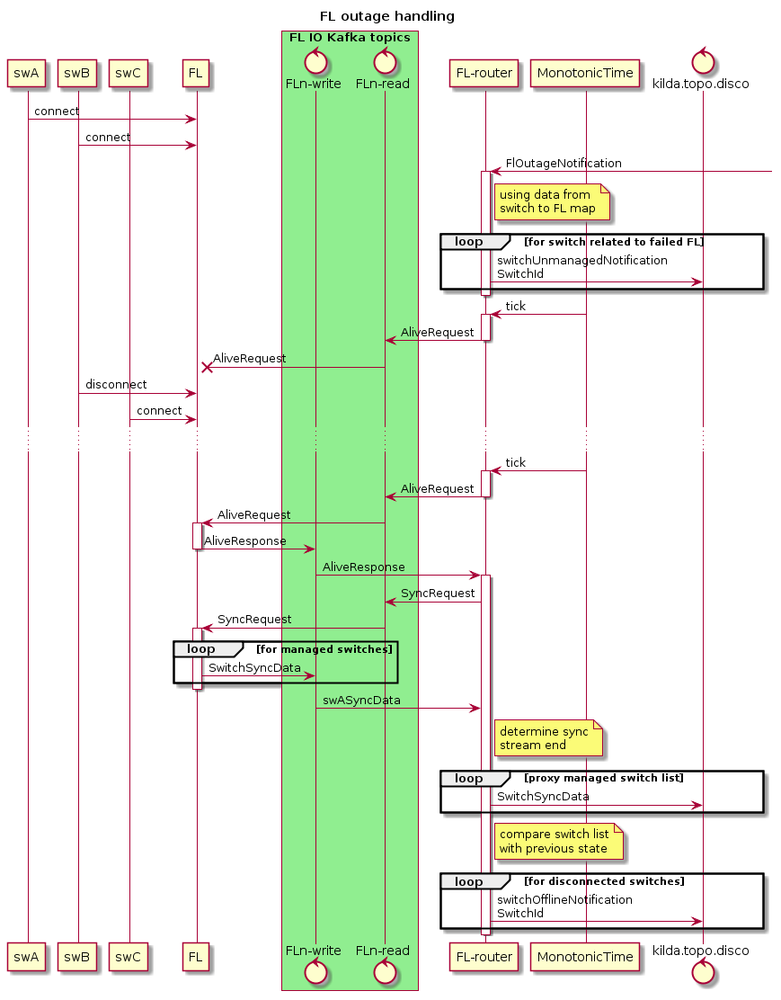

# FL parallelism

## Goals
- Have the ability to move FL instance closer to switch
- Remove Single point of failure
- Distribute the load to multiple instances (horizontal scale)
- Do high load testing

## Overall workflow
Create new service responsible to manage all particularity of multiple FL
communication. Lets call this service "FL-router".

FL-router is going to be placed between FL(one or multiple) and all other
services. I.e. FL-router service will have incoming kafka-topic, used to 
receive messages/commands designed for FL. On the other end it will have
N*2 kafka topics used to communicate with FL instances. Where N is the
number of FL. x2 appears because FL use 2 kafka-topics one for input(read)
and one for output(write).

Actual response topic will be determined on FL-router side in same way as
it is done now into FL.

One significant change will be made for message processing - each message
will have a response9at least one). In other word FL must send response
for each message(command) it receive. It can be a "normal" response or
error response. If FL do not produce response, FL-router will produce
error response by himself.

## FL message/command kinds
1. Single switch command - operate with 1 switch
   * do not require pre-processing and post-processing on FL-router side
1. Multi-switch commands - operate with several switched
   * need post-processing in FL-router - keep intermediate results and
     assemble final result

## Make FL status sync (multi-switch command)
Event topology need to sync it's state with FL on topology start. To do
this it send SyncRequest(`NetworkCommandData` now) into FL(into FL-router).

In multi FloodLight environment this request must be send to each FL. Each
FL will send N-kafka messages in response (message chain - same was as it
done for NB responses).

So as result event topology will receive N chains in response on sync
request. Each chain represent state of one FL. Event topology must be ready
to receive N sync chains complementing each other.

Because FL-router do not modify sync response chain and because event topology
must ignore incomplete chains it is safe to proxy individual sync responses
without storing them on FL-router side.

In case of errors during sync command(some FL do not send response or send 
incomplete chain), FL-router must repeat SyncRequest to failed FL(s). 

## FL alive tracking
To be able to handle events not posted in kafka due to lost network connection
between FL and kafka, we need to track lost messages or FL alive(from
FL-router point of view) status.

When outage is detected we must wait to connection recovery. After this we must
request FL "status" by emitting `SyncRequest`.

## FL data model
* id (used as part of read/write kafka-topic names).

## FL-router data model
* list of "known" FL instances
* map connected switchId to FL instance
* map correlationId to blacklist

## implemntation
* remove extra kafka-producers (there is at least 3 of them, for correct work
  of FL-router all FL-modules must use same kafka-producer)
* implement FL-router (single switch commands)
* implement kafka-connection trace feature (FL side)
* implement FL-dump assembling feature (FL-router side)
* remove current FL-connection tracing feature (`event`-topology)
* refactor `event`-topology (in it's current state it is overcomplicated and
  extremely hard to add/modify any feature there)
* implement FL-dump processing on `event`-topology side
* implement multy-switch commands in FL-router
