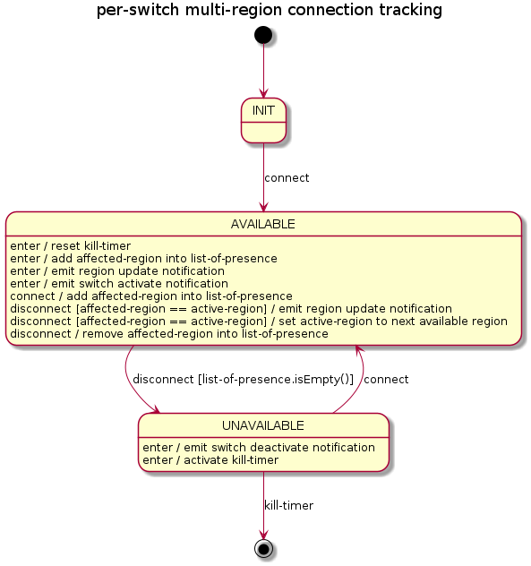
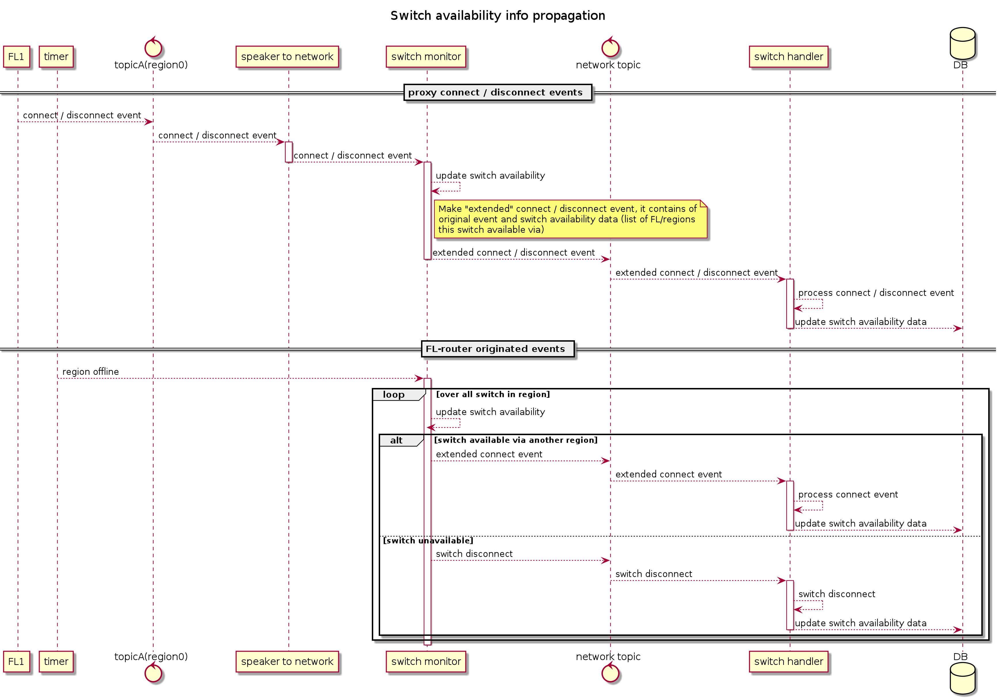

# FL parallelism

## Goals
- Have the ability to move an FL instance closer to a switch
- Remove the Single point of failure
- Distribute the load to multiple instances (horizontal scale)
- Do high load testing

## Overall workflow
Each speaker-region is represented by a speaker instance and the set of
"incoming" and the set of "outgoing" kafka-topics. Region's name is used as the
suffix for all these kafka-topic names.

A FL-router can be treated as the set of parallel streams responsible for:
- proxying messages from the controller (all other Storm topologies) to the speaker (a
specific speaker instance in a specific region that serves the connection with the
target switch). 
- the set of streams in the opposite direction, i.e. from the speaker to the controller.

In other words, we have a set of 1-to-N kafka-topic streams and a set of
N-to-1 kafka-topics streams. The main responsibility of the FL-router is to
route the message into the region that serves the connection to the switch that
is the target of this message. Also, the FL-router hides the knowledge about this switch-to-region
mapping from all other services/topologies.  


## FL message/command kinds
1. Single switch commands: operate with 1 switch, must be delivered into one region
2. Multi-switch commands: operate with several switches, must be delivered in multiple regions

## Make FL status sync
To keep network-discovery service in "up-to-date" state despite possible gaps
in the data passed from the speaker (due to connectivity issues between the
speaker and fl-router) to network-discovery, the FL-router performs a, so-called,
network sync. It repeatedly emits "dump-all-switches" requests into all regions with some
constant interval (1 minute by default). As a result, all speaker instances
on a regular basis send data about all connected switches including the status
of all their ports. This data is used to update possible outdated switch (and
all ports) state inside the network-discovery service.

The open-kilda system has a feature toggle responsible for enabling/disabling the
mentioned above periodic network sync. It is used mainly by functional tests.

**WARN:**

There is a strict requirement on the start order of open-kilda services
**if the network sync disabled**. The services must be started in the
following order:

* network topology
* FL-router topology
* FL (all regions)
* rest of the services.

This start order guarantees that the network-topology will receive all switch
connect notifications, and it will have the correct network view after the start.

## FL alive tracking
To be able to handle events not posted in Kafka due to the lost network
connection between FL and Kafka, we need to track lost messages or FL
aliveness status (from FL-router point of view).


## FL data model
* region-id.

## FL-router data model
* list of "known" FL instances
* map connected switchId to the FL instance

# Master-master or simultaneous multi-region switch connection tracking

FL-router must track switch connection status by itself. It must produce and send a "virtual"
connection status into all other open-kilda services. In this case, all
knowledge about multiple connections will be encapsulated inside FL-router and
all other services will continue to work with switches as if it has only 1
connection (i.e. in the same way as before).

There are 2 possible events that can/should be treated as availability or
unavailability of a switch in a specific region. This is "connect" and "activate"
for availability, and "deactivate" and "disconnect" for unavailability.
Depending on our expectation of a speaker role for a specific switch in a
specific region, we should either use one pair or another. If we are tracking
the "equal" (master) role of the speaker, we should use the "activate" /
"deactivate" pair. If we are tracking the "slave" role we must use "connect"
/ "disconnect" pair.

For simplicity, we will use "connect" / "disconnect" events pair during
following explanation of the switch tracking process.

Data required to track switch connection:

* switch-id
* set-of-presence: regions that can be used to communicate with this switch
* active-region: a region that is used to communicate with the switch

Connection tracking overall state diagram.



Real connection-tracking code will not use FSM because the state diagram is too
simple and full-featured FSM will bring unnecessary complexity in the implementation.

## Switch availability data propagation

The switches to speakers connections list must be reachable via northbound API
(NB -> nbworker -> DB). It will allow monitoring tools to monitor existing
switches connections and react to connection issues.

To provide this data to the northbound API, we need to expose the list of
floodlights/regions connections from floodlightrouter into the database. To
keep switch data consistent we should not update the switch data anywhere
outside the network topology. This data must be transferred into the
network topology.

Floodlightrouter will add switch availability data into events proxied from
floodlight into the network topology. In the following JSON event example, the
original event, produced by Floodlight, is placed into the "event" field,
corresponding connections are placed into "availability_data" fields.

```json
{
  "event": {
    "switch_id": "00:00..."
  },
  "availability_data": {
    "availability": [
      {"region": "abc", "ip": "10.10.10.10", "mode": "RW", "uptime": 1000},
      {"region": "def", "ip": "10.10.11.10", "mode": "RO", "uptime": 0}
    ]
  }
}
```

From the network topology perspective, it can receive a simple or extended switch event. 
A simple event (i.e. without availability data) is processed in the usual way. An extended switch event 
(with availability data) is processed in the usual way plus the availability data is updated in the database.


