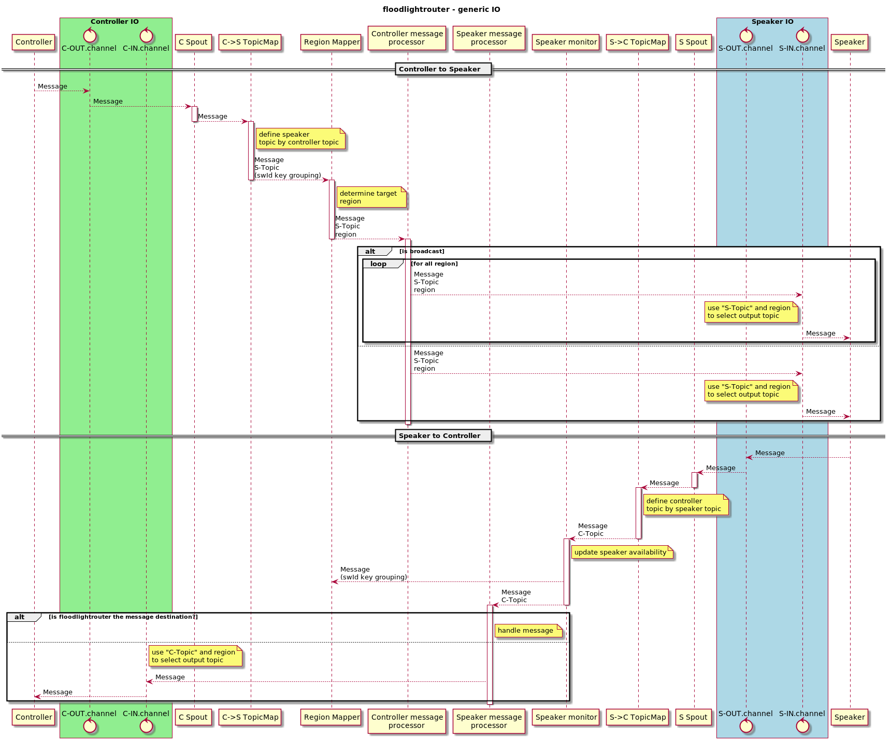
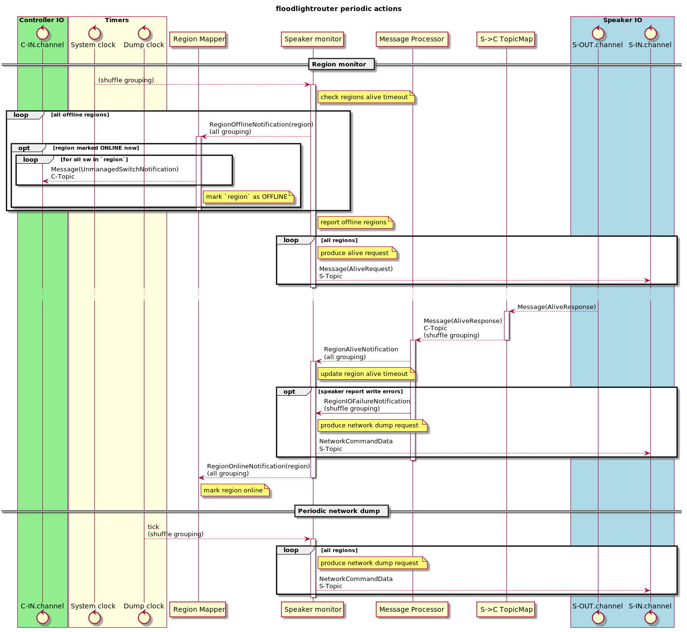

# FL parallelism (v2)

Goals:
- all(except MonotonicClock) bolts in system can be started in parallel

The main problem on the "parallelism" with parallelism - stored in bolts 
speaker "alive state". Change of this state trigger a lot of actions and
it will be a problem if action will be triggered multiple times (several
bolts react on status change). Because of this we should store this state
only in one bolt. 

Obvious solution - use region name as "key" for field
grouping and route events regarding specific region to specific bolt. It can
be used, but due to nature of regions(there is a small amount of speaker
regions in system), it can create bottle neck in processing.

Another solution - store FL alive state into all related bolts, but only
one of them must trigger actions. In other words - all bolts must receive
updates for FL alive status, but only one must be used during state analysis.
Flowing diagrams demonstrate how it can be implemented.

Other changes:
* Do not produce (spout -> handler -> kafka out) chains for all existing
  topics(in both directions). Instead of this create one chain that can
  determine output topic using input topic.

