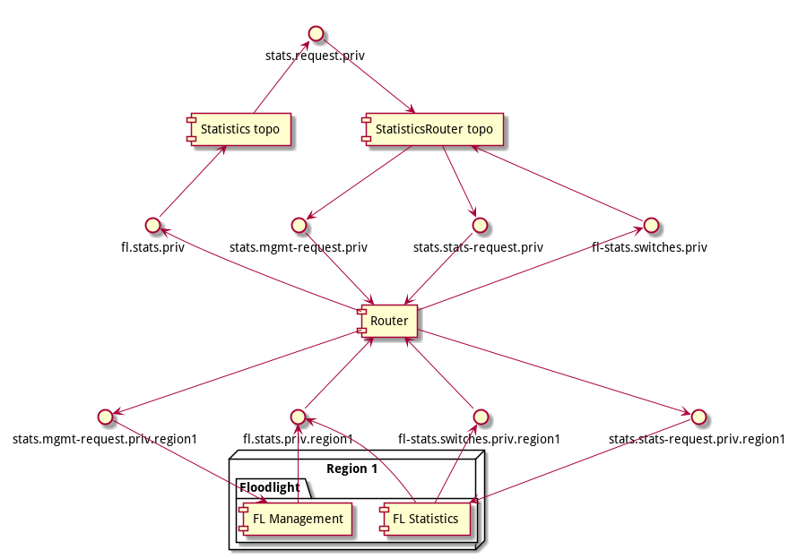
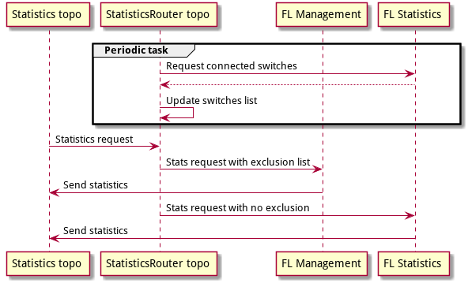

# FL Statistics

## Goals
- Ability to take statistics from switches more often
- Scale up numbers of switches

## The idea
Make a separate dedicated FL instance for statistics.

## Implementation
There is two FL instances: Management and Statistics.
- FL Statistics (here and after FL Stats) must only collect statistics from the switches.
- FL Management (here and after FL Mgmt) do the other work and can collect statistics as well in case when the
switch does not connect to FL Statistics.

The new topology "StatisticsRouter" was added between "Statistics" topology and "Router"
topology. Statistics router receive a request from "Statistics" topology and make two
separate requests for FL Mgmt and FL Stats. It puts exclude switch list into request to 
FL Mgmt for avoid double statistics collection.

Also Statistics router sends request to FL Stats for list of connected switches. Excluding 
rules will be based on this list. FL Stats respond the list with "controllerId". This 
allow us to have multiple FL Stats instances.

### Kafka topics participate in statistics collection.

### Sequence diagram

