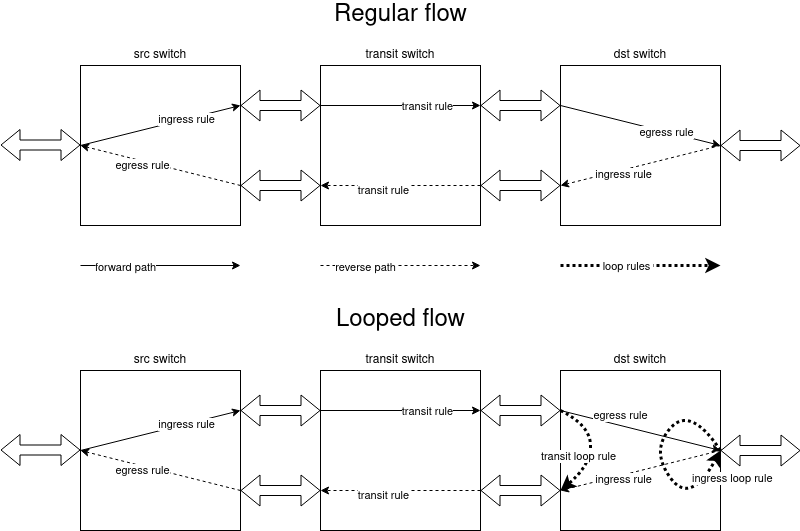

# Flow loop feature

## Overview

Flow loop feature designed for flow path testing. Loop provides additional flow rules on one of the terminating switch so any flow traffic is returned to switch-port where it was received. 
Such flow has not empty `loopSwitchId` property and supports all flow operations. When the loop removed system should restore the original flow rules.

## API

* Get existing flow loops `GET /v2/flows/loops` with optional params `flow_id` and `switch_id`. Response example:

~~~
[ 
    {
        "switch_id": "00:00:11:22:33:44:55:66",
        "flow_id": "string"
    },
...
]
~~~

* Create flow loop on chosen switch `POST /v2/flows/{flow_id}/loops` with body 
~~~
{
  "switch_id": "00:00:11:22:33:44:55:66"
}
~~~
Flow may have only one loop.

* Delete flow loop and restore regular flow rules `DELETE /v2/flows/{flow_id}/loops`. 

## Details

From persistence perspective flow loop stored as additional property for flow node: `loop_switch_id: string`. Property should be empty for non looped flows.

Flow loop create and delete operations implemented as a partial update options of the flow update FSM in `flow-hs` topology. All H&S flow operations use a single point of rule generation based on flow parameters. In current implementation it is `SpeakerFlowSegmentRequestBuilder` class. It should be modified to support the flow loop flag and reused in flow loop operations.

Additional loop rules have the flow cookie but different special `loop` bit and higher priority. Only these rules are installed or deleted during flow loop operations.

## Additional changes

Flow/switch validation/sync operations uses separate expected flow rules generation logic so it should be changed to support loop rules.

Protected flow may have a loop only on the main path. We need to remove loop rules related to the previous main path and install loop rules for the new main path during path swap.