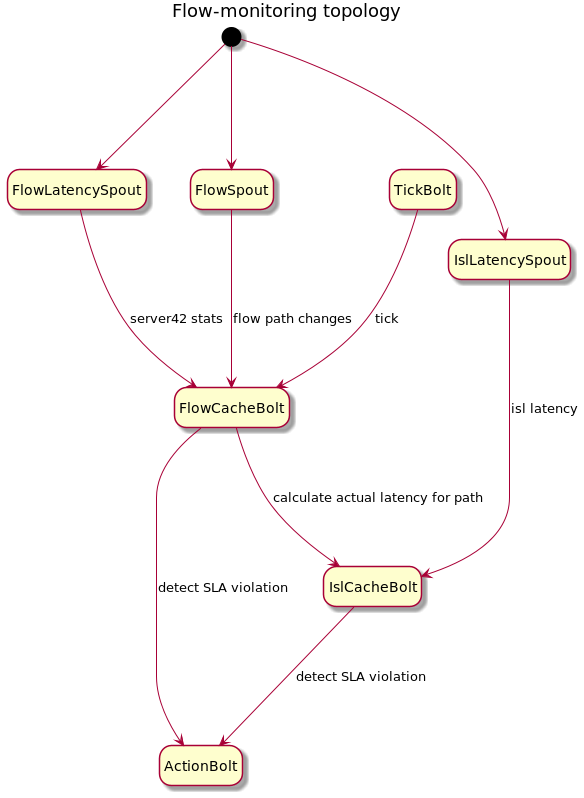

# Flow SLA monitoring and reactions

Open-kilda should detect flows with violated latency SLA in real-time. The new topology `flow-monitor` is designed for this purpose. 

## Flow SLA monitoring
The main idea is to keep an in-memory cache of all flows with actual latencies and a cache of ISLs with actual latencies. 

Flow cache structure:

Flow id | Server42 latency | Flow path
--- | --- | ---

All flows should pass SLA checks periodically. If the flow has not expired Server42 latency measurement then we can do a simple check. In another case, we should calculate actual flow latency based on used ISLs latencies with priority to RTT latency. 

ISL cache structure:

ISL | last RTT latency | RTT latency expiration time | last one way latency
--- | --- | --- | ---

On the topology startup both caches initialized with data from the database. During the topology lifetime system events helps to keep caches in actual states. `flow-hs` will notify `flow-monitor` about any flow path changes using additional events. All flow-modifying FSMs will execute `NOTIFY_FLOW_MONITOR` action before the finish. 

## Flow SLA reactions

To be discussed and documented in the future.