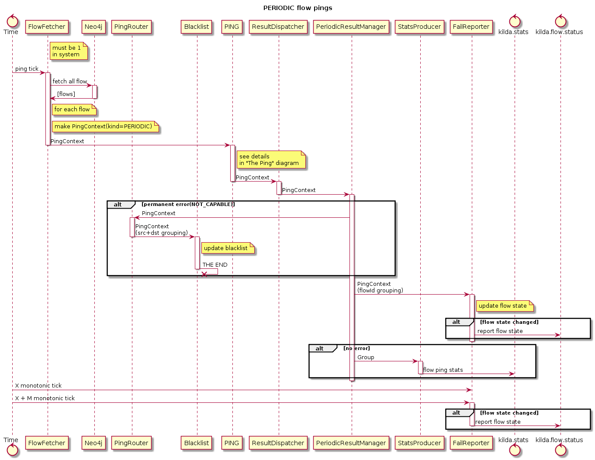
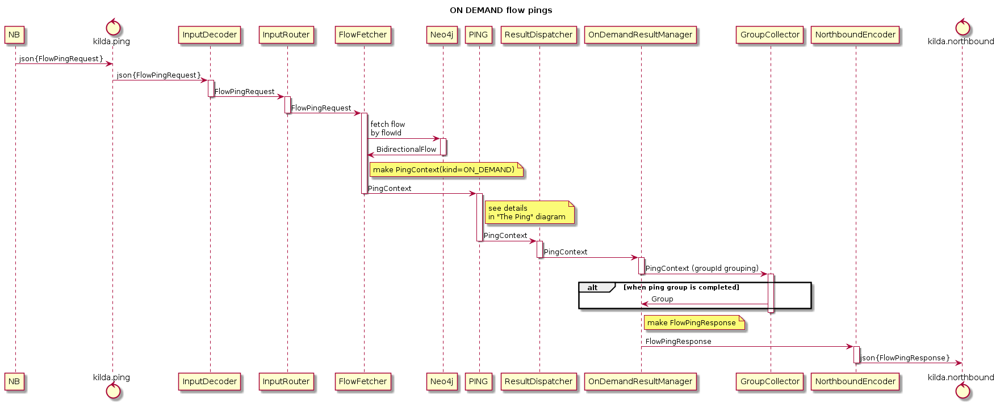
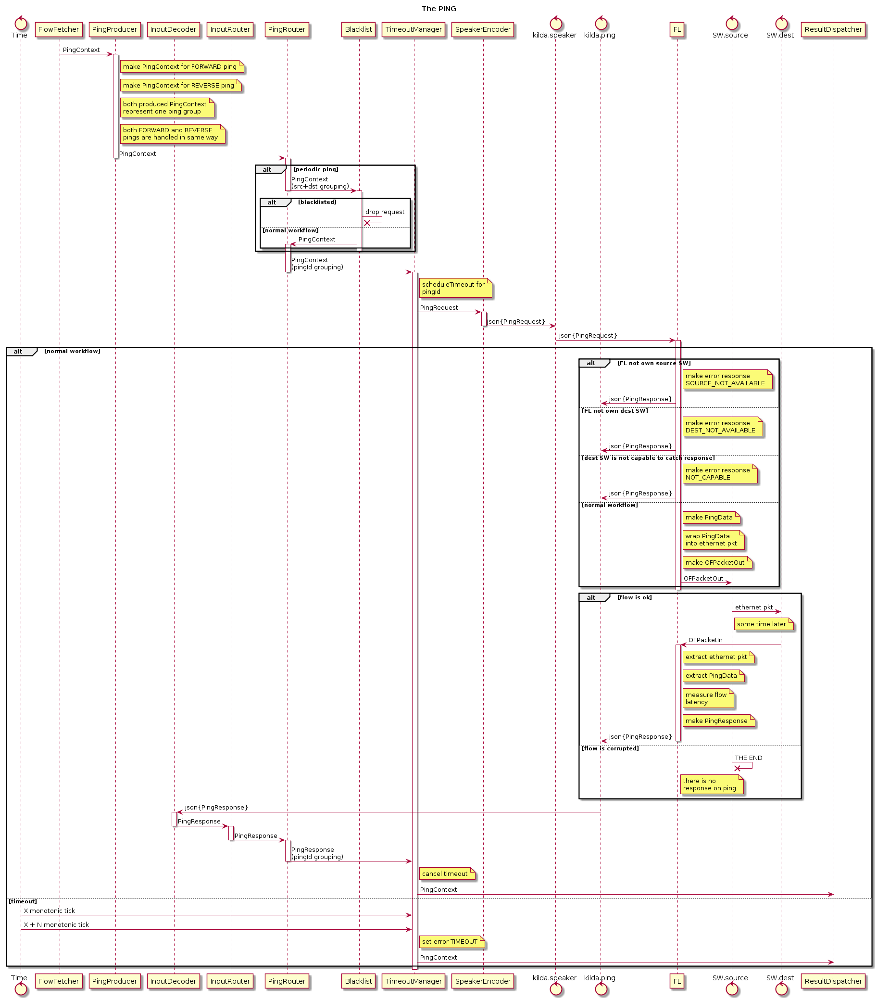

# Flow pings
## The idea
Use our link validation mechanism to validate the whole flow. We can inject
validation packet on edge switch, it will be "routed" using flow rules on all 
intermediate switches and cached on the edge switch on other side of flow
("packet out" message must specify special out port called "TABLE" to pass
packet via existing on switch open flow rules).

## Goals
* measure flow latency
* one more way to verify switch availability (detect control plane issues)

# Ping topology
## Periodic pings
Periodic pings are initiated by kilda system periodically, with interval defined by `flow.ping.interval` configuration option. Pings for both directions for all existing flows are created on each iteration.

If ping success - it's latency is stored into OTSDB, in metric `pen.flow.latency`, with tags flowid and direction.

If there is no successful pings for `flow.ping.fail.delay` seconds - flow failure will be reported in logs also `PingReport` message will be send into kafka topic defined in `kafka.topic.flow.status` configuration option.

To simplify flow status log filtration, all flow status log message are prefixed with `{FLOW-PING}` keyword.

Example of `PingReport` message:
```json
{
  "clazz": "org.openkilda.messaging.info.InfoMessage",
  "payload": {
    "clazz": "org.openkilda.messaging.info.flow.FlowPingReport",
    "report": {
      "flowid": "flowping-alpha",
      "status": "OPERATIONAL"
    },
    "timestamp": 1531157435563
  },
  "timestamp": 1531157435563,
  "correlation_id": "435ed47d-2438-4037-b432-d1d0cb01a709"
}
```



## On demand pings
This kind of flow ping is initiated via NorthBound API. The only mandatory input parameter if flowId. On this request kilda will initiate 2 pings, one in forward direction and one in reverse direction. 

NorthBound endpoint - ulr path `/flows/{flow_id}/ping`, method PUT. In request body you can pass additional ping options.

Request body example:
```json
{
  "timeout": 2000
}
```

`timeout` - how long time wait for response (in milliseconds). If not defined - the default value 2000 will be used.

Successful ping call response:
```json
{
  "flow_id": "flowping-alpha",
  "forward": {
    "ping_success": true,
    "error": null,
    "latency": 5
  },
  "reverse": {
    "ping_success": true,
    "error": null,
    "latency": 2
  },
  "error": null
}
```

Failure in forward direction:
```json
{
  "flow_id": "flowping-alpha",
  "forward": {
    "ping_success": false,
    "error": "No ping for reasonable time",
    "latency": 0
  },
  "reverse": {
    "ping_success": true,
    "error": null,
    "latency": 1
  },
  "error": null
}
```



## Common part for all kinds of pings

