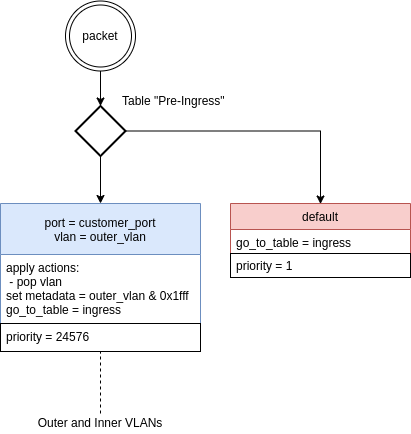
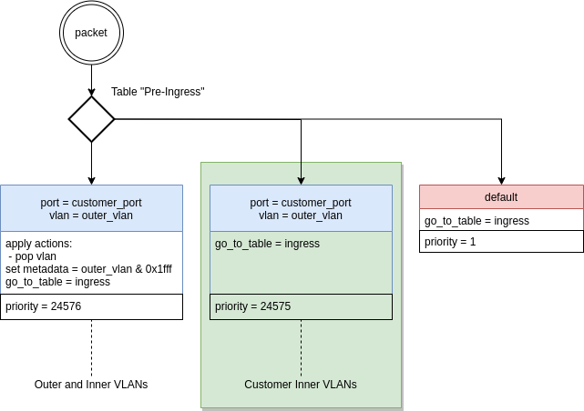

# Feature: Flow statistics per vlan


We want to collect statistics for VLANs on flows with full-port endpoints on both ends. That can be useful for controlling inner VLAN traffic for billing or another traffic engineering. All stats will be available in time series DB (currently, OpenTSDB). An operator must set up OpenKilda by adding particular VLANs for monitoring through northbound API.


## API

### Specify selected VLANs by flow create

`POST https://{host}/v2/flows/{flow_id}/`
```json
{
  "flow_id": "f12345678",
  "statistics": {
  	"vlans": [3, 4, n]
  },
  ...
}

```

### Modify VLANs by Put and Patch

`PATCH https://{host}/v2/flows/{flow_id}/`
`PUT https://{host}/v2/flows/{flow_id}/`
```json
{
  "flow_id": "f12345678",
  "statistics": {
  	"vlans": [5, 6] <- New VLANs 
  },
  ...
}
```

### Delete VLANs by Patch and Patch

`PATCH https://{host}/v2/flows/{flow_id}/`
`PUT https://{host}/v2/flows/{flow_id}/`
```json
{
  "flow_id": "f12345678",
  "statistics": {
  	"vlans": [] <- clean
  },
  ...
}
```

## Rules

### Full port flow scenario 

#### Current rules



#### Proposed rules



## Time Series DB metric name


`<prefix>.flow.vlan.<bit|bytes|packet>`


## Affected components

- NB
- Flow CRUD + Sync
- Statistics collection and store
- DB layer
- Floodlight
- Production: grafana dashboards
- GUI

## Limitation

- Only for multi-table switch mode
