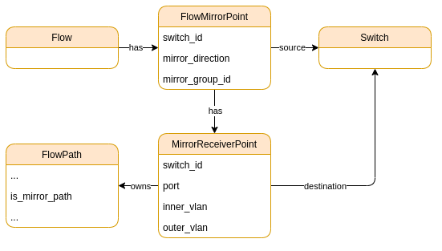
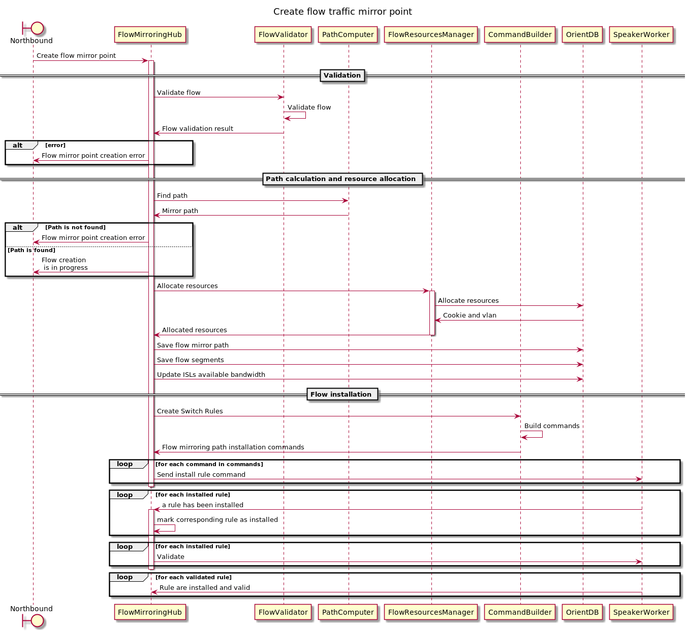

# Flow traffic mirroring

## Idea
There must be an ability to mirror traffic on a given flow and send it to a specific switch+port+vlan.

## Model
Flow has a list of FlowMirrorPoints, which will describe the direction and MirrorGroupId for the group on the switch. 
FlowMirrorPoints itself has a list of MirrorReceiverPoints. MirrorReceiverPoint contains the endpoint 
where the traffic should be mirrored and refers to the FlowPath. A flag is set in FlowPath that will not allow deleting 
this path during flow operations.



If the receiver point is on the mirroring source switch, then no segments will be built for such a FlowPath, 
and we will work with it like the paths in one switch flow.

## API
* Create mirror point:
  
  `PUT /flows/{flow_id}/mirror`
  
  payload:
  ```
  {
     "flow_id": string,
     "points":[
        {
           "mirror_point": switch_id,
           "mirror_direction": string [FORWARD|REVERSE],
           "receiver_point": {
              "switch_id": string,
              "port": int,
              "inner_vlan": int,
              "outer_vlan": int
           }
        }
     ]
  }
  ```

## Workflow



## Switch rules
Examples of rules for VLAN transit encapsulation:
* _Group_:
```
{
   "dpid": dpid,
   "type": "ALL",
   "group_id": GROUP_ID,
   "buckets":[
      {
         "actions":[
            {
               "type": "SET_FIELD", 
               "field": "vlan_vid",
               "value": vid
            },
            {
               "type": "OUTPUT",
               "port": first_out_port
            }
         ]
      },
      {
         "actions":[
            {
               "type": "SET_FIELD", 
               "field": "vlan_vid",
               "value": vid
            },
            {
               "type": "OUTPUT",
               "port": second_out_port
            }
         ]
      }
   ]
}
```
* _Mirror rule_ for egress rule:
```
{
   "dpid": dpid,
   "cookie": MIRROR_FLOW_COOKIE,
   "table_id": EGRESS_TABLE_ID,
   "priority": priority,
   "match":{
      "in_port": in_port,
      "vlan_vid": transit_vid
   },
   "actions":[
      {
         "type":"GROUP",
         "group_id":"GROUP_ID"
      }
   ]
}  
```
* _Mirror rule_ for ingress rule:
```
{
   "dpid": dpid,
   "cookie": MIRROR_FLOW_COOKIE,
   "table_id": INGRESS_TABLE_ID,
   "priority": priority,
   "match":{
      "metadata": metadata,
      "in_port": in_port,
   },
   "actions":[
      {
         "type":"GROUP",
         "group_id":"GROUP_ID"
      }
   ]
}  
```
