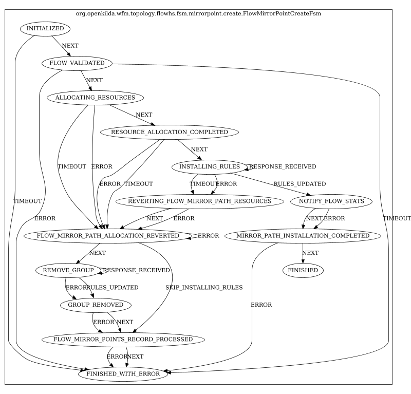
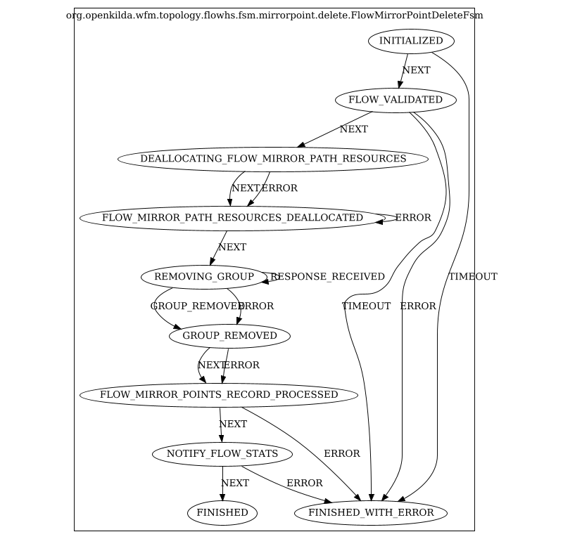
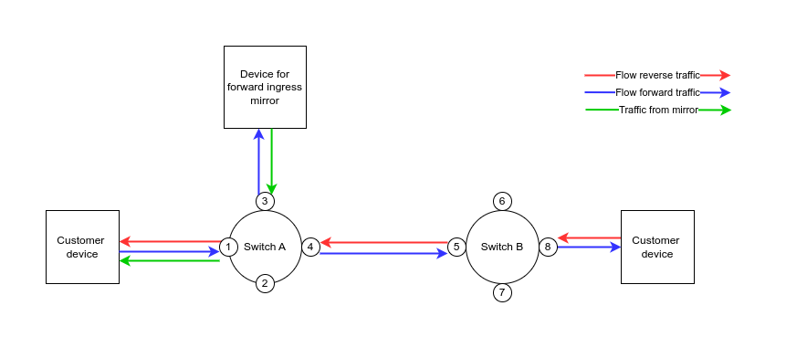
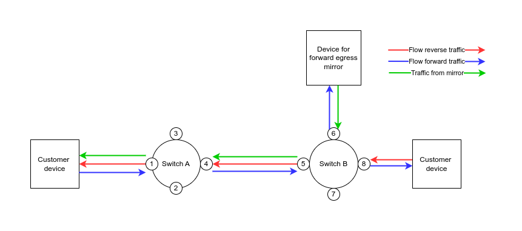
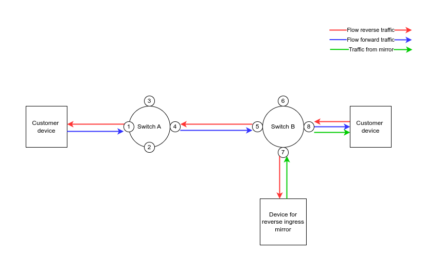

# Flow traffic mirroring

## Idea
There must be an ability to mirror traffic on a given flow 
and send it to a network endpoint (switch+port+inner_vlan+outer_vlan).

## Model
FlowPath has a list of FlowMirrorPoints, which will contain MirrorGroupId for multicasting on the switch. 
FlowMirrorPoint itself has a list of MirrorFlowPaths. MirrorFlowPaths contains the endpoint 
where the traffic should be mirrored and other necessary information to build the path.


If the receiver point is on the mirroring source switch, then no segments will be built for such a MirrorFlowPath, 
and we will work with it like the paths in one switch flow.

## API
* Create mirror point:
  
  `PUT /flows/{flow_id}/mirror`
  
  payload:
  ```
  {
      "mirror_point_id": string,
      "flow_id": string,
      "mirror_direction": string [FORWARD|REVERSE],
      "mirror_point_switch_id": string,
      "join_traffic_from_sink": boolean,
      "sink_endpoint": {
         "switch_id": string,
         "port_number": int,
         "vlan_id": int,
         "inner_vlan_id": int
      }
  }
  ```

* Delete mirror point:

  `DELETE /flows/{flow_id}/mirror/{mirror_point_id}`


* Get list of mirror points by flow id:

  `GET /flows/{flow_id}/mirror`

  Response payload:
  ```
  {
      "flow_id": string,
      "points":[
          {
              "mirror_point_id": string,
              "mirror_direction": string [FORWARD|REVERSE],
              "mirror_point_switch_id": string,
              "join_traffic_from_sink": boolean,
              "sink_endpoint": {
                  "switch_id": string,
                  "port_number": int,
                  "vlan_id": int,
                  "inner_vlan_id": int
              }
          }
      ]
  }
  ```
  `mirror_point_id` must be specified by user. It's unique across the flow and can only consist of alphanumeric 
  characters, underscore, and hyphen. The length of this parameter must not exceed 100 characters.


* API that needs to be updated: 
  - Need to add information about the state of the mirror paths in the flow payload.
  - It is necessary to add information about built mirror paths to API `GET /flows/{flow_id}/path`

## Joining traffic
It is possible to make mirror bidirectional. With special flag `join_traffic_from_sink=true` 
user can join traffic from sink to flow traffic in opposite direction.
See examples in section [Traffic examples](#Traffic examples)

## Workflow

Creation and deletion flow mirror points in the FlowHSTopology:


For mirror paths, transit vlan encapsulation should be used as it is currently used for flow. 
Also, this feature should work both in single table mode and in multi table.


Getting flow mirror points in the NbWorkerTopology:


## Affected kilda components
* need to add mirror groups to the Floodlight;
* need to update RerouteTopology to react to the network events for the mirror paths;
* add logic to the flow update operation when updating flow endpoints;
* update switch and flow validation.

## Limitations
It is allowed to use a transit switch as a mirror point only if flow is pinned.

## Related issues
There are currently no asymmetric bandwidth ISLs in the system. This feature sets paths in one direction only. 
This results in asymmetric ISLs appearing in the system. This effect on the system requires more in-depth research.

A possible solution to this issue is to create a dummy path that will consume bandwidth in the opposite direction.

## Switch rules
Existing actions set for any type of existing OF flows (ingress, transit, egress) 
will be replaced with a "goto group" action instead of an "output port" action.
The group will have 2 or more buckets: one will represent output to the flow or ISL port, 
the rest will represent mirror actions set (i.e. routing to the mirror paths).

## Need to decide
1. What status flow should have if mirror path is down
2. What path computation strategy mirror path should use (guess flow strategy)
3. Should we use ingress meter for egress sink traffic 

## FSM diagrams

### FlowMirrorPointCreateFsm


### FlowMirrorPointDeleteFsm


## Traffic examples
NOTE: in all examples `join_traffic_from_sink` is `true`. With `join_traffic_from_sink=false`
there would no traffic from mirror (green arrow).

### Forward ingress mirror


### Forward egress mirror


### Reverse ingress mirror


### Reverse egress mirror

