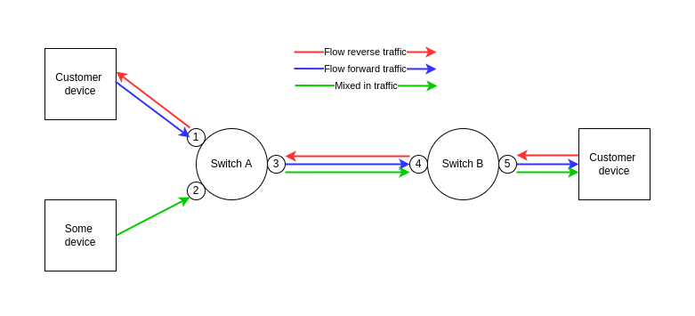
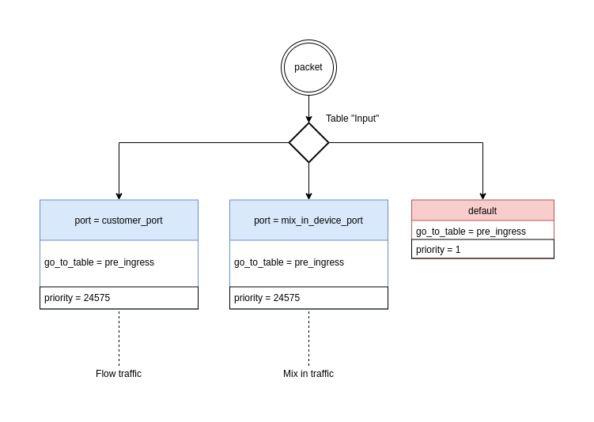
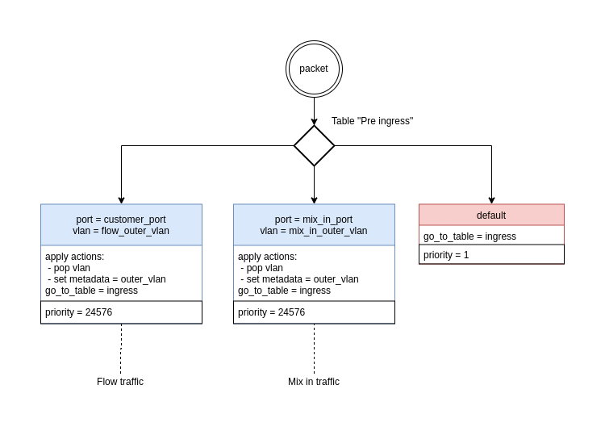
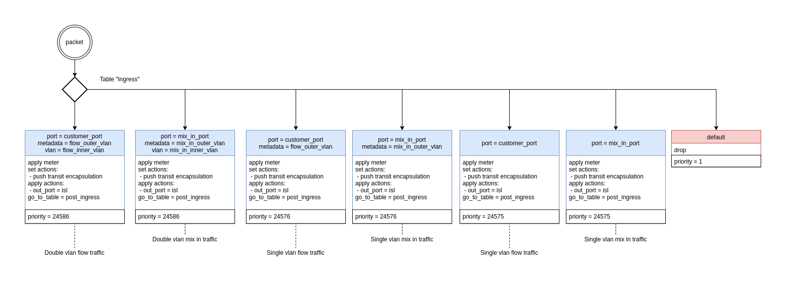

# Feature: Flow traffic mix in

## Description

Kilda has traffic mirroring feature. It mirrors flow's traffic to some mirror point.
Traffic mix in feature is needed for opposite purpose - to mix in traffic from some mix in point into flow traffic.
At the first stage user will be able to create mix in points only on flow source and destination endpoints.
Traffic, which comes from mix in point, will be marked by flow transit encapsulation and pushed into first flow segment port.
Later this feature can be extended to be able to mix in traffic not only on endpoint switches.
For this purpose new fields like 'direction' can be added into API request body.

### Example of traffic mix in



## API

### Create mix in point

`POST https://{host}/v2/flows/{flow_id}/mix-in`
```json
{
  "mix_in_point_id": "point1",
  "mix_in_endpoint": {
    "switch_id": "00:00:00:00:00:00:00:01",
    "port_number": 0,
    "vlan_id": 0,
    "inner_vlan_id": 0
  }
}

```

### Get mix in points list

`GET https://{host}/v2/flows/{flow_id}/mix-in`
```json
{
  "flow_id": "string",
  "points": [
    {
      "mix_in_point_id": "point1",
      "mix_in_endpoint": {
        "switch_id": "00:00:00:00:00:00:00:01",
        "port_number": 0,
        "vlan_id": 0,
        "inner_vlan_id": 0
      }
    }
    ...
  ],
}
```

### Modify mix in point by Put and Patch

`PATCH https://{host}/v2/flows/{flow_id}/mix-in/{mix_in_point_id}`

`PUT https://{host}/v2/flows/{flow_id}/mix-in/{mix_in_point_id}`

```json
{
  "mix_in_endpoint": {
    "switch_id": "00:00:00:00:00:00:00:01",
    "port_number": 0,
    "vlan_id": 0,
    "inner_vlan_id": 0
  }
}
```

### Delete mix in point

`DELETE https://{host}/v2/flows/{flow_id}/mix-in/{mix_in_point_id}`

## Switch rules

### Input table rules



### Pre-Ingress table rules



### Ingress table rules



## Affected components

- NB
- Flow CRUD + Sync
- DB layer
- Floodlight
