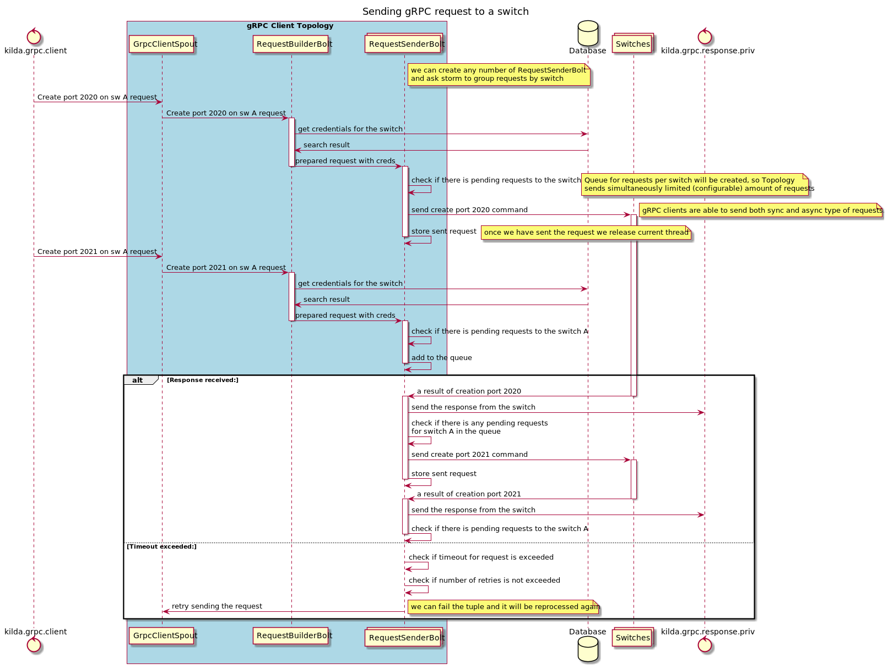

# gRPC client

## Goals
- Be able to send requests to gRPC server
- Have multiple instances of the client
- Be able to manage load (amount of simultaneous requests) per switch

## The idea
Requests processing by gRPC server on switches might take some time, so we should implement it in asynchronous way (gRPC client library supports it). Since we need to have multiple instances of the client, we also have to created some kind of router/balancer next to them. Because of that we can implement gRPC client as storm topology, storm will take over tasks to route requests. 

Bolt, that is responsible for sending requests, should wait the response asynchronously and do not block bolt's executions. In other words, bolt will have storages for tuples/requests and tuple will be acknowledged once response to gRPC requests is received.

Besides, the mechanism for limiting amount of simultaneous requests to the switch should be implemented. It may be some queue per switch or separate bolt that will manage requests sending. That limit should be configurable.

## Switches' credentials
Perhaps we need to store credentials somewhere (it might be neo4j or another DB?), so during building the requests, credentials for the target switch should be included into proto request.

## Diagram
