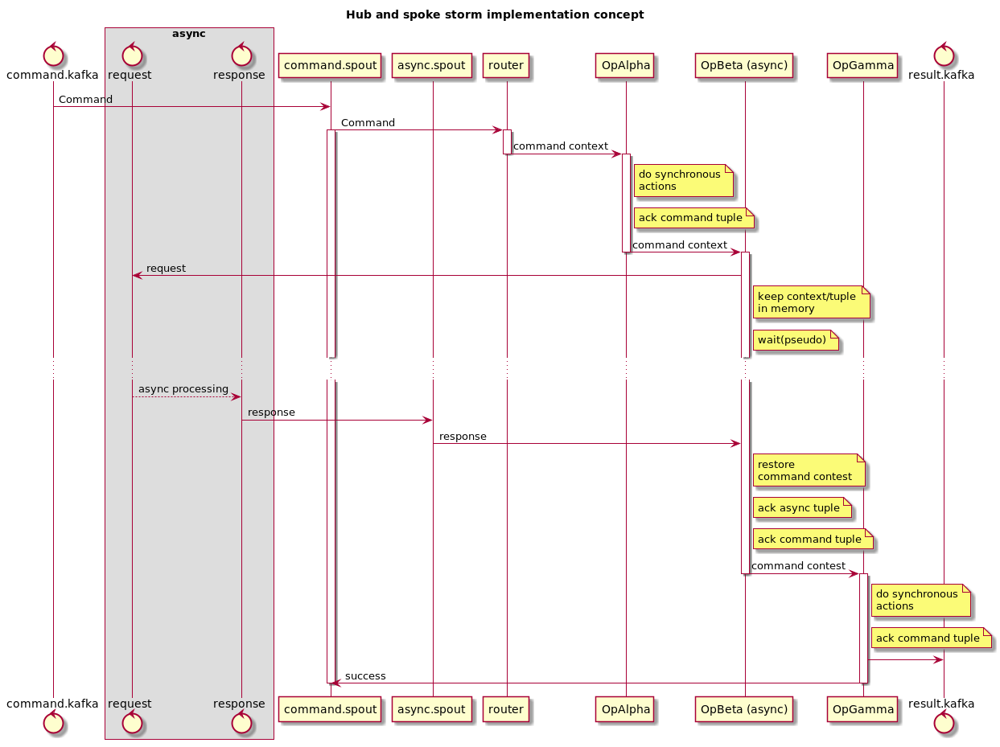
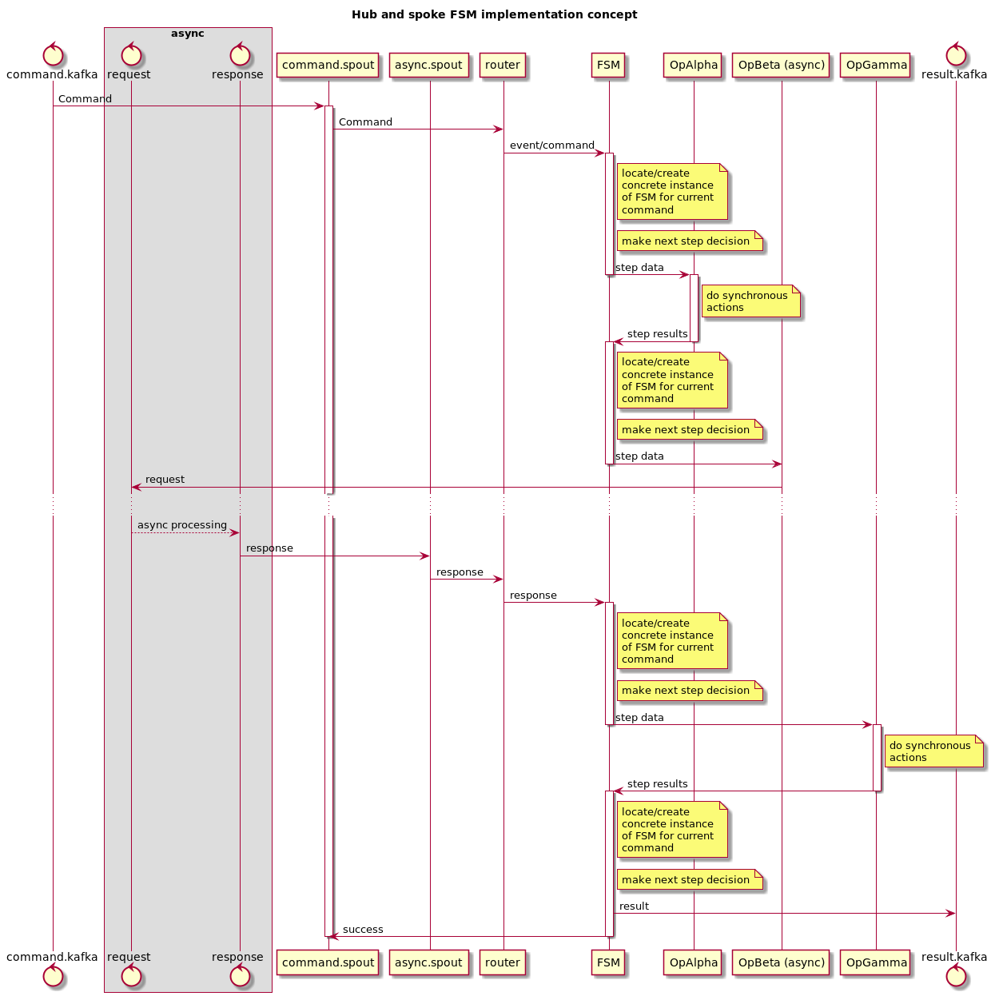

# Hub and spoke storm implementation

## Option 1 - storm natural workflow

Storm topology represent the "hub" itself, or whole operation workflow. Each
bolt is responsible for single operation. Bolt interconnections represent 
possible forks and joints.

There is 2 kind of operations/bolts - synchronous and asynchronous.

Synchronous operations do not require any specific handling. They are handled
and pass operation to the next bolt.

Asynchronous operation require "sleep" after request have been sent and
response have not received. But we must not "sleep" inside storm's bolt. So
this operation must be split on 2 parts. First store command context inside
bolt and emit async request. Second receive async response, restore command
context handle response and pass control to the next bolt.

To be able to use in-memory bolt's storage, async response must be handled
same bolt that send request. There is at least 2 way to achieve this - we can
use "field grouping" for response tuple. Or we can use "direct grouping" for
response tuple and store "task id" inside request/response.

Or we can split async operation on 2 bolts - one for request, second to store
context and wait response. This case require "field grouping" too.

## Option 2 - use one bolt as a "hub"

Topology contain bolt that handle wide range of incoming events and
schedule individual operations(synchronous and asynchronous) i.e. this bolt
represent our "hub".

Inside this bolt the "finite state machine" should be used to define and control
command workflow.

State of FSM can be stored inside bolt's memory, or in some external persistent
storage. If bolt's memory are used to store command state, we should carefully 
route responses to handle them in correct bolt instance i.e. we will need a lot
of "field grouping"(or "direct grouping") streams.

## Storm features we should use
### Timeout
To limit operation execution time, we can use storm's TOPOLOGY_MESSAGE_TIMEOUT_SECS
feature. It will require custom spout, that will emit "error" after ".fail()" call.
Or special bolt placed right after spout. This bolt will track "repeated" tuples
and emit "errors" for them.

### Repeats
To repeat failed operation we should use storm's guarantee delivery mechanism.
I.e. correct usage of ".ack()/.fail()" calls for processing tuples. In this way
we can repeat whole command processing. Or repeat only one operation (it will
require separate entry point/spout for such operations).

