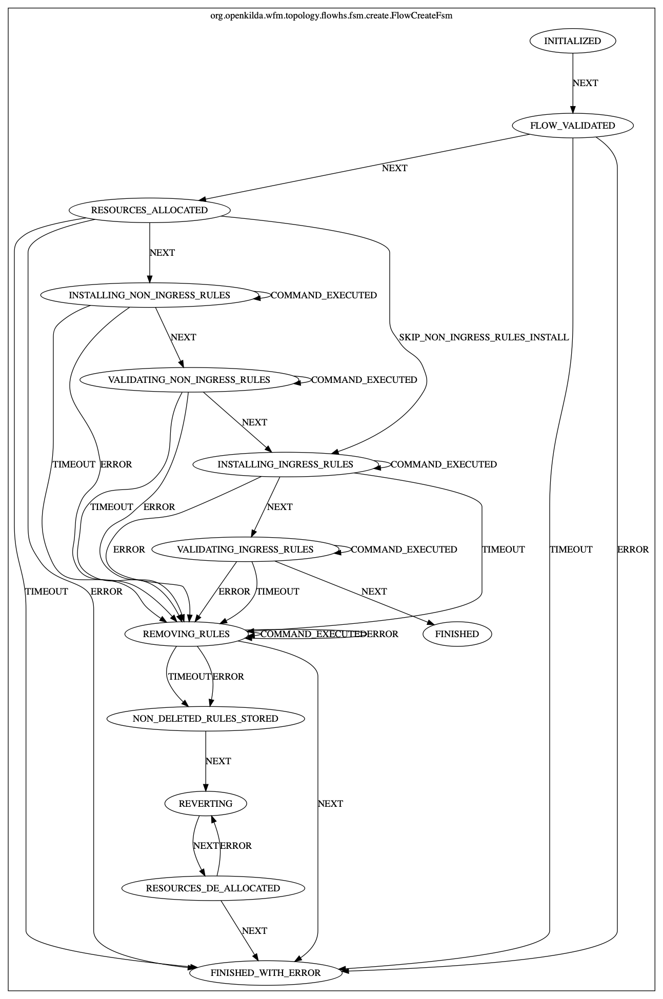

# Flow creation with hub and spoke approach

## Current implementation

There are multiple issues occur and might occur because of the design of crud (create operations in particular):
- rules might not be installed due to some errors or switches disappearance during installation
- there is still one last cache where we store flow resources
- it is almost impossible to track down what went wrong during flow creation
- it is hard to support current code base without FSM

## Flow creation using hub and spoke
This approach helps to detect failures during installation and revert changes if something went wrong. Also it allows to
handle timeout cases and add retries or another custom logic. In scope of this refactoring we should get rid of last
"cache" in the system, it is ResourceCache where we store cookies, vlans and meters.

## FSM for flow create
Here is a FSM diagram that helps to understand main steps of flow creation.

### For more details about hub&spoke and look into examples please follow this [link](https://github.com/telstra/open-kilda/blob/develop/docs/design/hub-and-spoke/v7/README.md)