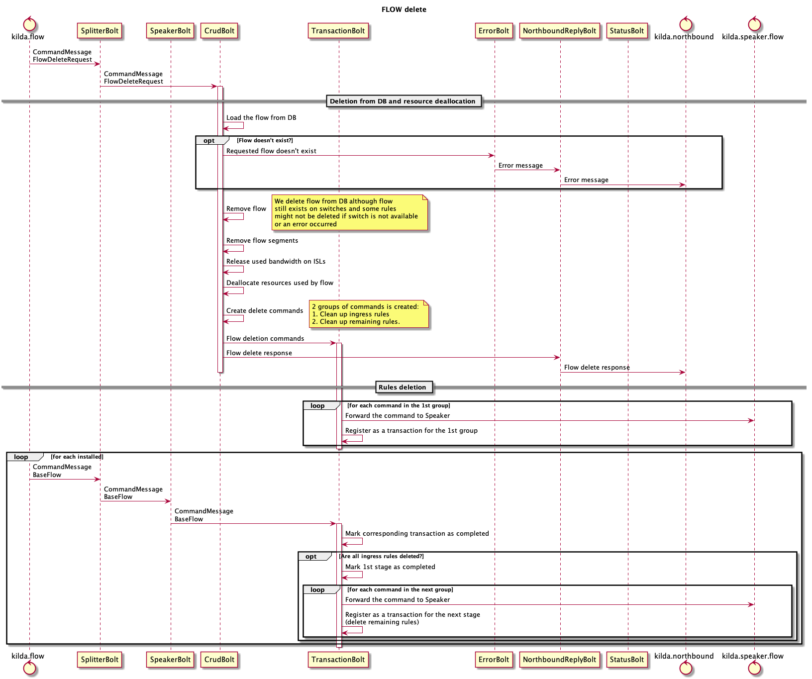
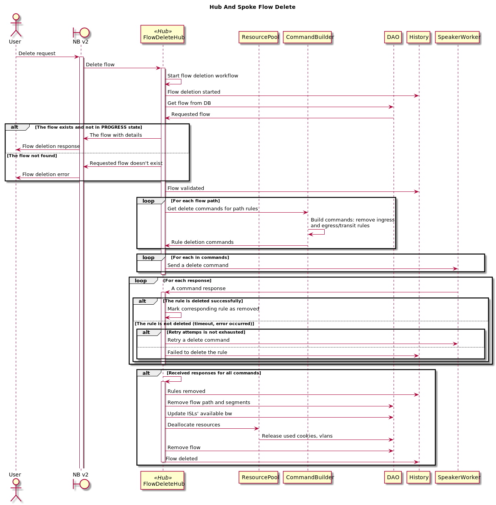
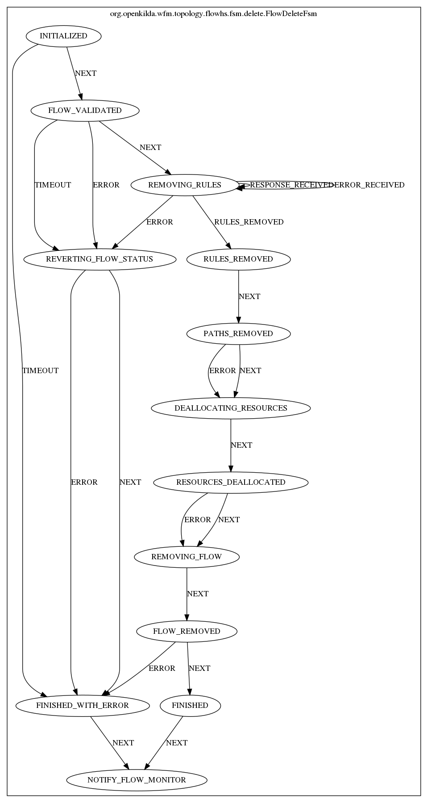

# Flow deletion with hub and spoke approach

## Current implementation

There are multiple issues occur and might occur because of the design of flow delete:
- rules might not be deleted due to some errors or switches disappearance during installation and because of that we face excess rules on switches
- there is still one last cache where we store flow resources
- it is almost impossible to track down what went wrong during flow deletion
- it is hard to support current code base without FSM

## Flow deletion using hub and spoke
This approach helps to detect failures during rules deletion and revert changes if something went wrong. Also it allows to
handle timeout cases and add retries or another custom logic. In scope of this refactoring we should get rid of last
"cache" in the system, it is ResourceCache where we store cookies, vlans and meters.

## FSM for flow delete
Here is a FSM diagram that helps to understand main steps of flow deletion.

### For more details about hub&spoke and look into examples please follow this [link](https://github.com/telstra/open-kilda/blob/develop/docs/design/hub-and-spoke/v7/README.md)