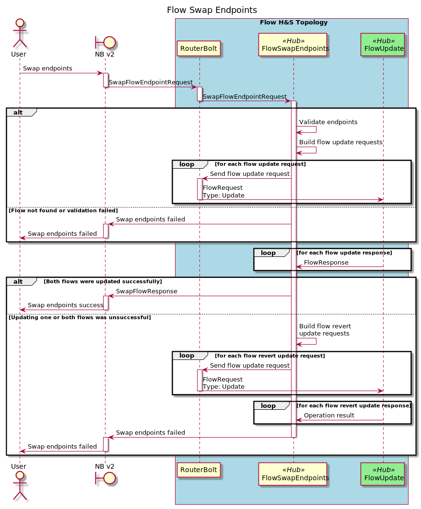
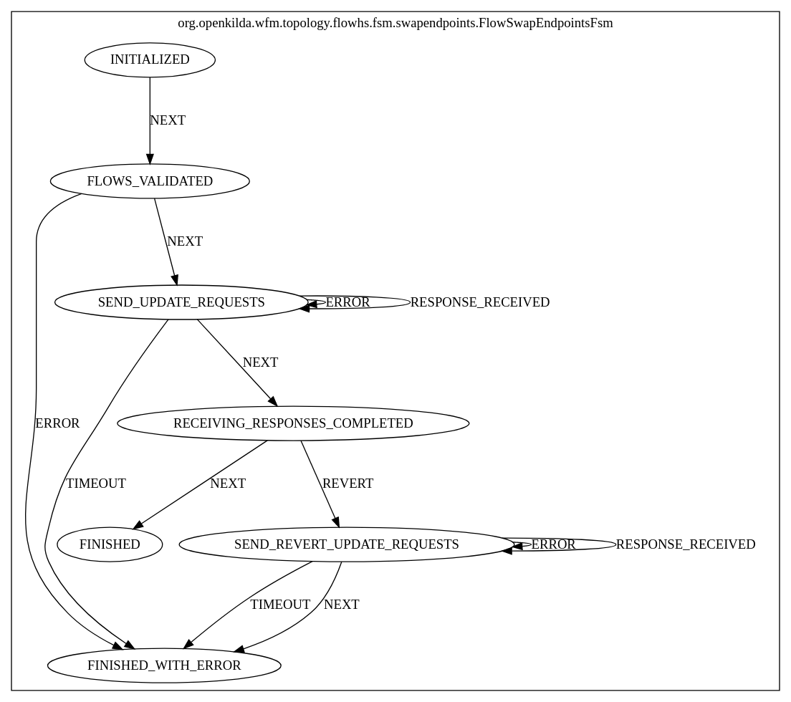

# Flow swap endpoints with hub and spoke approach

## Introduction
Since Flow Topology should be removed soon, need to transfer the functionality of this topology to other places. 
Swap endpoints are one of the operations performed by the Flow Topology.

This design proposes to transfer the logic of the swap endpoints operation to Nbworker Topology, 
which uses the Update operation in the Flow H&S Topology.

## Flow swap endpoints using hub and spoke
Flow swap endpoints sequence diagram.

### FSM for flow swap endpoints
Here is a FSM diagram that helps to understand main steps of flow swap endpoints.

### For more details about hub&spoke and look into examples please follow this [link](https://github.com/telstra/open-kilda/blob/develop/docs/design/hub-and-spoke/v7/README.md)