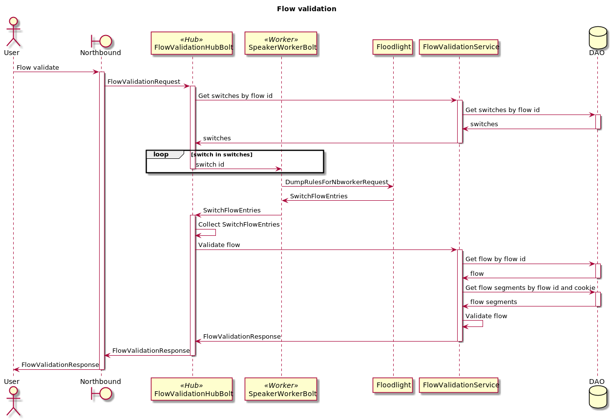
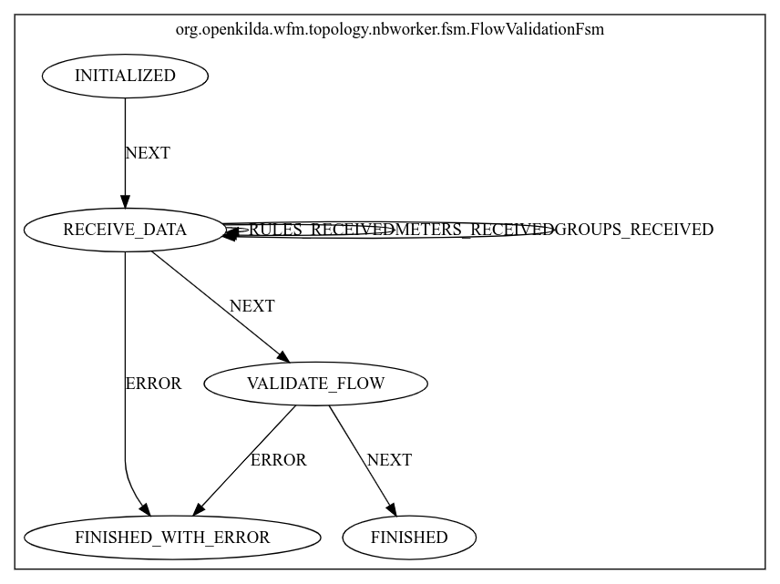

# Flow validation with hub and spoke approach

## Flow validation using hub and spoke

## FSM for flow validation
Here is a FSM diagram that helps to understand main steps of flow validation.

### For more details about hub&spoke and look into examples please follow this [link](https://github.com/telstra/open-kilda/blob/develop/docs/design/hub-and-spoke/v7/README.md)

Issue [#1442](https://github.com/telstra/open-kilda/issues/1442)