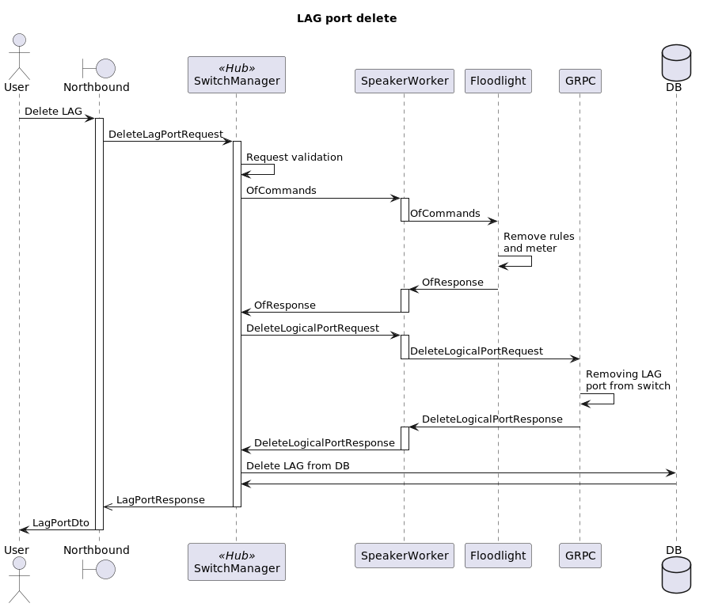
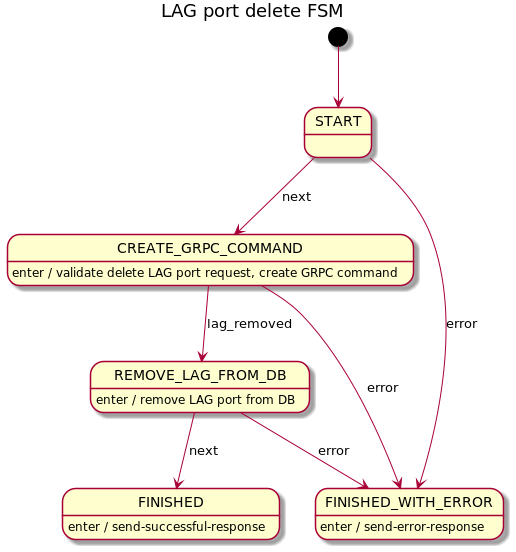

# LAG port delete with hub and spoke approach

## Delete LAG port using hub and spoke

## FSM for LAG creation
Here is an FSM diagram that helps to understand main steps of LAG creation.

### For more details about hub&spoke and look into examples please follow this [link](https://github.com/telstra/open-kilda/blob/develop/docs/design/hub-and-spoke/v7/README.md)

[Issue #1987](https://github.com/telstra/open-kilda/issues/1987),
[Issue #2189](https://github.com/telstra/open-kilda/issues/2189)
