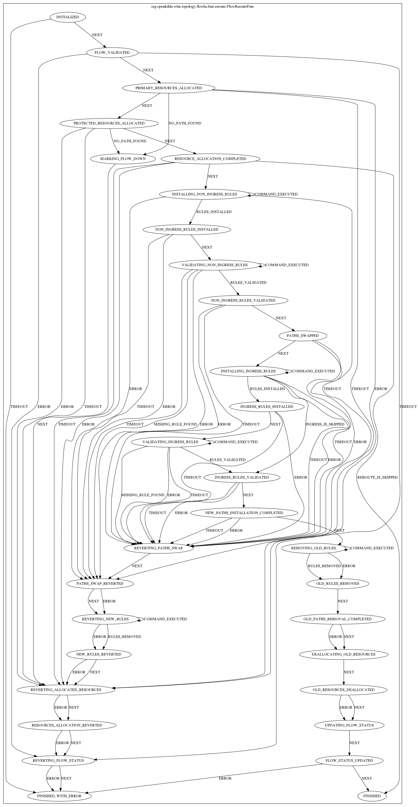

# Flow rerouting with hub and spoke approach

## Current implementation

There are potential issues that may occur because of the current design and implementation of the rerouting operations:
- Rules might not be installed due to some errors or switch(es) disappearance during installation.
  The system doesn't rollback any changes applied before the failure, and leaves the flow in DOWN state.
- Rules might not be removed if switch(es) become inaccessible during the process.
- It is almost impossible to track down what went wrong during the process.

## Flow rerouting using hub and spoke
This approach helps to detect failures during installation and revert changes if something went wrong. Also it allows to
handle timeout cases and add retries or another custom logic.

### FSM for flow rerouting
Here is a FSM diagram that helps to understand main steps of flow rerouting.

### For more details about hub&spoke and look into examples please follow this [link](https://github.com/telstra/open-kilda/blob/develop/docs/design/hub-and-spoke/v7/README.md)