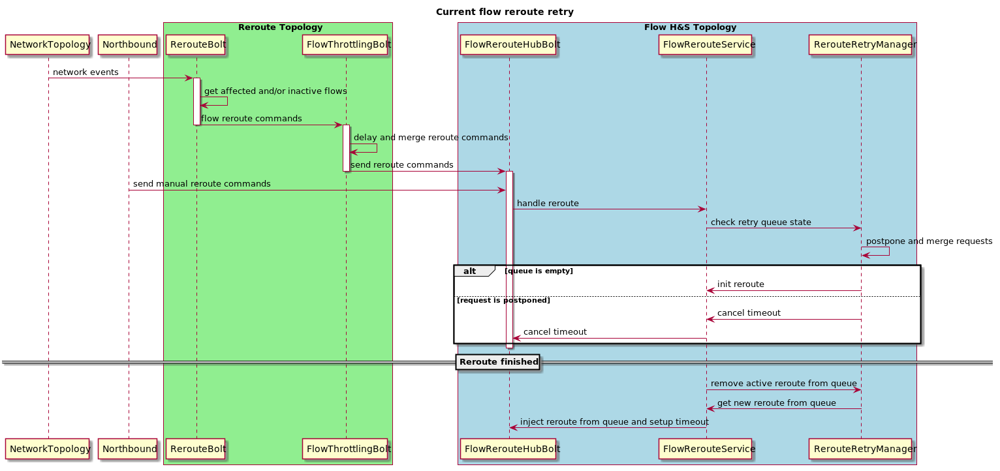
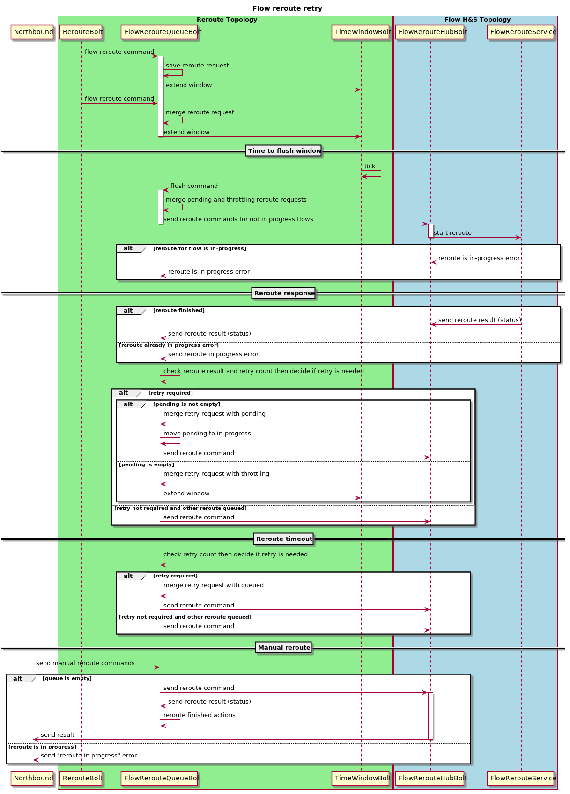
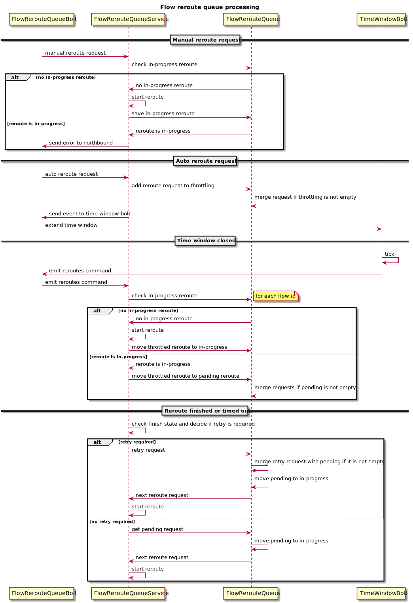
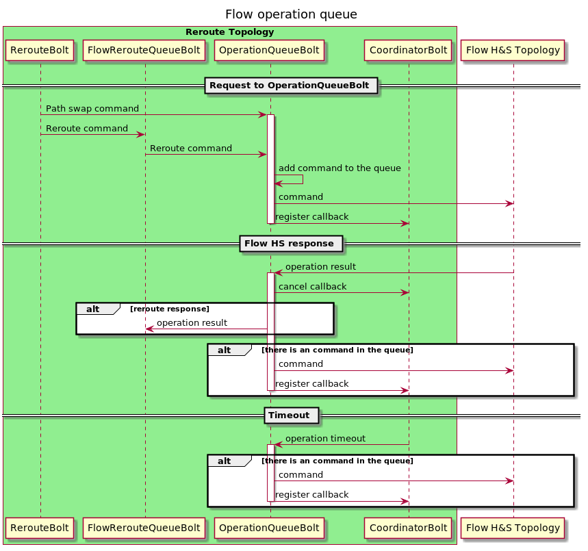

# Flow H&S reroute retry

## Current implementation
Current flow reroute retry implementation has few issues:
* Logic duplication. Reroute requests are merged two times: in Reroute Throttling Bolt (Reroute topology) and 
in Retry Manager (flow H&S topology).
* The way Retry Manager injecting retries into processing is not clear. Service layer call is masqueraded 
as transport layer message.

## Flow reroute retry in Reroute Topology

This solution is aimed to fix mentioned above issues. 

FlowRerouteQueueBolt is a single point for flow reroute requests queuing and merging. New reroute queue should combine 
time-based throttling and in-progress reroute tracking. For this purpose following data structure is used:

| flow-id | in-progress | pending  | throttling |
| ---     | ---         | ---      | ---        |
| 1       | request1    | request2 | request3   |

Flow reroute FSM should save error reason with retryable flag and FlowRerouteQueueService will check this flag and 
retry counter to decide will system emit reroute retry request or not.

OperationQueueBolt is needed for sequential execution of operations supplied by Reroute Topology for a flow.

