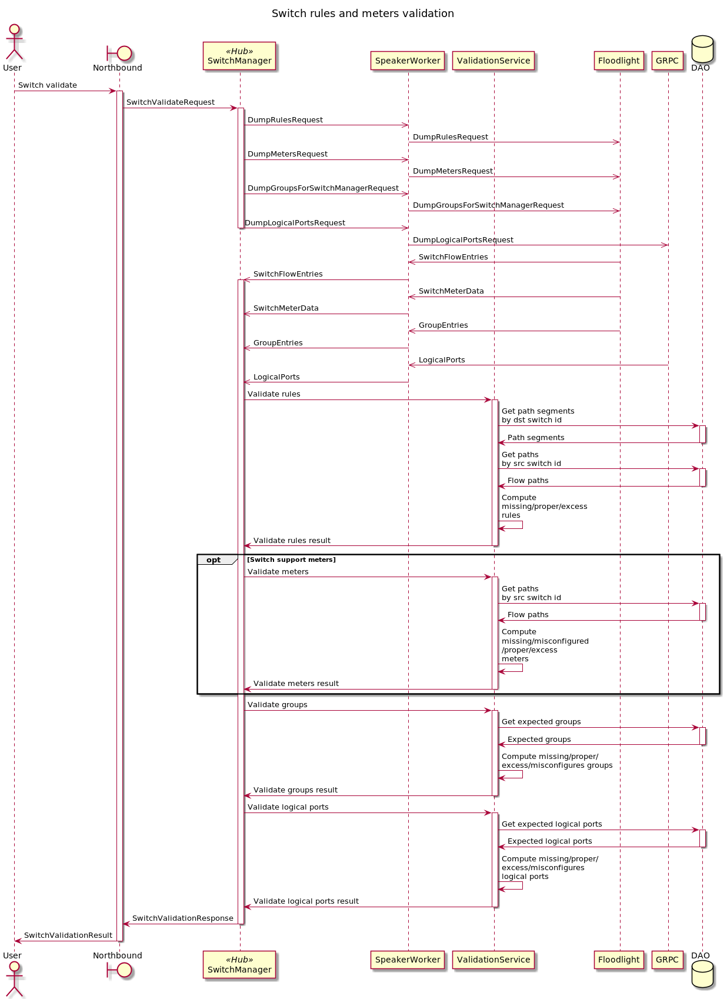
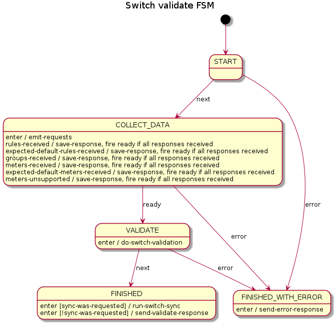

# Validation switch rules and meters with hub and spoke approach

## Validation switch rules and meters using hub and spoke

## FSM for validation switch rules and meters
Here is a FSM diagram that helps to understand main steps of validation switch rules and meters.

### For more details about hub&spoke and look into examples please follow this [link](https://github.com/telstra/open-kilda/blob/develop/docs/design/hub-and-spoke/v7/README.md)

[Issue #1551](https://github.com/telstra/open-kilda/issues/1551)