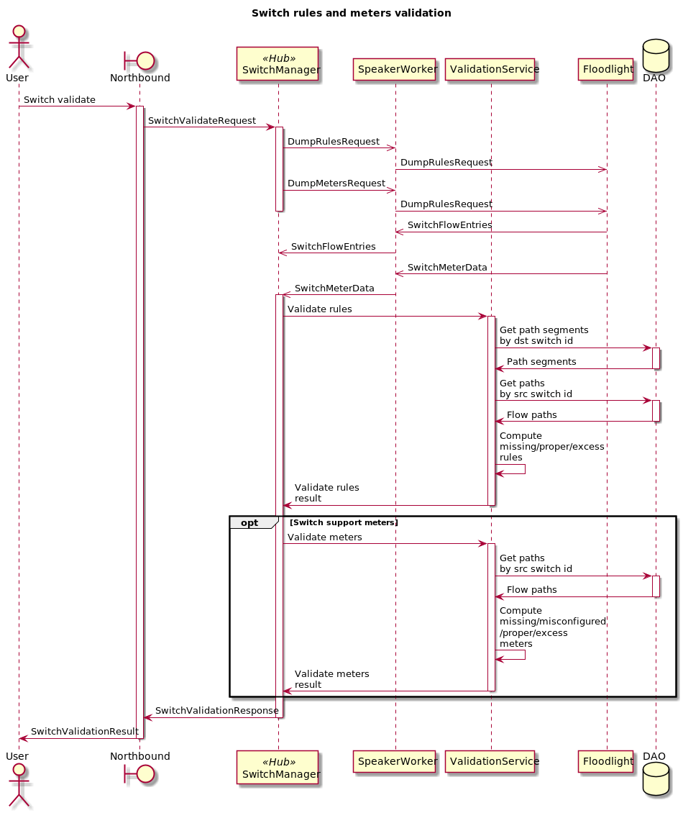
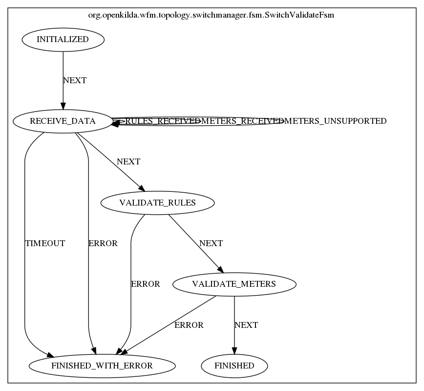

# Validation switch rules and meters with hub and spoke approach

## Validation switch rules and meters using hub and spoke



## FSM for validation switch rules and meters

Here is a FSM diagram that helps to understand main steps of validation switch rules and meters.


### For more details about hub&spoke and look into [examples](https://github.com/telstra/open-kilda/blob/develop/docs/design/hub-and-spoke/v7/README.md)

[Issue #1551](https://github.com/telstra/open-kilda/issues/1551)

## v1 API summary:
* [Validate rules installed on the switch](#validate-rules-installed-on-the-switch)

`GET https://{host}/v1/switches/{switch_id}/rules/validate`

* [Validate rules, meters, lags and groups installed on the switch v1](#validate-rules-meters-lags-and-groups-installed-on-the-switch-v1)

`GET https://{host}/v1/switches/{switch_id}/validate`

## v2 API summary:
* [Validate rules, meters, lags and groups installed on the switch v2](#validate-rules-meters-lags-and-groups-installed-on-the-switch-v2)

`GET https://{host}/v2/switches/{switch_id}/validate`

**Default: without any query params response contains v2 info about groups, lags, meters and rules.**

* [Validate rules, meters, lags and groups installed on the switch with filters](#validate-rules-meters-lags-and-groups-installed-on-the-switch-with-filters)

`GET https://{host}/v2/switches/{switch_id}/validate?include=groups|meters|logical_ports|rules&exclude=flow_info`

## v1 API : GET

### Validate rules installed on the switch

`GET https://{host}/v1/switches/{switch_id}/rules/validate`

Response payload

```json
{
  "excess-rules-hex": [
    "8000000000000001"
  ],
  "excess_rules": [
    -9223372036854776000
  ],
  "missing-rules-hex": [
    "800000000000001b"
  ],
  "missing_rules": [
    -9223372036854776000
  ],
  "proper-rules-hex": [
    "8000000000000001"
  ],
  "proper_rules": [
    -9223372036854776000
  ]
}
```

### General info

<details><summary>v1GroupInfo</summary>

```json
{
  "group_id": 10,
  "excess_group_buckets": [
    {
      "port": 2,
      "vlan": 2,
      "vni": 2
    }
  ],
  "group_buckets": [
    {
      "port": 3,
      "vlan": 3,
      "vni": 3
    }
  ],
  "missing_group_buckets": [
    {
      "port": 4,
      "vlan": 4,
      "vni": 4
    }
  ]
}
```

</details>

<details><summary>v1LogicalPortInfo</summary>

```json
{
  "logical_port_number": 100,
  "physical_ports": [
    1
  ],
  "type": "lag",
  "actual": { // only for misconfigured section
    "physical_ports": [
      10,
      11
    ],
    "type": "lag"
  },
  "expected": { // only for misconfigured section
    "physical_ports": [
      10,
      11,
      13
    ],
    "type": "bfd"
  }
}
```
</details>

<details><summary>v1MeterInfo</summary>

```json
{
  "rate": 300,
  "burst_size": 200,
  "cookie": 10,
  "flow_id": "1231232",
  "meter_id": 1,
  "flags": [
    "STATS"
  ],
  "actual": { // only for misconfigured section
    "flags": [
      "KBPS"
    ],
    "rate": 250,
    "burst_size": 220
  },
  "expected": { // only for misconfigured section
    "flags": [
      "STATS"
    ],
    "rate": 200,
    "burst_size": 230
  }
}
```
</details>

### Validate rules, meters, lags and groups installed on the switch v1

`GET https://{host}/v1/switches/{switch_id}/validate`

Response payload

```json
{
  "groups": {
    "excess": [
      <v1GroupInfo>
    ],
    "misconfigured": [
      <v1GroupInfo>
    ],
    "missing": [
      <v1GroupInfo>
    ],
    "proper": [
      <v1GroupInfo>
    ]
  },
  "logical_ports": {
    "error": "some_error",
    "excess": [
      <v1LogicalPortInfo>
    ],
    "misconfigured": [
      <v1LogicalPortInfo>
    ],
    "missing": [
      <v1LogicalPortInfo>
    ],
    "proper": [
      <v1LogicalPortInfo>
    ]
  },
  "meters": {
    "excess": [
      <v1MeterInfo>
    ],
    "misconfigured": [
      <v1MeterInfo>
    ],
    "missing": [
      <v1MeterInfo>
    ],
    "proper": [
      <v1MeterInfo>
    ]
  },
  "rules": {
    "excess": [
      -9223372036854776000
    ],
    "excess-hex": [
      "800000000000001b"
    ],
    "misconfigured": [
      -9223372036854776000
    ],
    "misconfigured-hex": [
      "800000000000001b"
    ],
    "missing": [
      -9223372036854776000
    ],
    "missing-hex": [
      "800000000000001b"
    ],
    "proper": [
      -9223372036854776000
    ],
    "proper-hex": [
      "800000000000001b"
    ]
  }
}
```

## v2 API : GET

### Groups, meters, lags and rules info include flow_id, flow_path and y_flow_id(for meters,groups and rules).

<details><summary>v2GroupInfo</summary>

```json
{
  "flow_id": "10",
  "flow_path": "e0b0716e-cc59-4ef6-8572-518bdcdc5c72",
  "group_id": 10,
  "buckets": [
    {
      "port": 3,
      "vlan": 3,
      "vni": 3
    }
  ]
}
```

</details>

<details><summary>v2LogicalPortInfo</summary>

```json
{
  "logical_port_number": 1001,
  "type": "lag",
  "physical_ports": [
    1,
    2,
    3
  ]
}
```
</details>

<details><summary>v2MeterInfo</summary>

```json
{
  "flow_id": "10",
  "flow_path": "e0b0716e-cc59-4ef6-8572-518bdcdc5c72",
  "y_flow_id": "111",
  "meter_id": 1,
  "flags": [
    "STATS"
  ],
  "rate": 300,
  "burst_size": 200
}
```
</details>

<details><summary>v2RuleInfo</summary>

```json
{
  "cookie": -9223372036854776000,
  "cookie_hex": "800000000000001b",
  "cookie_kind": "LLDP_INPUT_PRE_DROP", // not implemented yet
  "table_id": 10,
  "priority": 5,
  "flow_id": "9",
  "flow_path": "10a1df3a-dc30-453e-8671-246f82ea0e77",
  "y_flow_id": "111",
  "flags": [
    "RESET_COUNTERS"
  ],
  "match": {
    "in_port": {
      "value": 1,
      "mask": 0
    }
  },
  "instructions": {
    "go_to_table": 30,
    "go_to_meter": 40,
    "write_metadata": {
      "value": 200,
      "mask": 200
    },
    "apply_actions": [
      <V2ActionInfo>
    ],
    "write_actions": [
      <V2ActionInfo>
    ]
  }
}
```
</details>

<details><summary>V2ActionInfo</summary>

```json
{
  "action_type": "NOVI_COPY_FIELD",
  "number_of_bits": 12,
  "src_offset": 10,
  "dst_offset": 12,
  "oxm_src_header": "111",
  "oxm_dst_header": "111"
}
```
```json
{
  "action_type": "GROUP",
  "group_id": 12345
}
```
```json
{
  "action_type": "METER",
  "meter_id": 12345
}
```
```json
{
  "action_type": "POP_VLAN"
}
```
```json
{
  "action_type": "POP_VXLAN_NOVIFLOW"
}
```
```json
{
  "action_type": "POP_VXLAN_OVS"
}
```

```json
{
  "action_type": "PORT_OUT",
  "port_number": 123,
  "port_type": "CONTROLLER"
}
```
```json
{
  "action_type": "PUSH_VLAN"
}
```

```json
{
  "action_type": "PUSH_VXLAN_NOVIFLOW",
  "src_mac_address": "111",
  "dst_mac_address": "111",
  "src_ipv4_address": "123",
  "dst_ipv4_address": "123",
  "udp_src": 54321,
  "vni": 123
}
```
```json
{
  "action_type": "PUSH_VXLAN_OVS",
  "src_mac_address": "111",
  "dst_mac_address": "111",
  "src_ipv4_address": "123",
  "dst_ipv4_address": "123",
  "udp_src": 54321,
  "vni": 123
}
```
```json
{
  "action_type": "SET_FIELD",
  "value": 12345,
  "field": "some_field"
}
```

```json
{
  "action_type": "NOVI_SWAP_FIELD",
  "number_of_bits": 12345,
  "src_offset": 10,
  "dst_offset": 12,
  "oxm_src_header": "1235",
  "oxm_dst_header": "12312"
}
```
```json
{
  "action_type": "KILDA_SWAP_FIELD",
  "number_of_bits": 12345,
  "src_offset": 10,
  "dst_offset": 12,
  "oxm_src_header": "1235",
  "oxm_dst_header": "12312"
}
```
</details>

### Validate rules, meters, lags and groups installed on the switch v2

`GET https://{host}/v2/switches/{switch_id}/validate`

**By Default:**

* `flow info` is set of values: for groups - `flow_id, flow_path`, for meters and rules - `flow_id, flow_path, y_flow_id`.
* without any query params response contains v2 info about groups, lags, meters and rules (with flow_info for all mentioned fields).
* groups[excess], meters[excess] and rule[excess] do not contain flow info.
* for groups, lags, meters and rules flow info will be presented in misconfigured[expected] field.
* misconfigured[id] is 
  * meter_id for meters
  * logical_port_id for logical_ports
  * group_id for groups
  * (priority + match + tableId).toString() for rules // may change during api implementation

Response payload

```json
{
  "as_expected": true,
  "groups": {
    "as_expected": true,
    "excess": [
      <v2GroupInfo> // without flow_id and flow_path
    ],
    "missing": [
      <v2GroupInfo>
    ],
    "proper": [
      <v2GroupInfo>
    ],
    "misconfigured": [
      {
        "id": "12123213",
        "expected": {
          <v2GroupInfo>
        },
        "discrepancies": {
          <v2GroupInfo>
        }
      }
    ]
  },
  "logical_ports": {
    "as_expected": true,
    "excess": [
      <v2LogicalPortInfo>
    ],
    "missing": [
      <v2LogicalPortInfo>
    ],
    "proper": [
      <v2LogicalPortInfo>
    ],
    "misconfigured": [
      {
        "id": "123123",
        "expected": {
          <v2LogicalPortInfo>
        },
        "discrepancies": {
          <v2LogicalPortInfo>
        }
      }
    ]
  },
  "meters": {
    "as_expected": true,
    "excess": [
      <v2MeterInfo> // without flow_id, y_flow_id and flow_path
    ],
    "missing": [
      <v2MeterInfo>
    ],
    "proper": [
      <v2MeterInfo>
    ],
    "misconfigured": [
      {
        "id": "1232131",
        "expected": {
          <v2MeterInfo>
        },
        "discrepancies": {
          <v2MeterInfo>
        }
      }
    ]
  },
  "rules": {
    "as_expected": true,
    "excess": [
      <v2RuleInfo> // without flow_id, y_flow_id and flow_path
    ],
    "missing": [
      <v2RuleInfo>
    ],
    "proper": [
      <v2RuleInfo>
    ],
    "misconfigured": [
      {
        "id": "tableId=1,priority=2,IN_PORTS:value=1,mask=123",
        "expected": {
          <v2RuleInfo>
        },
        "discrepancies": {
          <v2RuleInfo>
        }
      }
    ]
  }
}
```

### Validate rules, meters, lags and groups installed on the switch with filters

### Requesting validation of specific switch objects/subjects.

Request params

To get only group info in response use query param `groups`, other fields will be omitted.

`GET https://{host}/v2/switches/{switch_id}/validate?include=groups`

Response payload

```json
{
  "groups": {
    "as_expected": true,
    "excess": [
        <v2GroupInfo> // without flow_id and flow_path
      ],
      "missing": [
        <v2GroupInfo>
      ],
      "proper": [
        <v2GroupInfo>
      ],
      "misconfigured": [
        {
          "id": "12123213",
          "expected": {
            <v2GroupInfo>
          },
          "discrepancies": {
            <v2GroupInfo>
          }
        }
      ]
    }
}
```

All other targets can be selected in same way i.e `include=meters` for meters, `include=rules` and
so on.

You can combine several flags in one query e.g. to get full info only about groups and meters use query
params `groups` and `meters`.

`GET https://{host}/v2/switches/{switch_id}/validate?include=groups|meters`

### Excluding flow info from response

Request params

To exclude flow info from response use `flow_info`.

`GET https://{host}/v2/switches/{switch_id}/validate?exclude=flow_info`

<details><summary>Response payload</summary>

```json
{
  "as_expected": true,
  "groups": {
    "as_expected": true,
    "excess": [
      <v2GroupInfo> // without flow_id and flow_path
    ],
    "missing": [
      <v2GroupInfo> // without flow_id and flow_path
    ],
    "proper": [
      <v2GroupInfo> // without flow_id and flow_path
    ],
    "misconfigured": [
      {
        "id": "12123213",
        "expected": {
          <v2GroupInfo>  // without flow_id and flow_path
        },
        "discrepancies": {
          <v2GroupInfo>  // without flow_id and flow_path
        }
      }
    ]
  },
  "logical_ports": {
    "as_expected": true,
    "excess": [
      <v2LogicalPortInfo>
    ],
    "missing": [
      <v2LogicalPortInfo>
    ],
    "proper": [
      <v2LogicalPortInfo>
    ],
    "misconfigured": [
      {
        "id": "12123213",
        "expected": {
          <v2LogicalPortInfo>  
        },
        "discrepancies": {
          <v2LogicalPortInfo>  
        }
      }
    ]
  },
  "meters": {
    "as_expected": true,
    "excess": [
      <v2MeterInfo> // without flow_id, y_flow_id and flow_path
    ],
    "missing": [
      <v2MeterInfo> // without flow_id, y_flow_id and flow_path
    ],
    "proper": [
      <v2MeterInfo> // without flow_id, y_flow_id and flow_path
    ],
    "misconfigured": [
      {
        "id": "12123213",
        "expected": {
          <v2MeterInfo>  // without flow_id, y_flow_id and flow_path
        },
        "discrepancies": {
          <v2MeterInfo>  // without flow_id, y_flow_id and flow_path
        }
      }
    ]
  },
  "rules": {
    "as_expected": true,
    "excess": [
      <v2RuleInfo> // without flow_id, y_flow_id and flow_path
    ],
    "missing": [
      <v2RuleInfo> // without flow_id, y_flow_id and flow_path
    ],
    "proper": [
      <v2RuleInfo> // without flow_id, y_flow_id and flow_path
    ],
    "misconfigured": [
      {
        "id": "tableId=1,priority=2,IN_PORTS:value=1,mask=123",
        "expected": {
          <v2RuleInfo>  // without flow_id, y_flow_id and flow_path
        },
        "discrepancies": {
          <v2RuleInfo>  // without flow_id, y_flow_id and flow_path
        }
      }
    ]
  }
}
```
</details>

### Including/excluding info in response

To exclude flow info from response use `exclude=flow_info`. You can combine it with `include=groups|logical_ports|meters|rules` 
in query e.g.

Ex 1. `GET https://{host}/v2/switches/{switch_id}/validate?exclude=flow_info&include=groups|meters`

In this case response will show you only group and meter info (without flow info) and omit other
validated fields.

Response payload

```json
{
  "as_expected": true,
  "groups": {
    "as_expected": true,
    "excess": [
      <v2GroupInfo> // without flow_id and flow_path
    ],
    "missing": [
      <v2GroupInfo> // without flow_id and flow_path
    ],
    "proper": [
      <v2GroupInfo> // without flow_id and flow_path
    ],
    "misconfigured": [
      {
        "id": "12123213",
        "expected": {
          <v2GroupInfo>  // without flow_id and flow_path
        },
        "discrepancies": {
          <v2GroupInfo>  // without flow_id and flow_path
        }
      }
    ]
  },
  "meters": {
    "as_expected": true,
    "excess": [
      <v2MeterInfo> // without flow_id, y_flow_id and flow_path
    ],
    "missing": [
      <v2MeterInfo> // without flow_id, y_flow_id and flow_path
    ],
    "proper": [
      <v2MeterInfo> // without flow_id, y_flow_id and flow_path
    ],
    "misconfigured": [
      {
        "id": "12123213",
        "expected": {
          <v2MeterInfo>  // without flow_id, y_flow_id and flow_path
        },
        "discrepancies": {
          <v2MeterInfo>  // without flow_id, y_flow_id and flow_path
        }
      }
    ]
  }
}
```

Ex 2. `GET https://{host}/v2/switches/{switch_id}/validate?exclude=flow_info&include=rules`

In this case response will show you only rule info without flow info.
