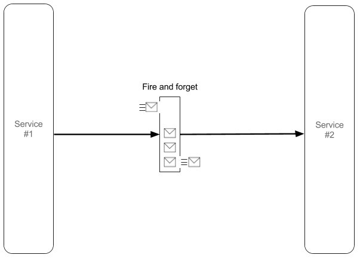
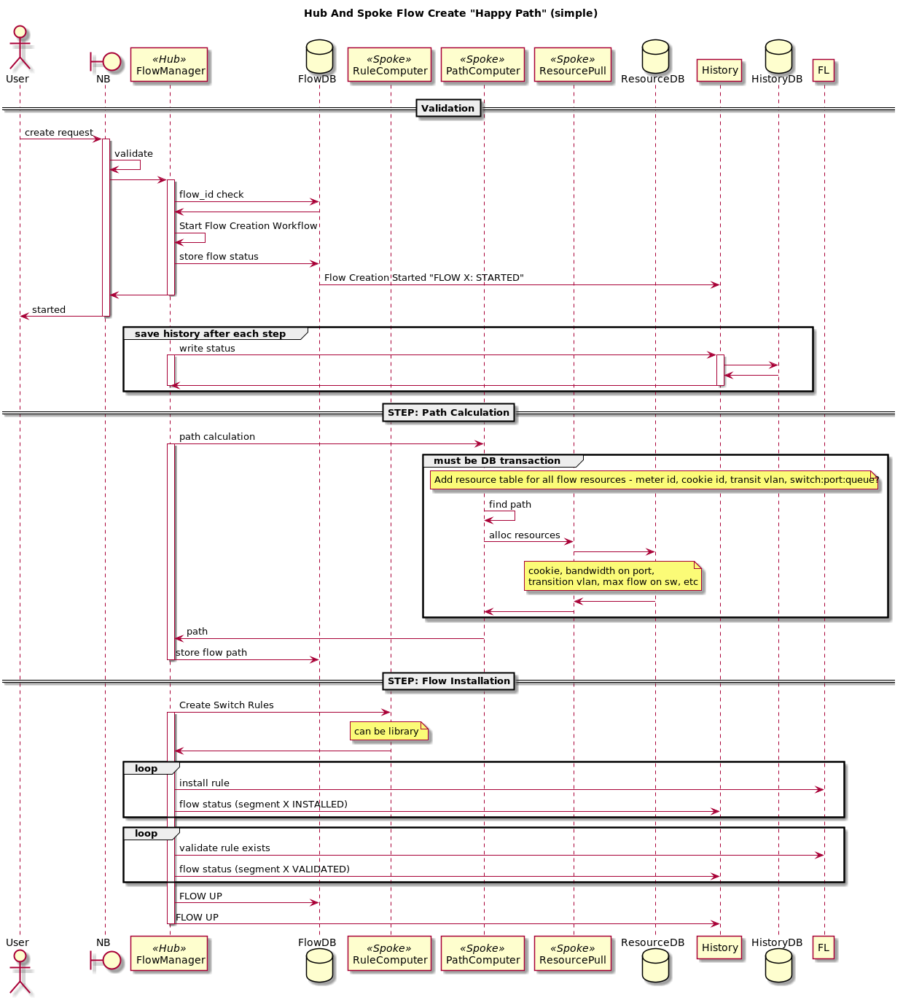
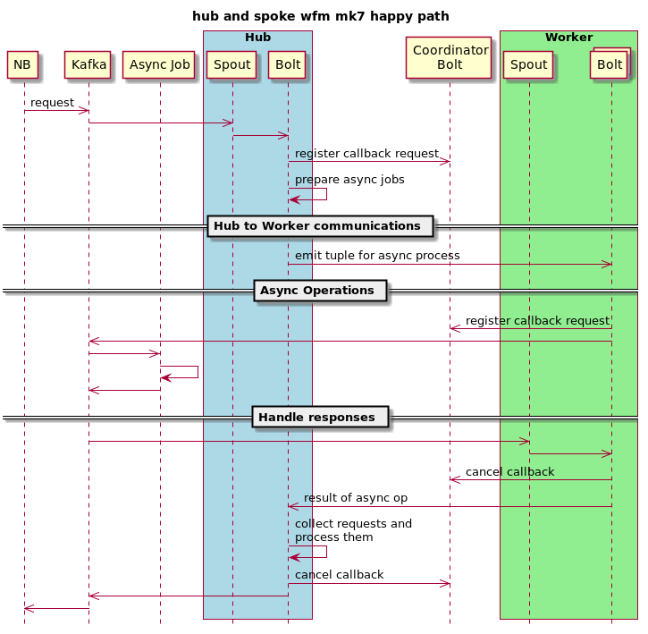
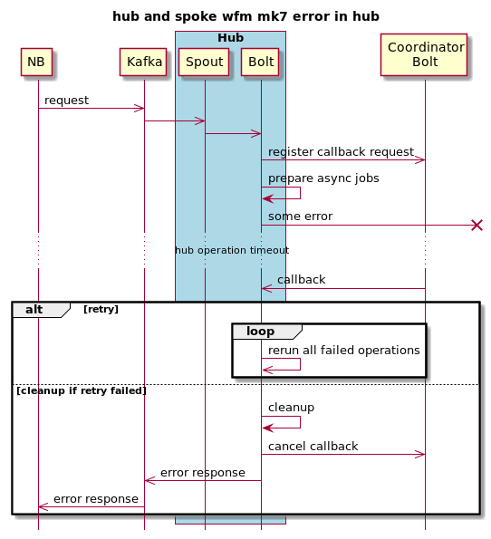
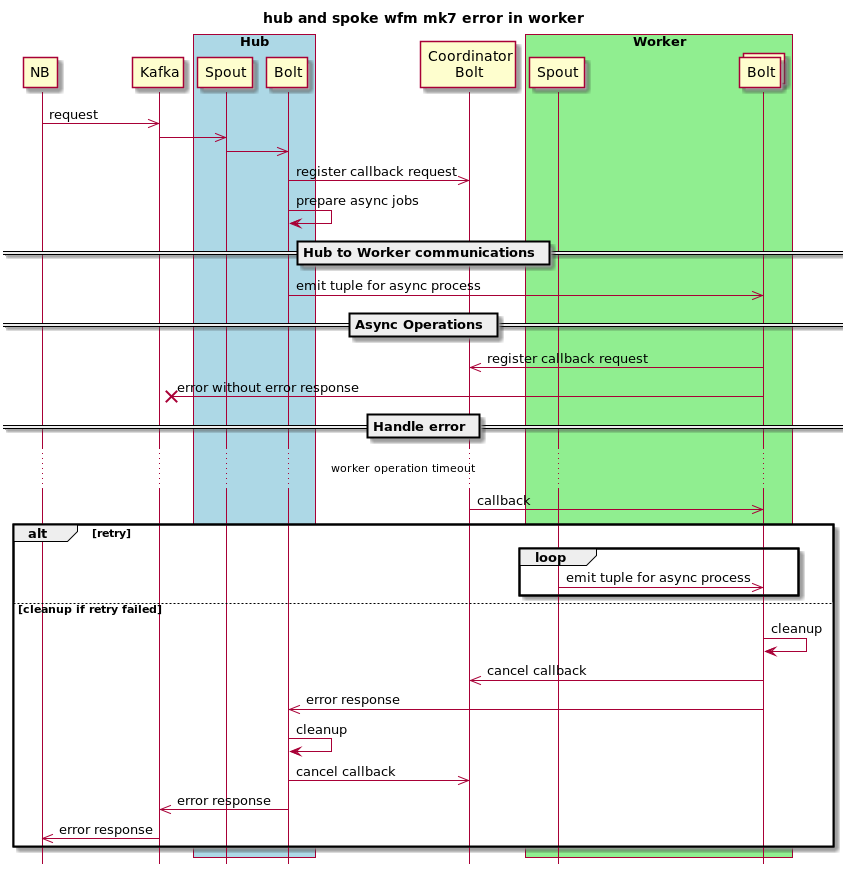
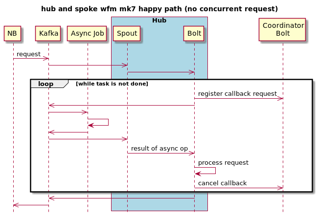

# Workflow manager with hub and spoke on Storm PoC 

## Fire and forget model

Сurrently, in kilda (ver 1.2.*) we use fire-and-forget model that I'll abbreviate here as FAF. 
FAF is the simplest of all conversations. The simplicity and loose coupling of FAF comes at a 
price: error handling is not possible because there is no feedback regarding message delivery. 
Therefore, FAF has to use Guaranteed Delivery or be content with "best effort" delivery, where 
messages may be lost.

## Hub and spoke the main idea

A spoke-hub distribution paradigm is a form of transport topology optimization in which 
traffic planners organize routes as a series of "spokes" that connect outlying points to a 
central "hub". Simple forms of this distribution/connection model compare with point-to-point 
transit systems, in which each point has a direct route to every other point, and which modeled 
the principal method of transporting passengers and freight until the 1970s. 

We are going to use that paradigm for solving problems that come from FAF. The main idea is 
to operate and control all execution from one point - hub, and distribute all asynchronous 
operation to spokes.

## Problems of Storm

But here we have a problem. In storm, you can't send an async request from a bolt and just 
wait, you need to release a thread and process another tuple. But if you still have to send 
such an async request, you need a guarantee to get a response from an asynchronous worker who 
gets your message. That is a problem because we can't guarantee that a worker is alive.

## Solution

I propose to use additional spout and bolt. I called them Coordinators who will send timeout to 
bolt in case of any problems on the worker side.

### Happy path with asynchronous calls

### Handling errors in hub

### Handling errors in worker

### Happy path without concurrent asynchronous calls (simple case)

## PoC components

CoordinatorSpout - spout that infinitely pulls tuple to CoordinatorBolt.
 We can't use Ticker bolt instead, because its minimal trigger interval is 1s.
CoordinatorBolt - contains all callback requests from clients.
HubBolt - base class for hub.
WorkerBolt - base class for worker.
FlowCrudBolt and FlWorkerBolt - contain business logic of current PoC. 
nb.py - Northbound analog that parses REST calls and puts them to Kafka.
fl.py - Floodlight analog that reads messages from Kafka and responds to them.

## how to run

- Run Kafka server. I prefer do docker run --rm --net=host landoop/fast-data-dev
- Create virtualenv for nb.py and fl.py with requirements from requirements.txt
- Run nb.py and fl.py
- Run main method from Topology class.
- The rest-api.http file contains 3 requests: one for happy path, one for errors on the hub, and last one - for worker error.

links:
https://www.enterpriseintegrationpatterns.com/patterns/conversation/FireAndForget.html
https://en.wikipedia.org/wiki/Spoke%E2%80%93hub_distribution_paradigm

