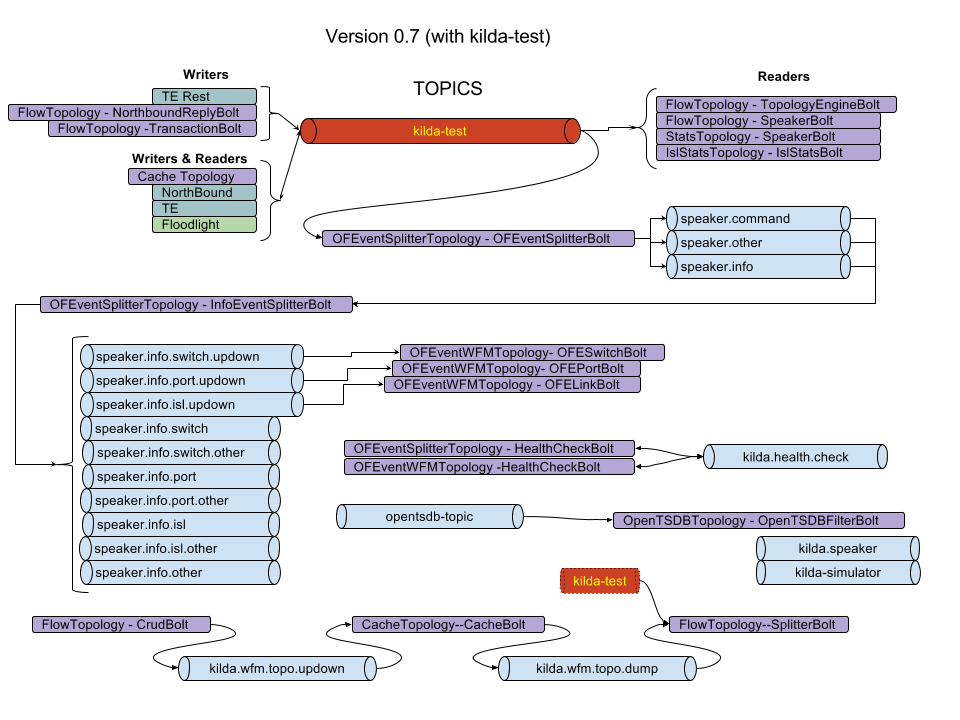

# Kafka topics
All messages transferred via kafka are serialized into json format.

## Version 0.8 Kafka Design

### Introduction
Version 0.8 has been refactored with a focus on clear topics per inbound component.
For instance, the floodlight module should have a clear input topic (eg kilda.speaker.*),
and it should understand where to send responses to, within reason (eg kilda.flow, 
kilda.topo.event, etc).

To some degree, the more granular we can make it, the easier it is for components to opt into
exactly what they want to listen to.

Regarding the components that initiate traffic, and receive it, this document will just use
some shorthand references to classes or modules to facilitate understand where in the code
base to look to understand the details better.

### Topology Discovery

### Flow Management

This involves a request to the NB API, through the FLOW WFM, Topology Engine, and OF Speaker

Process:
```
FlowTopology::  --> kilda.speaker.flow --> Floodlight::KafkaMessageCollector
- InstallIngressFlow
- InstallEgressFlow
- InstallTransitFlow
- InstallOneSwitchFlow
- RemoveFlow


```

### Other NorthBound API request

```
??::?? --> kilda.northbound


where do errors go??
```
#### from FlowTopology

```
FlowTopology::CrudBolt --> kilda.northbound

```


## Version 0.7 Kafka Design

_The [source](https://docs.google.com/drawings/d/1MEwVnkaYMJ829FB_fKmKHiALokLLjoqcYBycvf0F6Pk) for
 this diagram is in a google drawing_




### Special Mentions

`kilda-test` is most used kafka topic into kilda project. It used into communications between kilda components (northbound,
topology engine, topology engine REST, workflow manager).

We can say that message divided on two part - first one is transport (used to address destination point), second
one - payload.

Example message:
```json
{
  "type": "COMMAND",
  "timestamp": 1511365147,
  "destination": "WFM",
  "correlation_id": "admin-request",
  "payload": {
    "type-specific": "payload"
  }
}
```

### Usage

#### `kilda-test`
* (W) Topology engine REST
* (R/W) Topology engine
* (R/W) Northbound
* (R/W) workflow manager
  * (R) OFEventSplitterTopology - OFEventSplitterBolt
  * (R) FlowTopology - SplitterBolt
  * (W) FlowTopology - NorthboundReplyBolt
  * (R) FlowTopology - TopologyEngineBolt
  * (R) FlowTopology - SpeakerBolt
  * (W) FlowTopology -TransactionBolt
  * (R) StatsTopology - SpeakerBolt
  * (R/W) CacheTopology - CacheBolt
  * (R) IslLatencyTopology - IslStatsBolt

#### `kilda.wfm.topo.updown` 
* (W) FlowTopology - CrudBolt
* (R) CacheTopology - CacheBolt

#### `kilda.wfm.topo.dump`
* FlowTopology--SplitterBolt (R)
* CacheTopology--CacheBolt (W)

#### `kilda.speaker`
#### `kilda-simulator` 

#### `opentsdb-topic` 
* (R) OpenTSDBTopology - OpenTSDBFilterBolt

#### `kilda.health.check`
* (R/W) OFEventSplitterTopology - HealthCheckBolt
* (R/W) OFEventWFMTopology -HealthCheckBolt

#### `speaker.info`
* (W) OFEventSplitterTopology - OFEventSplitterBolt

#### `speaker.command` 
* (W) OFEventSplitterTopology - OFEventSplitterBolt

#### `speaker.other` 
* (W) OFEventSplitterTopology - OFEventSplitterBolt

#### `speaker.info.other`
* (W) OFEventSplitterTopology - InfoEventSplitterBolt

#### `speaker.info.switch` 
* (W) OFEventSplitterTopology - InfoEventSplitterBolt

#### `speaker.info.switch.updown` 
* (W) OFEventSplitterTopology - InfoEventSplitterBolt
* (R) OFEventWFMTopology - OFESwitchBolt

#### `speaker.info.switch.other` 
* (W) OFEventSplitterTopology - InfoEventSplitterBolt

#### `speaker.info.port` 
* (W) OFEventSplitterTopology - InfoEventSplitterBolt

#### `speaker.info.port.updown` 
* (W) OFEventSplitterTopology - InfoEventSplitterBolt
* (R) OFEventWFMTopology- OFEPortBolt

#### `speaker.info.port.other` 
* (W) OFEventSplitterTopology - InfoEventSplitterBolt

#### `speaker.info.isl` 
* (W) OFEventSplitterTopology - InfoEventSplitterBolt

#### `speaker.info.isl.updown` 
* (W) OFEventSplitterTopology - InfoEventSplitterBolt
* (R) OFEventWFMTopology - OFELinkBolt

#### `speaker.info.isl.other` 
* (W) OFEventSplitterTopology - InfoEventSplitterBolt
