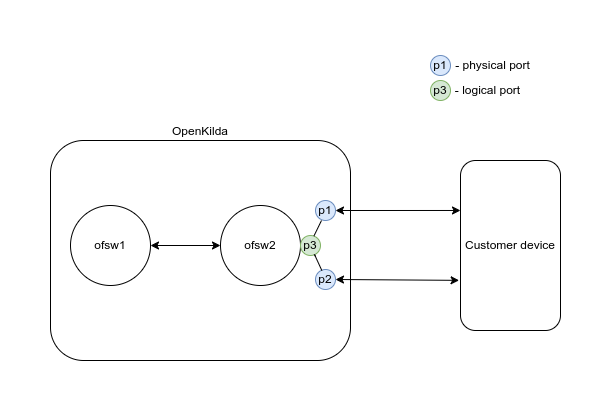
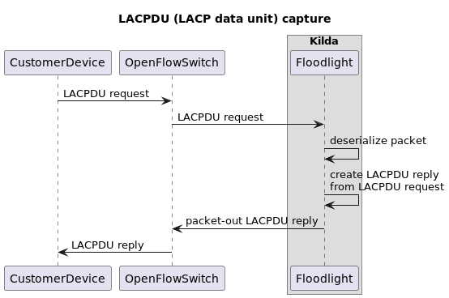

# Link Aggregation Control Protocol support

## Description

Link Aggregation allows parallel full duplex point-to-point links to be used as if they were a single link.
This design is focused on the following scenario:

  

A Customer device (Actor) is connected to an OpenKilda switch (Partner) by two or more physical cables.
All these cables are united into one virtual cable with higher capacity via LACP.
In this scenario OpenKilda works in the passive LACP mode. It means that LACPDU packets must be sent by a customer device which is in active mode.
To establish an aggregated link, OpenKilda must only reply on customer's LACPDUs.

To be able to work with aggregated links, OpenKilda must crate a Link Aggregation Group (LAG) on switch's physical ports.
OpenKilda LAG provides a logical port which can be used as an endpoint port for OpenKilda flows. 
This logical port is an input/output port for a logical group of united physical cables.

## LACP session control



An additional openflow rule will be installed for each LAG port on OpenKilda switches to catch LACP packets and send them 
to the controller. This rule has a match by `eth_type=0x8809` (Slow protocols), `eth_dst=01:80:C2:00:00:02` (Slow protocols),
and `in_port=<LAG_logical_port>`.
This rule will have a meter in order to not overload a controller. All LAG ports on a switch will share one meter.

LACPDU has several fields:
* systemId
* systemPriority
* key
* portNumber
* portPriority
* state

Several links can be aggregated correctly if they have the same `systemId`s, the same `key`s, but different `portNumber`s. 
OpenKilda can aggregate any ports. So, it should respond with constant `systemId` and `key` but different `portNumber`s.
A port number value should be copied from the incoming LACPDU packets to avoid port collisions on partner's side. 

Actor state should be determined in the following way:
* active = false (passive LACP)
* timeout = copied from incoming packet (fast/slow timeout)
* aggregation = true (all endpoints are aggregeteable by OpenKilda)
* syncronization = true
* collecting = copied from an incoming packet
* distributing = copied from an incoming packet (OpenKilda is ready to send/receive data as soon as a partner's system is ready)
* defaulted = false (predefined partner system info isn't supported)
* expired = false

### API 

To enable LACP we will use an existing API `POST /v2/{switch_id}/lags`.
A new field `lacp_reply` will be added to the request body. This field will be `true` by default. 
`lacp_reply=true` means that OpenKilda will reply on LACP requests.
`lacp_reply=false` means that OpenKilda will ignore LACP requests.

LAG create request:
```json
{
  "port_numbers": [1,2,3],
  "lacp_reply": true
}
```

LAG response:
```json
{
  "logical_port_number": 555,
  "port_numbers": [1,2,3],
  "lacp_reply": true
}
```

To create a flow which will use this LACP, a user must set the received `logical_port_number` as a source or destination port 
in the flow create/update request.

### Disadvantages

An LACP session is established using the control plane. If connectivity is lost for a triple LACP timeout
(3 seconds for fast and 90 seconds for slow mode), all aggregated links on the disconnected switch should be marked as 
expired and stop transmit/receive data plane traffic.
