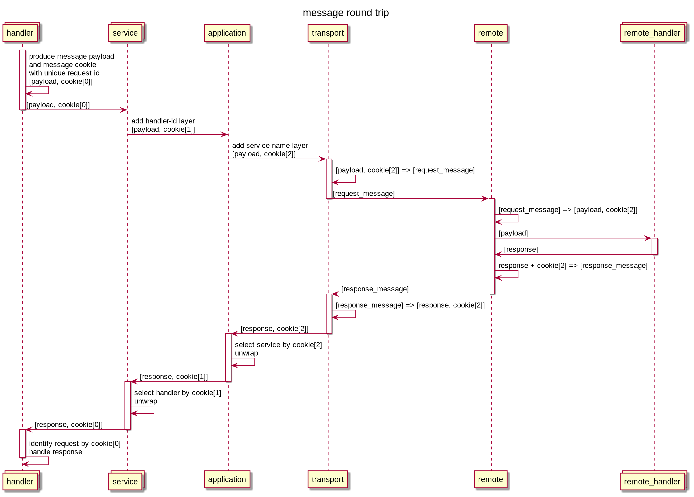

# Message cookie

## Concept
The goal of this approach is to be able to route response into specific handler (the handler that have produced request)
into specific service into specific application/storm-bolt.

The message producer must include into the message info unambiguously describing the sender (into hierarchical manner) - 
the message cookie object. Message recipient must produce response and copy message cookie from request. So the only 
task for message recipient in this approach is to copy message cookie from request into response.

Message cookie hierarchy represent/mirror code hierarchy that produce this cookie - for example, from innermost to 
outermost layers: `unique-request-id => unique-handler-id => service-id`. During message producing each code layer must
add corresponding cookie layer.

Message cookie must be placed into message envelope (`BaseMessage` and inheritors in our terminology). It will simplify
its copying on recipient side - message cookie will not be passed into code that handle request itself but copied on the 
level responsible for message decoding/encoding. At same time on request producer side, carrier decorators can add
extra message cookie layers during delivering message payload into message ejecting level without any interaction with
message payload object.

Keeping all dispatch info into request/response objects relief from keeping it somewhere on request side and as result
no need to track it for invalidation and obsolescence.



## Wrapping process

Cookie wrapping or layer adding process can be done by carrier(objects responsible for communication with transport layer) 
decorators. I.e. application produce service and provide carrier object decorated with object that will add service
name cookie layer to each produced requests.

For example, we have an interface defining some carrier that will be used by service and by handlers inside service:

```java
public interface SomeCarrier {
    void sendCommandToSpeaker(CommandData command, @NonNull MessageCookie cookie);
}
```

We can define a decorator that adds some cookie layer during request to the `sendSpeakerCommand`.

```java
public class SomeCarrierDecorator implements SomeCarrier {
    private final SomeCarrier target;
    private final String layerValue;

    public SomeCarrierDecorator(SomeCarrier target, String layerValue) {
        this.target = target;
        this.layerValue = layerValue;
    }

    public void sendCommandToSpeaker(CommandData command, @NonNull MessageCookie cookie) {
        target.sendCommandToSpeaker(command, new MessageCookie(layerValue, cookie));
    }
}
```

And on application init we will create service in this way:

```java
public class App {
    Map<Sting, ServiceBase> services = new Map<>();

    public void init() {
        SomeService someService = new SomeService(new SomeCarrierDecorator(carrier, "some_service_name"));
        serivces.put("some_service_name", someService);
    }
}
```

So on response we can locate required service in this way: 

```java
public class App {
    Map<Sting, ServiceBase> services = new Map<>();

    public void dispatch(MessageData payload, MessageCookie cookie) {
        ServiceBase service = services.get(cookie.getValue());
        if (service != null) {
            service.dispatch(payload, cookie.getNested());
        } else {
            log.error("dispatch error");
        }
    }
}
```

Service itself can add one more decorator to the carrier, responsible for adding handler unique id cookie layer. And
dispatching can be continued inside service. So each code layer process it's own message cookie layer and fully control
the meaning of cookie value (on specific layer).

## Some possible tooling improvements

`MessageCookie` can define equals/hash methods that do not take into account value of nested field/cookie. In this case
cookie object itself can be used as `Map` key during dispatch.
