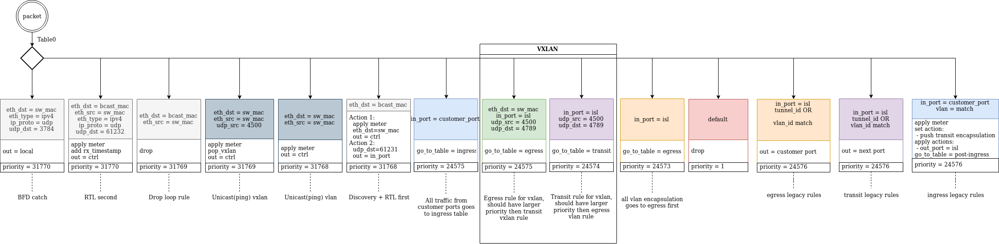
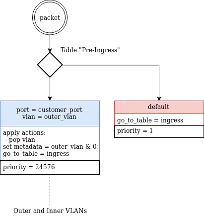
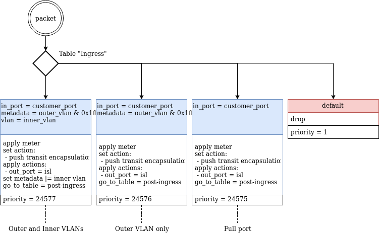
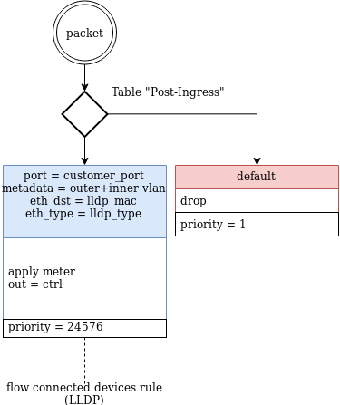
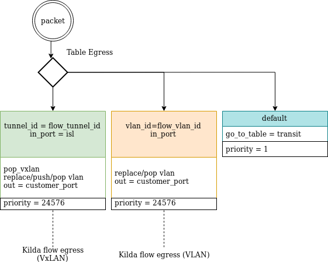

# Multi-Table Pipelines for Kilda

## Goal

The goal of this document is to describe how kilda works with switches that support multi-table mode.

## Kilda OF Rules

There are 4 types of rules that controller installs to a switch:
* Default Rules
* Ingress Rules
* Transit Rules
* Egress Rules 

### Default Rules

Kilda has a set of default switch rules that handle telemetry and discovery processes and also 
verify link consistency:

* Drop Rule: a custom rule to track all unresolved or un-routable packets.
* Verification Broadcast rule: catches discovery packets and passes them back to the speaker.
* Verification Unicast rule: catches customer flow ping packets and passes them back to the speaker.
* Drop Verification Loop rule: prevents flood of discovery packets among switches.
* Catch BFD rule: catch BFD telemetry packets and passes them to the switch.
* Round Trip Latency Rule: copies disco packets with timestamp writing and passes it back to speaker.
* Verification Unicast VxLAN rule: catches customer flow ping packets for VXLAN encapsulated flow.

### Customer Flow Rules

Along with the default rules, there are 4 types that belong to customer flows:

* Ingress Flow rule: match packet by port/vlan encapsulate it with VLAN/VXLAN and passes to the next hop.
* Single Switch Flow rule: match packet by port/vlan optionally re-tag packet and pass it to customer port.
* Transit Flow rule: matches packet by a port (and transit VLAN/VXLAN) and passes to the next hop.
* Egress Flow rule: matches packet by a port (and transit VLAN/VXLAN), removes transit encapsulation in case of
  VXLAN, and, optionally, re-tags VLAN. After that, it passes packets out to the customer port.

## Single-Table Mode Design

In a single-table mode, all flows are being installed in the table 0. This approach is very straightforward,
but at the same time it doesn't allow to build flexible solutions, i.e. q-n-q, applications, etc. Since all flows
are placed in a single table, you couldn't properly use metadata. There might be a disadvantage because of the table size limitations.
For mode details on single-table mode refer [Single Table Mode](SingleTableMode.pdf)

## Multi-Table Mode

To address problems of single-table mode, it's proposed to split rules by tables and specify a set of additional
rules that will wire them together. In this mode, the controller will manage 7 tables of a switch:
* Input table(0): an entry point for the packet.
* Pre Ingress Table(1): the first table in a chain to handle customer port traffic could contain additional matches. 
* Ingress Table(2): the second table in a chain for the ingress traffic.
* Post Ingress Table(3): the last table in a chain for the ingress traffic.
* Egress Table(4): a table for egress rules.
* Transit Table(5): a table for transit rules. 
* Applications Table(6): the table for mirroring traffic based on enabled apps for flow.

An aggregated list of rules for Multi-Table Mode is available [here](MultiTableMode.pdf).

### Input Table Rules

In multi-table mode, the input table(0) is responsible for doing the following:
* Provide backward compatibility for single-table mode customer flows.
* Color traffic by port and pass it to the proper table.
* Maintain default rules.

Here is a set of possible rules and its actions that could be placed in a table(0):

#### Service Default Rules

To dispatch a packet to proper tables, there must be an additional set of rules:

* Ingress Pass Through rule: matches traffic by a port and passes it to the ingress tables.
* VXLAN Egress rule: matches traffic by eth_dst and VXLAN ports and passes it directly into the Egress table (VXLAN shortcut)
* VXLAN Transit rule: matches traffic by in port and VXLAN ports and passes it directly into theTransit table (VXLAN shortcut)
* ISL VLAN Egress rule: if traffic comes from an ISL port, but doesn't have a VxLAN encapsulation, passes it to the egress table for further processing. 
NOTICE: the Egress Table is defaulted to passing packets down for transit. This is due to it is impossible to figure out whether 
the switch is a terminating switch for a customer flow or a transit switch. For details, please see VXLAN vs VLAN encapsulation.

#### Backward-compatibility

After switching to Multi-Table mode, all existing flows will still remain in table 0 (where they are normally in a 
Single-Table mode). Service default rules won't steal traffic, since they have priority lower than the rules listed above. 

### Pre Ingress Table Rules

The Pre-Ingress Table could be used as a first step in ingress packets handling. Notice that a default fallback
is to pass traffic to the ingress table.

 

### Ingress Table Rules

Ingress Table could be used as a second step in ingress packets handling. Notice that by default it drops packets.

 

### Post Ingress Table Rules

The Post Ingress Table is a third table in ingress packet processing. Notice that by default it drops packets.

 

  
### Egress Table Rules

The Egress Table contains the rule to re-tag customer packets and remove VXLAN. By default, it passes packets down to the Transit Table.

 

### Transit Table Rules

The transit Table passes traffic to the next switch. By default, it drops unmatched packets.

 
 
## Modes Change and Customer Flow migration

In order to migrate to Multi-Table mode, operator must do the following steps for each switch:

* Enable Multi-Table for the switch via NorthBound API. See `PUT` `/v1/switches/{switch-id}/properties`.
* Validate the switch and verify that there are no rule discrepancies.
* Sync flows that go through the switch one by one, starting from `default` flows.
* Validate switch and verify that all rules are installed. Check flow statistics for the traffic details.

NOTE: In case of migration from Multi-Table to Single-Table mode, all the steps remain the same, except the flow sync.
Operator must start migrating from `non-default` flows first, and then proceed with default ones.

To change the mode of an existing switch from Single-Table to Multi-Table operator must use the
switch properties endpoint in the Northbound API.

NOTE: change of the mode will cause the switch sync procedure. It's responsible for creating default and service rules
for the mode setup. It will not migrate customer flows to the new pipeline. 

IMPORTANT: if the switch is operating in multi-table mode, and there are multi-table customer flows on it, changing
the property back won't remove default and service rules. These rules are required for the customer flow rules. 
 
A Flow migration from one mode to the other could be achieved by various ways:
* Flow sync.
* Flow update.
* Flow re-route (NOTE: reroute will migrate the flow only if the rerouting is successful. The rerouting logic assures that the current flow
path and new one is not the same and the flow is not in the `UP` state. If the checks pass, actual re-route will happen)

NOTE: default flows should be migrated to multi-table mode first.

## Implementation Details

### ISL Lifecycle Management

Refer to the ISL service rule lifecycle management [here](../network-discovery/ISL-FSM.png).
 
### Database changes

For the smooth flow migration to the Multi-Table pipeline, new fields were added to the `Flow`
and `PathSegment` nodes. `src_with_multi_table` and `dst_with_multi_table` are boolean flags
that are responsible for tracking information about the actual state in which the flow was created
per each switch. NOTE: since single switch flows don't have path segments in DB,
the tracking is done on the both levels.

A new switch property and kilda configuration parameters are introduced and added to REST API as well.
Kilda configuration is responsible for handling newly added switches, while switch property changes
switch mode on the fly.

