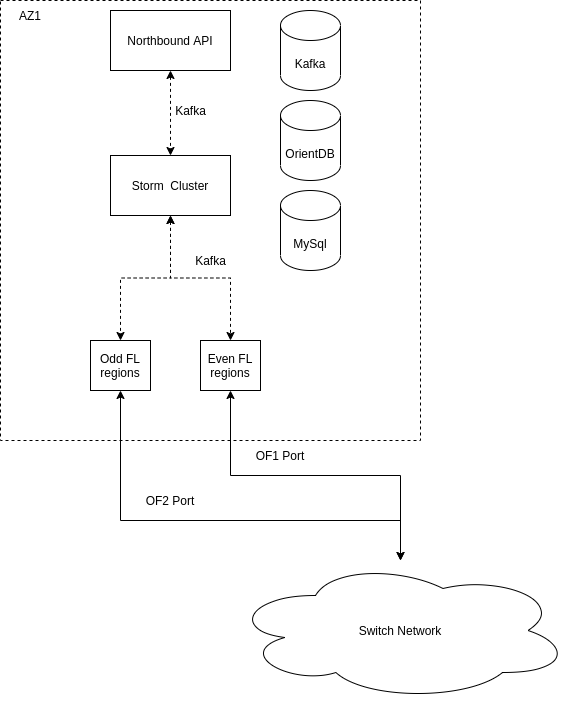
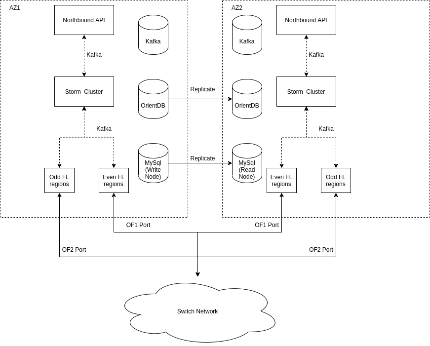
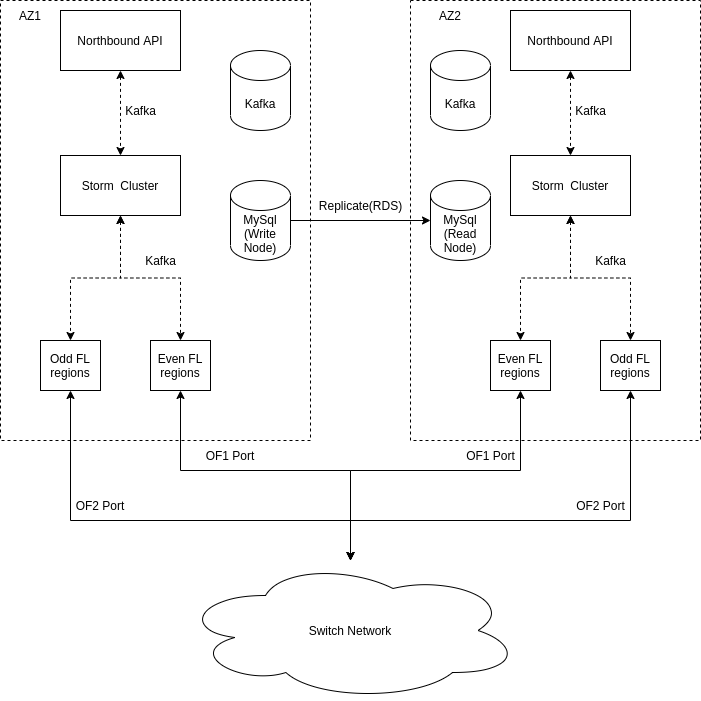
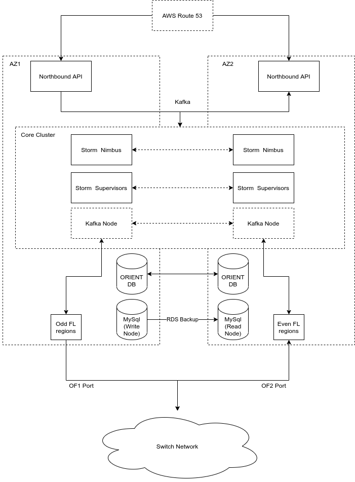

# Multi AZ Kilda Env

## Problem

Current Kilda standard deployment assumes that environment is deployed in a single
availability zone. And however there is possibility to deploy env with no downtime
on a control plane, by using blue-green approach, there is a still room for downtime
caused by network or host outages. Purpose of this document is to provide a list of
actions and improvements that will increase ability to survive any outages.

## Current State

## Related problems

- Apache Storm 1.x has limitations for deploying it on top of kubernetes
- Orient DB is a SPoF
- Mysql is a SPoF as well, but it's only used for history data

## Possible options

Pre-requirements:
- Upgrade storm to 2.x
- Upgrade OrientDB from 3.0.3 to fix replication issues
- Time series data is out of scope and might be lost in some rare cases.

### Active/Standby on the same DBs

Pros:
- Relatively easy to achieve
- Low cost impact

Cons:
- Hard to move to active/active

### Active/Standby without Orient DB

Suggested actions:
- Migrate to mysql for network data.

Pros:
- Low cost impact

Cons:
- Active/Active is still questionable

### Active/Active

Pros:
- No downtime
- Easy to operate(One cluster to work on)
- no external watchdog at best

Cons:
- High costs
- A lot of code changing
- Cloud provider locking possible
- More then 2 AZ at worst
- Possible Split Brains 
