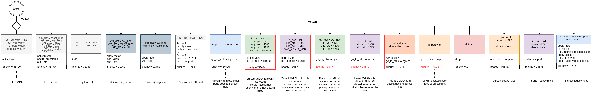
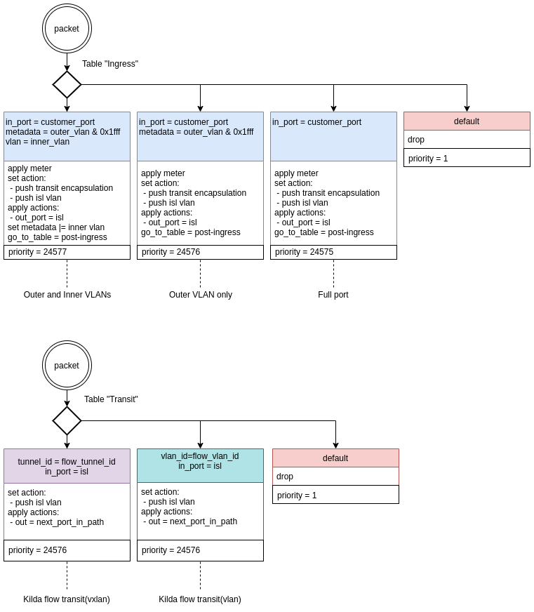

# Multiple ISLs on the same port (VLANs) [Draft] [Proposal] [Not implemented]

## Goal 

The goal of this document is to describe how kilda works with virtual ISLs. 

## Description

We must be able to create tagged ISLs. There may be different VLANs at the ends of such ISLs. 
We need to specify the interval of the used VLANs (for example: 4083, 4087-4091). Also, we need to 
update discovery and other modules for these ISLs.

## Rules

This feature is based on [Multi-Table Mode](../multi-table-pipelines/README.md).

### Input Table Rules

For each port + ISL VLAN, we will need to add additional rules for transit and egress. 
These are two rules for VxLAN and one rule for VLAN, in which we will pop ISL VLAN.
We also need to lower the priority for the rules for non-virtual ISLs.

Here are these rules (marked with a red border) in the table(0):

### Ingress and Transit Table Rules

For ingress and transit tables, we need to add `push isl vlan` to all rules if the next ISL is virtual.

 

An aggregated list of rules is available [here](multi_isl_tables.pdf).

## Components affected by this feature

### Floodlight

* Floodlight requires a change in the processing of discovery packets on virtual ISLs.
* Floodlight must be able to install additional rules on the switch for each tagged ISL. Additional actions for flow rules must be added.

### Path computation engine

The definition of Edge needs to be expanded with the addition of VLANs. Virtual ISLs must be considered when building a network.

### Network topology

* Network topology requires changes when working with ISL.
* Particular attention should be paid to the discovery mechanism 
  because sending discovery requests for a large number of VLANs simultaneously can be expensive.
* In this topology, we also need to add the ability to create tagged ISLs.

### Flow topology

Both versions of CRUD require updating related to the processing of rules passing through virtual ISLs.

### Nbworker topology

* Flow validation requires updating because this feature affects the rules on the switch.
* A field will be added to PortProperties that will specify which VLANs for the virtual ISL we can use.

### SwitchManager topology

Due to a change in the rules on the switch, we need to update the synchronization and validation on the switch.

### LabService

In LabService, we need to add the ability to emulate the network through which virtual ISLs will be laid.

### Stats

It may be necessary to make changes to the statistics.

### Kilda GUI

Changes to the Kilda GUI will also be required.

## Database changes

There are two options:
1. Add two new fields (`src_vlan` and `dst_vlan`) to existing fields in the ISL model.
   
   This approach is not very convenient, but it is the fastest to implement. 

2. Create a new entity `Endpoint` with the fields `switch`, `port` and` vlan`, 
   divide such endpoints into `FlowEndpoins` and` IslEndpoint`, 
   then refer to them in the `Flow` and` Isl` models.
   
   With this approach, our entities will be more flexible and convenient, 
   but this will require additional time for code refactoring.

## Limitations

* The speed of each virtual ISL will be determined by the speed of the physical port.
* It will not be possible to create virtual ISLs (tagged ISL port) on customer ports.
* No changes are planned in the BFD in the scope of this issue.
