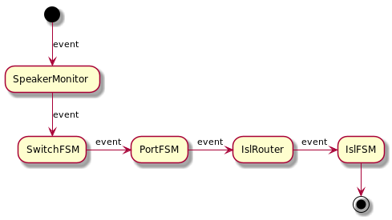
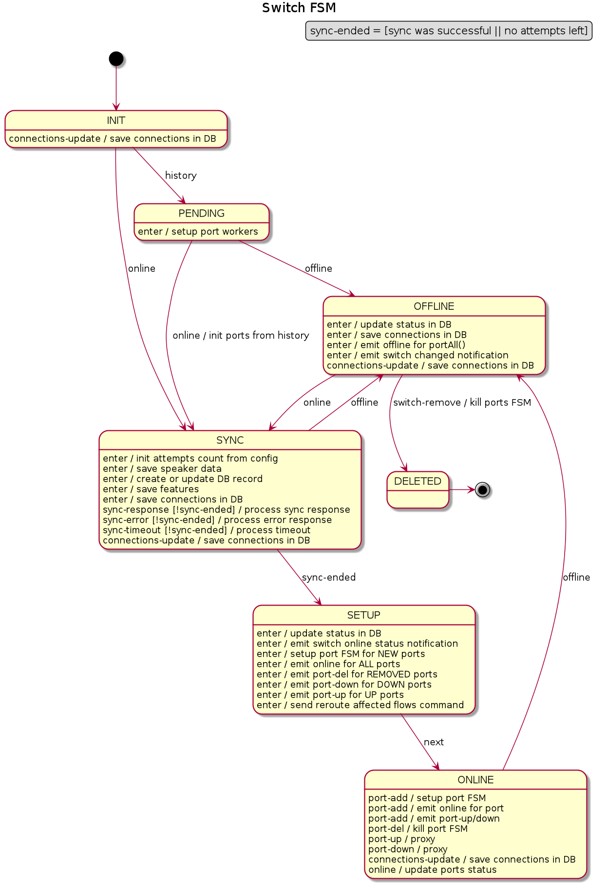
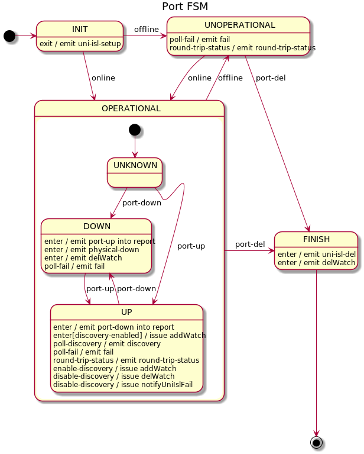
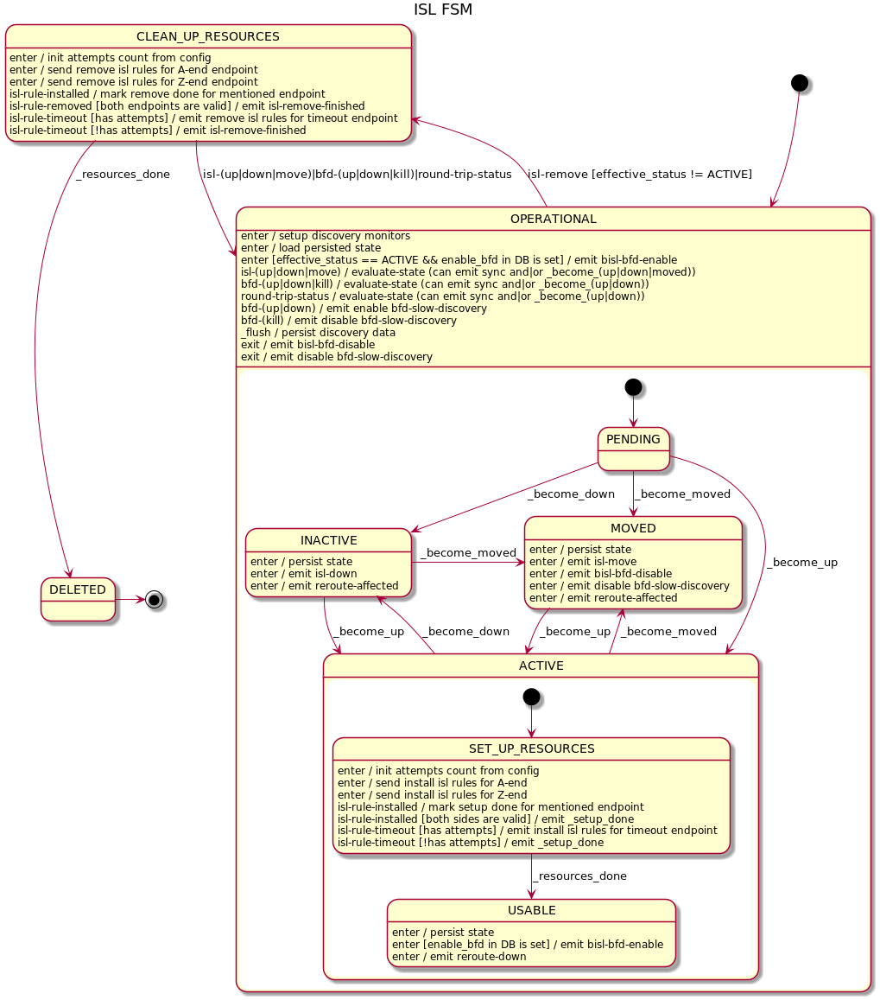

# Network discovery

## Overview
One of the main Open-Kilda task is automatic network discovery. The discovery 
process is not some one time action. We must be able to track and react on
topology change. I.e. new inter switch links (ISL) must be detected and used 
as possible route for existing and future flows. Corrupted (temporary or
permanently) ISLs must be detected too. All flows must be evacuated from such
ISLs.

Open-Kilda periodically push `discovery` packets into all switch port in "UP"
state. This `discovery` packet contain information from where it was 
sent(datapathId + portNumber) and time and some marker to distinguish `discovery`
packets from other traffic using OF match fields.

On receive of such packet, we got second endpoint (datapathId + portNumber). So
first endpoint extracted from packet payload and second is a switch+port where
we have received this packet. Lets name receive of `discovery` - 
`discovery-event`.

Because we send `discovery` packets via all active ports - for each ISL we will
receive 2 `discovery-event` - one for each direction. 

## Events model
Events produced by switches via OF:
* switch-added (ignored - have meaning only in multi-FL environment)
* switch-activated (alias switch-online)
* switch-deactivated (alias switch-offline)
* switch-removed (ignored - have meaning only in multi-FL environment)
* port-up
* port-down
* port-add
* port-delete
* port-other-update (ignored - must be translated into port-up/down event)

This set of events must be translated into ISL UP/DOWN events and
related artifacts(network topology stored into persistent storage).

Whole process can be divided into 3 separate layers - switch layer, port layer
and ISL layer.

To simplify event routing from switch and ports one more 
layer required - `ISL management`. This layer trace correspondence between 
endpoints (switch + port) and ISLs.

One extra layer of event processing - is SpeakerMonitor - it responsible for
speaker outage detection. It monitor speaker connection consuming `heart-beat`
events from speaker. In case of outage it produce `UNMANAGEMENT` notification
for next layer (switches FSM) and initiate state sync when speaker
communication restores.

## First layer - switch events processor

## Second layer - port events processor

# Third layer - ISL events processor

