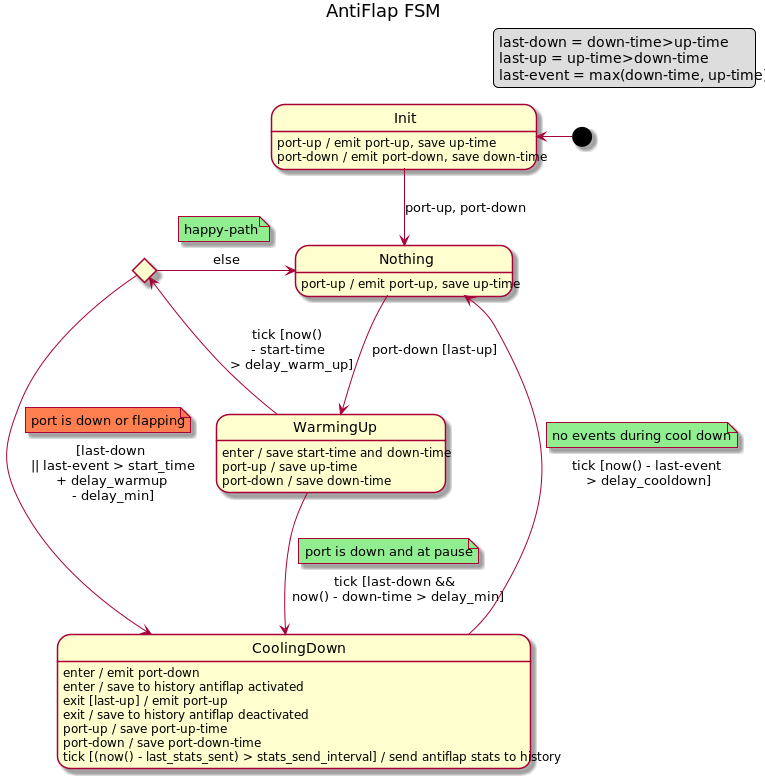
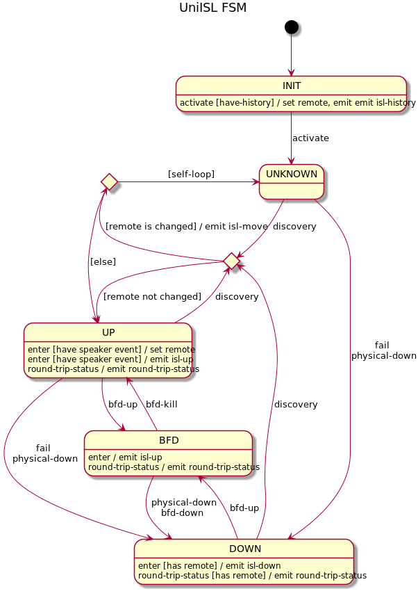
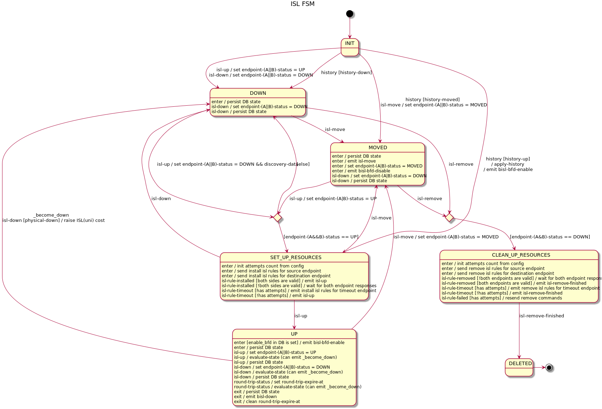
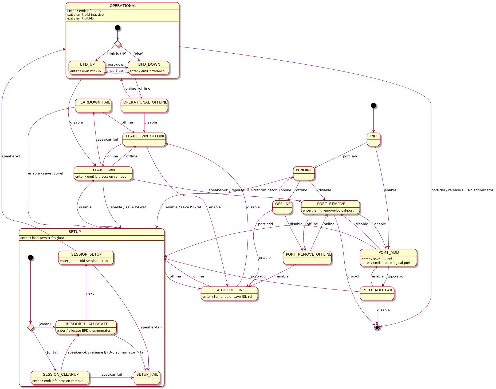
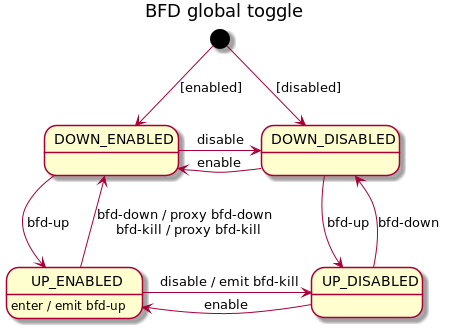

# Network discovery

## Overview
One of the main Open-Kilda task is automatic network discovery. The discovery 
process is not some one time action. We must be able to track and react on
topology change. I.e. new inter switch links (ISL) must be detected and used 
as possible route for existing and future flows. Corrupted (temporary or
permanently) ISLs must be detected too. All flows must be evacuated from such
ISLs.

Discovered ISL consist of:
* datapath + port-number (source)
* datapath + port-number (dest)
* link-speed
* link-latency
* BFD-support (and other optional capabilities)

Open-Kilda produce "discovery" packet (Ethernet+IP+UDP+LLDP), put inside source
datapath, source port-number, current time and send it using PACKET_OUT OF
message to the source switch and set as PORT_OUT source port-number in actions.

All switches have OF rule that match and send to controller our "discovery"
packets (using PACKET_IN message.

When controller receive "discovery" packet via PACKET_IN message it extract
source datapath and source port-number extract datapath and port-number 
(from PACKET_IN message) and treat it as destination datapath and destination
port-number. So now it have both ISL endpoints. Link speed is extracted from
current port-speed. Latency is calculated as current time minus packet create
time (extracted from packet) minus source switch latency (calculated by FL
using echo-request/response OF messages) minus dest switch latency. All
accumulated data used to create "discovery-event" and pass in into storm for
further processing.

This "process" is done for each enabled port of each switch on each N 
seconds(configuration parameter). As result we will receive 2 discovery
packets/event for each "link" - one for each direction. And because it repeats
periodically Open-Kilda can "detect" ISL-fails i.e. link-corruptions. And react
on them.

Only discovery events is not enough to "discover" all links in network, we need
to "know" the list of switches and list of their ports. This info is collected
from OF async messages - switch-add/remove, port-add/up/down/del.

## All events used in discovery process
* switch-added (ignored - have meaning only in multi-FL environment)
* switch-activated (alias switch-online)
* switch-deactivated (alias switch-offline)
* switch-removed (ignored - have meaning only in multi-FL environment)
* port-up
* port-down
* port-add (collect extra detail - port UP/DOWN status)
* port-delete
* port-other-update (ignored - must be translated into port-up/down event)

This events are wrapped into IslInfoData/PortInfoData messages and pushed into
storm for processing.

# Processing layers

Whole event process is slitted into several layers or serveral nested finite
state machines. Each layer is responsible for some specific "function".

## Switch layer
Track switch online/offline status and track port change between switch reconnects.
Also update DB with swich data.

## Port anti-flapping layer
Filter out port flapping events.

## Port events processor
Track port UP/DOWN state and control discovery poll process.
 

## Uni-ISL layer
Abstract the way how we track ISL status and responsible for ISL-MOVE detection.

## ISL events processor
Collect both discovery-event for both ISL directions, manage DB representation of
ISL, emit flows reroute on ISL discovery/fail.

## BFD port
Manage setup/remove BFD sessions

## BFD port global toggle
Responsible for global BFD toggle.

