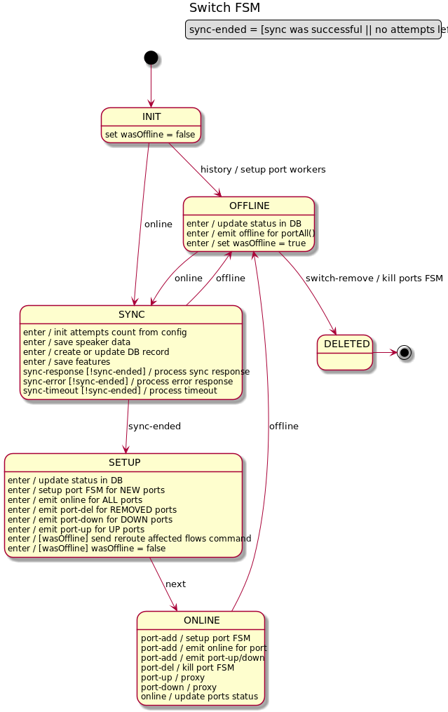

# Network discovery

## Overview
One of the main OpenKilda tasks is the automatic network discovery. This discovery 
process is not a one-time action. We must be able to track and react on
topology changes. For example, a new inter-switch link (ISL) must be detected and used 
as a possible route for existing or future flows. Temporary or permanently corrupted 
ISLs must be detected and all flows must be evacuated from these kind of ISLs.

Information about a discovered ISL contains:
* data path + port number (source)
* data path + port number (dest)
* link speed
* link latency
* whether it supports BFD or other optional capabilities

OpenKilda installs on all switches an OF rule that manages discovery packets. Switches use
that rule to send and receive discovery packets (based on PACKET_IN and PACKET_OUT messages),
as well as to report the state to the controller.

OpenKilda produces a "discovery" packet (Ethernet+IP+UDP+LLDP), puts inside it a source
data path, source port number, current time. OpenKilda sends this packet using a PACKET_OUT OF
message to the source switch and sets the source port number in actions as PORT_OUT.

When the controller receives a "discovery" packet via PACKET_IN message, it extracts
the source data path and the source port number from PACKET_IN message and uses it 
as a destination data path and destination port number on a receiving end point. 
Combining information from PACKET_IN and PACKET_OUT messages, a controller has information
about both ISL endpoints. Link speed is extracted from the current port speed. 
Latency is calculated as the current time minus packet create time (extracted from packet)
minus source switch latency (calculated by FL using echo-request/response OF messages) 
minus dest switch latency. All accumulated data is used to create a "discovery-event"
which is passed in to the Storm for further processing.

This "process" is done for each enabled port of each switch each N 
seconds (a configuration parameter). As a result, we receive two discovery
packets/events for each "link": one for each direction. Due to this process repeats
periodically, OpenKilda is able to detect ISL fails (link corruptions) and react
on them.

In order to reduce the number of PACKET_OUT and PACKET_IN messages, network topology
uses delays between discovery requests. These delays vary depending on discovery history
for the specific switch and port:
 - if the last discovery was unsuccessful for port without links, 
 then the interval for the next discovery messages will be increased 
 until we get a successful one;
 - if BFD is active on this endpoint, then regardless of whether the discovery 
 is successful or not, the interval for discovery messages will be increased.

Discovery events alone are not sufficient to "discover" all links in a network. We need
to "know" the list of switches and list of their ports. This information is collected
from OF async messages: _switch-add, switch-remove, port-add, port-up, port-down, port-delete_.

## All events used in discovery process
* _switch-added_ (ignored - have meaning only in multi-FL environment)
* _switch-activated_ (alias switch-online)
* _switch-deactivated_ (alias switch-offline)
* _switch-removed_ (ignored - have meaning only in multi-FL environment)
* _port-up_
* _port-down_
* _port-add_ (collect extra detail - port UP/DOWN status)
* _port-delete_
* _port-other-update_ (ignored - must be translated into port-up/down event)

These events are wrapped into IslInfoData or PortInfoData messages and pushed into
Storm for processing.

# Processing layers

Whole event processing is split into several layers: several nested finite
state machines. Each layer is responsible for some specific "function".

## Switch layer
The switch layer tracks switch status changes and tracks ports changes between 
switch reconnect events. It manages DB objects related to switches.

## Port anti-flapping layer
This layer detects and filters out port flapping events.

## Port events processor
The port events processor tracks port state changes (UP/DOWN) and controls 
the discovery poll process.
 

## Uni-ISL layer
This layer collects information about both ISL endpoints by extracting remote points from discovery
events. It is responsible for routing ISL event (correctly populate Storm tuple with 
fields used in stream fields grouping) and for tracking moved state.

## ISL events processor
The ISL events processor collects both discovery events for both ISL directions. It manages DB representation of
ISLs. The processor emits a flow reroute on ISL discovery or fail.

## BFD port
This layer manages setting up and removing BFD sessions.

## BFD port global toggle
This layer is responsible for the global BFD toggle.

# Discovery poll process
The discovery poll process is represented by 3 services, each one responsible for some small
particular part.

## Watch list service
The watch list service keeps the list of ISL endpoints (switch + port) available for
the discovery process. The port event processor is responsible for managing _add_ and 
_remove_ events from this list. Periodically, for each entry in this list,
the service produces a request to the `watcher` service.

## Watcher service
This service tracks the state of the particular discovery request. Using request
from watch list, the service produces and sends discovery requests to the `speaker`.

Each produced discovery request contains a unique identifier, discovery sent
confirmation, discovery response, and round trip notification are bring this
identifier back to the watcher service. If the unique identifier, extracted from one
of these responses, is missing in the "wait" list of the watcher, this response is
stale/foreign and must be ignored. See the discovery sequence diagram
above for details.

The watcher service is responsible for tracking round trip status (this status is
represented with "last round trip received time" for each network endpoint). On
receive-round-trip event from the `speaker`, the watcher service updates the
currently stored round-trip-status.

With some constant time interval (1 second should be a good default value) the 
watcher service emits a round-trip-status event for all network endpoints
(managed by this watcher service) into the port handler, which is responsible to route
this event to the correct ISL handler. ISL handler can use this round-trip-status data to
measure the affected time frame and use it during ISL state evaluation. 

## Decision maker service

The decision-maker collects and aggregates events from the `watcher` service.
