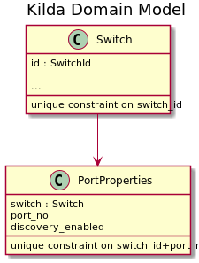
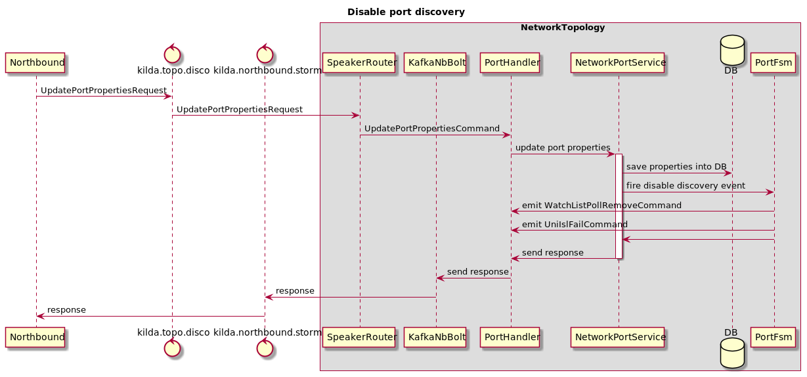

# Disable Port Discovery Feature

##  Overview

Some switch ports should not be used in network discovery process. By default
all ports on all switches are available for discovery. Admin has ability to
enable/disable discovery on a specific port on a switch using Northbound REST API.

## Persistence layer

On a DB layer enable/disable discovery property is stored in PortProperties object.

 

## Workflow

Northbound send update port properties request directly to the network topology.
  
For each port up event Port Fsm should check database and start network discovery
process only if it's enabled.

When port properties changed corresponding Port Fsm should be notified according
to the next diagram:

