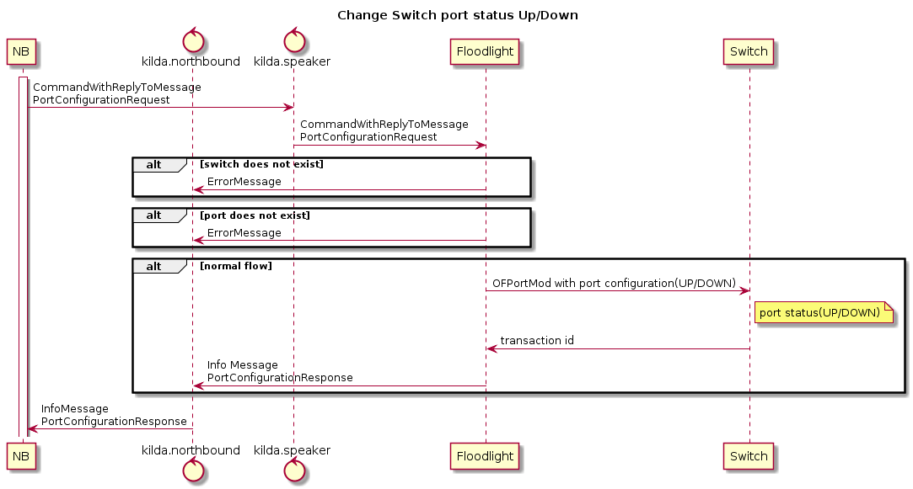

# Change Switch port status (Up/Down)

## The idea
To have the ability to change switch port status from Up to Down and Down to Up.

## Goals
Status of port changed Up/Down depends upon the configuration passed.

## Implementation
