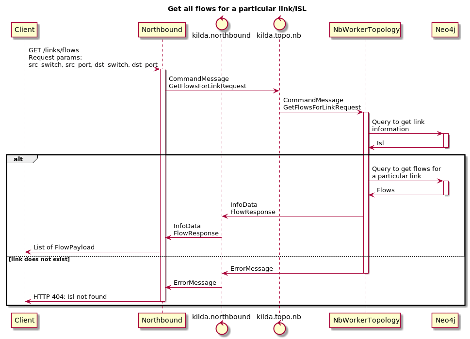

# Get all flows for a particular link/ISL

## The idea
To have the ability to get all flows for a particular link/ISL via Northbound API.

## Goals
Get all flows for a particular link/ISL via Northbound API.

## Implementation

