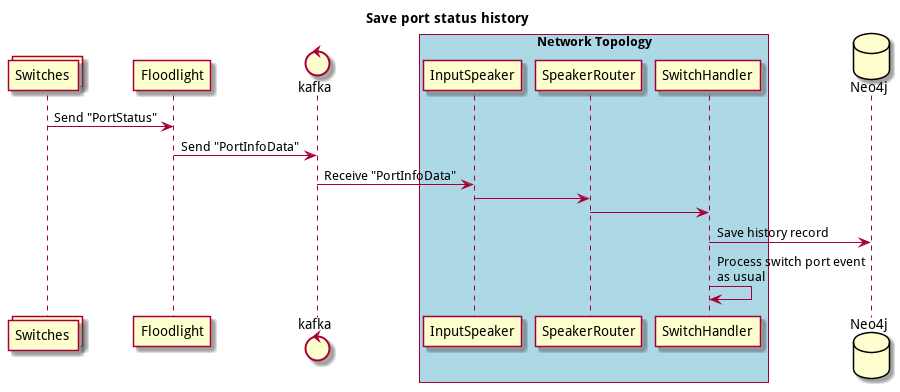
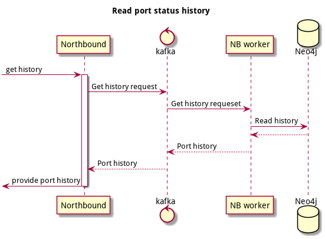

# Port status history

## Goals
- Be able to collect and see the history of the port.
- Easy to debug weird hardware behaviour.

## The idea
Handle PortStatus messages from a Switch.
Log received information as port history records.

Extend `PortInfoData` with `OFPortDesc` information. 
In Network topology log history data.
The history record will be stored as separate nodes. 
The node contains switchAddr, portNo, state, currentFeatures, supportedFeatures, etc.

Add `/v1/switches/{switch-id}/ports/{port}/history` to NB API.

## Diagrams

