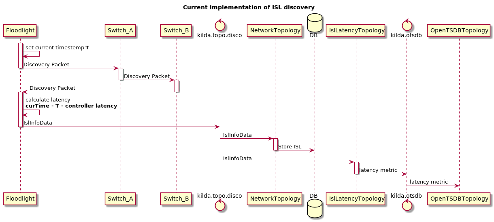
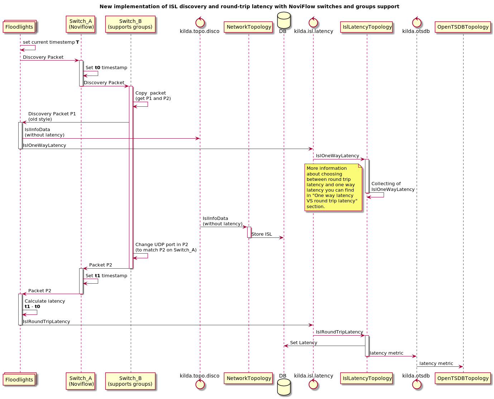
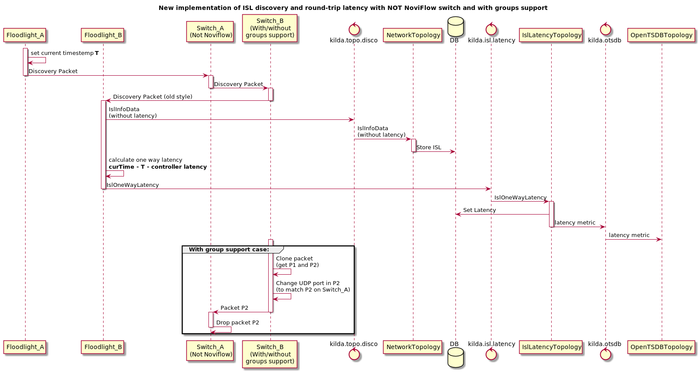
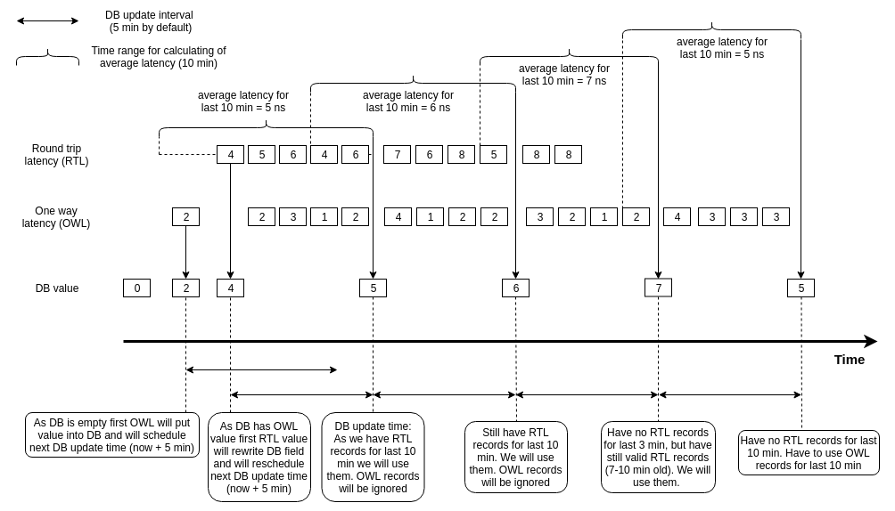
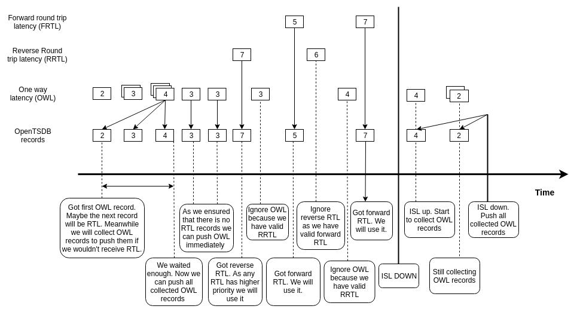

# Round trip latency

## Current implementation

In current implementation we measure latency from Switch A to Switch B by discovery packets.


## Round trip latency design with NoviFlow switches

The new way to measure round trip latency:

1) Send a discovery as a packet_out to switch A
2) Switch A put a timestamp t1 to the discovery packet and send it to switch B
3) Switch B receives the discovery packet and copies it. 
After copying we got two packets - P1 (for discovery) and P2 (for round trip latency).
Switch B has different actions for where two copies: 
    * P1 will be send to the controller
    * P2 will be modified (UDP port will be changed) and send back to switch A (via group table)
4) Switch A receives his own message, add a timestamp t2 to it and send it to a controller.
5) Controller use the discovery packet from Switch B for ISL discovery purposes and store ISL in DB (without latency).
6) Controller use the discovery packet from Switch A for a roundtrip latency (t2-t1) measurement purposes:
    * Save ISL latency in DB
    * Send latency stats to OTSDB 



## Round trip latency design with NOT NoviFlow switch

Not NoviFlow switches can't store timestamps so the old way of latency measuring will be used for them.


## One way latency VS round trip latency

How to determine which latency must be used?
There are 2 common cases:
1. We got round trip latency and one way latency.
2. We got only one way latency

Round trip latency is more prioritised so we will use one way latency only if there is no round trip latency data.
Ways of determination of RTL availability are different for Neo4j and for OpenTSDB.

### Storing latency in Neo4j Database

We can't update isl latency on each received latency packet. It's high load for Neo4j.
So we will collect latency for some period of time and update average latency in DB periodically. 
Two new config options were introduced for that purpose:

* `latency.update.interval` interval of sending new latency into DB
* `latency.update.time.range` interval of collecting latency to calculate average latency

At the moment of sending latency to DB we are checking RTL and one way latency records.
RTL records will be chosen if even one RTL record is still valid.
One way latency records will be chosen otherwise.

Here is a timeline of latency processing for Neo4j:



### OpenTSDB metrics

We send RTL metrics immediately. If we got RTL record one way latency metric will be ignored. 

If there is no RTL metrics we will start to collect one way records
and start to wait for some time. Collected batch of one way metrics will be sent to OpenTSDB after timeout.
All following one way records will be sent immediately.

New config option was introduce for this purpose:
`latency.discovery.interval.multiplier`

To get time of awaiting you need to multiply discovery interval on this config option.

Here is a timeline of latency processing for OpenTSDB:



## New OpenFlow rule and group

New openflow group copies discovery packets and sends one copy to controller
and the other copy back to sender switch.

Group description:

```
[GROUP_ENTRY1]
    ofp_version     = 4
    ControllerGroup = Management
    type = all
    Group_Id = 1
    [BUCKETS]
        [BUCKET0]
            Live = 1
            weight = 0
            wprt = any
            wgrp = any
            [ACTIONS]
                [OFPAT_SET_FIELD]
                    OFPXMT_OFB_ETH_DST = XX:XX:XX:XX:XX:XX (dst switch mac)
                [OFPAT_OUTPUT]
                    port = ctrl
                    mlen = 65535
        [BUCKET1]
            Live = 1
            weight = 0
            wprt = any
            wgrp = any
            [ACTIONS]
                [OFPAT_SET_FIELD]
                    OFPXMT_OFB_UDP_DST = 61232 (Round trip latency UPD port)
                [OFPAT_OUTPUT]
                    port = in_port
```

New default rule catches packets and sends them to controller:

```
[FLOW_ID5]
    ofp_version      = 4
    ControllerGroup  = Management
    Priority         = 31770
    Cookie           = 8000000000000006
    [MATCHFIELDS]
        OFPXMT_OFB_ETH_DST = XX:XX:XX:XX:XX:XX (broadcast packet mac)
        OFPXMT_OFB_ETH_SRC = YY:YY:YY:YY:YY:YY (src switch mac)
        OFPXMT_OFB_ETH_TYPE = 0x800
        OFPXMT_OFB_IP_PROTO = 17
        OFPXMT_OFB_UDP_DST = 61232 (Round trip latency UPD port)
    [INSTRUCTIONS]
        [OFPIT_APPLY_ACTIONS]
             [ACTIONS]
                [OFPAT_EXPERIMENTER]
                    [SET_COPY_FIELD]
                        n_bits = 64
                        src_offset = 0
                        dst_offset = 640
                        src_oxm = NOVI_OXM_RX_TIMESTAMP
                        dst_oxm = NOVI_OXM_PKT_OFFSET
                [OFPAT_OUTPUT]
                    port = ctrl
                    mlen = 65535

```

There are some technical problems with creating of this rule and group from CLI.

## Structure of discovery packet

Two new LLDP TVL fields will be added to discovery packet to store T0 and T1 timestamps.
New discovery packet structure:

```
 0                   1                   2                   3                   4              
 0 1 2 3 4 5 6 7 8 9 0 1 2 3 4 5 6 7 8 9 0 1 2 3 4 5 6 7 8 9 0 1 2 3 4 5 6 7 8 9 0 1 2 3 4 5 6 7
+-+-+-+-+-+-+-+-+-+-+-+-+-+-+-+-+-+-+-+-+-+-+-+-+-+-+-+-+-+-+-+-+-+-+-+-+-+-+-+-+-+-+-+-+-+-+-+-+
|                                    Destination Mac Address                                    |
+-+-+-+-+-+-+-+-+-+-+-+-+-+-+-+-+-+-+-+-+-+-+-+-+-+-+-+-+-+-+-+-+-+-+-+-+-+-+-+-+-+-+-+-+-+-+-+-+
|                                       Source Mac Address                                      |
+-+-+-+-+-+-+-+-+-+-+-+-+-+-+-+-+-+-+-+-+-+-+-+-+-+-+-+-+-+-+-+-+-+-+-+-+-+-+-+-+-+-+-+-+-+-+-+-+
|           EtherType           |Version|  IHL  |Type of Service|          Total Length         |
+-+-+-+-+-+-+-+-+-+-+-+-+-+-+-+-+-+-+-+-+-+-+-+-+-+-+-+-+-+-+-+-+-+-+-+-+-+-+-+-+-+-+-+-+-+-+-+-+
|         Identification        |Flags|     Fragment Offset     |  Time to Live |    Protocol   |
+-+-+-+-+-+-+-+-+-+-+-+-+-+-+-+-+-+-+-+-+-+-+-+-+-+-+-+-+-+-+-+-+-+-+-+-+-+-+-+-+-+-+-+-+-+-+-+-+
|        Header Checksum        |                       Source IP Address                       |
+-+-+-+-+-+-+-+-+-+-+-+-+-+-+-+-+-+-+-+-+-+-+-+-+-+-+-+-+-+-+-+-+-+-+-+-+-+-+-+-+-+-+-+-+-+-+-+-+
|                     Destination IP Address                    |          Source Port          |
+-+-+-+-+-+-+-+-+-+-+-+-+-+-+-+-+-+-+-+-+-+-+-+-+-+-+-+-+-+-+-+-+-+-+-+-+-+-+-+-+-+-+-+-+-+-+-+-+
|        Destination Port       |             Length            |            Checksum           |
+-+-+-+-+-+-+-+-+-+-+-+-+-+-+-+-+-+-+-+-+-+-+-+-+-+-+-+-+-+-+-+-+-+-+-+-+-+-+-+-+-+-+-+-+-+-+-+-+
| TVL Type = 1|      length     |                           Chassis Id                          |
+-+-+-+-+-+-+-+-+-+-+-+-+-+-+-+-+               +-+-+-+-+-+-+-+-+-+-+-+-+-+-+-+-+-+-+-+-+-+-+-+-+
|                                               | TVL Type = 2|      length     |               |
+-+-+-+-+-+-+-+-+-+-+-+-+-+-+-+-+-+-+-+-+-+-+-+-+-+-+-+-+-+-+-+-+-+-+-+-+-+-+-+-+-+-+-+-+-+-+-+-+
|              Port             | TVL Type = 3|      length     |              TTL              |
+-+-+-+-+-+-+-+-+-+-+-+-+-+-+-+-+-+-+-+-+-+-+-+-+-+-+-+-+-+-+-+-+-+-+-+-+-+-+-+-+-+-+-+-+-+-+-+-+
| TVL Type=127|      length     |       Organizationally Unique Identifier      | Timestamp type|
+-+-+-+-+-+-+-+-+-+-+-+-+-+-+-+-+-+-+-+-+-+-+-+-+-+-+-+-+-+-+-+-+-+-+-+-+-+-+-+-+-+-+-+-+-+-+-+-+
|                                          Timestamp T0                                         |
+                               +-+-+-+-+-+-+-+-+-+-+-+-+-+-+-+-+-+-+-+-+-+-+-+-+-+-+-+-+-+-+-+-+
|                               | TVL Type=127|      length     |Organizationally Unique Identi.|
+-+-+-+-+-+-+-+-+-+-+-+-+-+-+-+-+-+-+-+-+-+-+-+-+-+-+-+-+-+-+-+-+-+-+-+-+-+-+-+-+-+-+-+-+-+-+-+-+
|               | Timestamp type|                          Timestamp T1                         |
+-+-+-+-+-+-+-+-+-+-+-+-+-+-+-+-+                               +-+-+-+-+-+-+-+-+-+-+-+-+-+-+-+-+
|                                                               | TVL Type=127|      length     |
+-+-+-+-+-+-+-+-+-+-+-+-+-+-+-+-+-+-+-+-+-+-+-+-+-+-+-+-+-+-+-+-+-+-+-+-+-+-+-+-+-+-+-+-+-+-+-+-+
|       Organizationally Unique Identifier      | SwitchId type |                               |
+-+-+-+-+-+-+-+-+-+-+-+-+-+-+-+-+-+-+-+-+-+-+-+-+-+-+-+-+-+-+-+-+                               +
|                                          Datapath ID                                          |
+-+-+-+-+-+-+-+-+-+-+-+-+-+-+-+-+-+-+-+-+-+-+-+-+-+-+-+-+-+-+-+-+-+-+-+-+-+-+-+-+-+-+-+-+-+-+-+-+
| TVL Type=127|      length     |       Organizationally Unique Identifier      | Timestamp type|
+-+-+-+-+-+-+-+-+-+-+-+-+-+-+-+-+-+-+-+-+-+-+-+-+-+-+-+-+-+-+-+-+-+-+-+-+-+-+-+-+-+-+-+-+-+-+-+-+
|                                      Floodlight Timestamp                                     |
+                               +-+-+-+-+-+-+-+-+-+-+-+-+-+-+-+-+-+-+-+-+-+-+-+-+-+-+-+-+-+-+-+-+
|                               | TVL Type=127|      length     |Organizationally Unique Identi.|
+-+-+-+-+-+-+-+-+-+-+-+-+-+-+-+-+-+-+-+-+-+-+-+-+-+-+-+-+-+-+-+-+-+-+-+-+-+-+-+-+-+-+-+-+-+-+-+-+
|               |  Ordinal type |                            Ordinal                            |
+-+-+-+-+-+-+-+-+-+-+-+-+-+-+-+-+-+-+-+-+-+-+-+-+-+-+-+-+-+-+-+-+-+-+-+-+-+-+-+-+-+-+-+-+-+-+-+-+
| TVL Type=127|      length     |       Organizationally Unique Identifier      |   Sigh type   |
+-+-+-+-+-+-+-+-+-+-+-+-+-+-+-+-+-+-+-+-+-+-+-+-+-+-+-+-+-+-+-+-+-+-+-+-+-+-+-+-+-+-+-+-+-+-+-+-+
|                                                                                               |
+                                                                                               +
|                                             Token                                             |
+                                                                     +-+-+-+-+-+-+-+-+-+-+-+-+-+
|                                                                     |       End of LLDP       |
+-+-+-+-+-+-+-+-+-+-+-+-+-+-+-+-+-+-+-+-+-+-+-+-+-+-+-+-+-+-+-+-+-+-+-+-+-+-+-+-+-+-+-+-+-+-+-+-+
|     |
+-+-+-+
```

**NOTE:** This structure was generated be script from file `generate_packet_structure.sh`

##### TVL Packet Types

| TLV type | TLV name   | Usage in LLDPDU |
|----------|------------|-----------------|
|1         |Chassis ID  | Mandatory       |
|2         |Port ID     | Mandatory       |
|3         |Time To Live| Mandatory       |
|127       |Custom TLVs | Optional        | 
