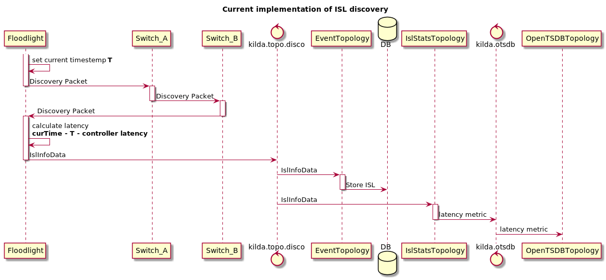
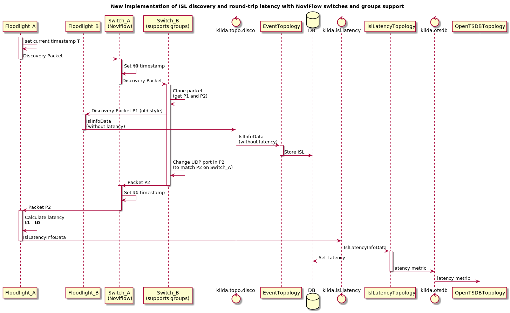
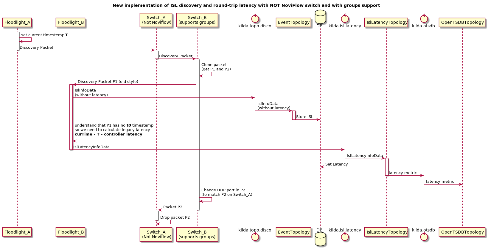
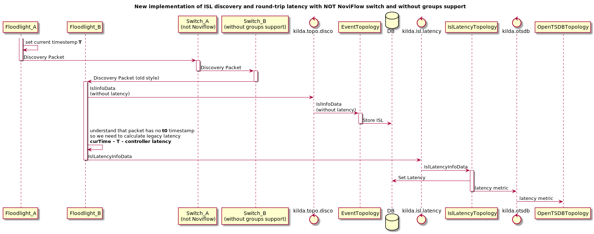
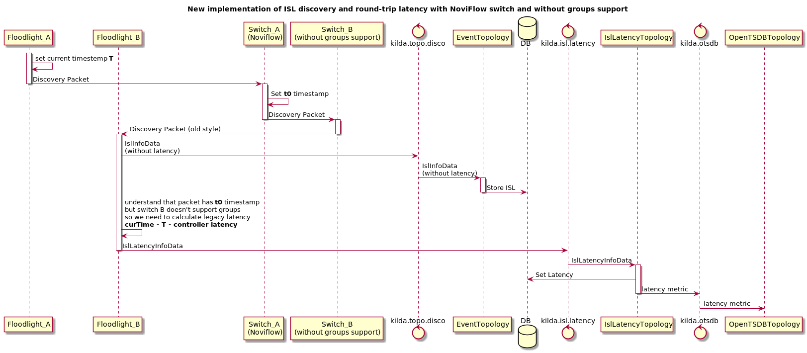

# Round trip latency

## Current implementation

In current implementation we measure latency from Switch A to Switch B by discovery packets.

## Round trip latency design with NoviFlow switches

The new way to measure round trip latency:

1) Send a discovery as a packet_out to switch A
2) Switch A put a timestamp t1 to the discovery packet and send it to switch B
3) Switch B receives the discovery packet and does 2 things: send it to the controller, modify packet (UDP port) and send it back to switch A (via group tables)
4) Switch A receives his own message, add a timestamp t2 to it and send it to a controller.
5) Controller use the discovery packet from Switch B for ISL discovery purposes and store ISL in DB (with old latency).
6) Controller use the discovery packet from Switch A for a roundtrip latency (t2-t1) measurement purposes:
    * Update ISL latency in DB
    * Send latency stats to OTSDB 

Note about step 5: Why we need to store old latency (not round-trip) in DB? Two reasons:
* Not NoviFlow switches can't measure round trip latency so we will store old latency for them
* To do not left field 'latency' in DB empty while we are waiting for message with round-trip latency.

Also IslStatsTopology will bew removed. New IslLatencyTopology will take over its duties.

## Round trip latency design with NOT NoviFlow switch

Not NoviFlow switches can't store timestamps so the old way of latency measuring will be used for them.

## Round trip latency design with NoviFlow switch and without groups support

