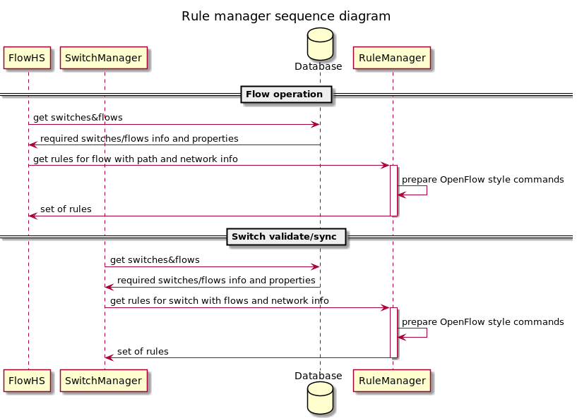

# Rule Manager

## Overview

Rule Manager is a separate OpenKilda component responsible for building switch rules. The main goal of this component is to gather all rule-related logic in one place. All other components (flow CRUD, flow/switch validation and sync, service rules management, etc.) should use rule Manager API to build rules.

## Details

Rule Manager implemented as a separate library module. It should support input data from database (for internal system calls) and data provided by user in json format (for manual calls). Manual calls should have CLI options to support data input from a file. Rule Manager should use adapters to encapsulate input data and provide the same results for different input types. 

Rule Manager should build rules as close as possible to the actual OpenFlow representation so Floodlight may just translate messages directly into OF commands. Rule Manager takes care of OpenFLow protocol version used by switch and create rules according to it. 

Rule Manager doesn't send any commands to anywhere it's responsible only for building rules. Sending results to floodlight is out of scope and should be covered by calling component.

## API

Rule Manager should be able to process two types of requests:
* Build rules for a flow.

  Required data: paths with flow, switch properties for used switches.

* Build rules for switch.

  Required data: set of flows with paths on this switch, switch properties.

Rule Manager generates the output in the same format for any request: set of custom commands including dependencies between them.
Output example in json format:
~~~json
[
    {
        "command_id": "uuid1",
        "command_type": "meter",
        "switch_id": "00:11:22:33:44:55",
        "parameters": {
            "id": 1001,
            "rate": 10000,
            "burst": 10100,
            "flags": ["KBPS", "BURST", "STATS"]
        },
        "depends_on": []
    },
    {
        "command_id": "uuid2",
        "command_type": "group",
        "switch_id": "00:11:22:33:44:55",
        "parameters": {
            "id": 2,
            "type": "ALL",
            "buckets": [
                {
                    "watch_group": "ANY",
                    "watch_port": "ANY",
                    "actions": [
                        { "action_type": "POP_VLAN" },
                        { "action_type": "PUSH_VLAN", "vlan": 123 },
                        { "action_type": "output_port", "port": "IN_PORT" }
                    ]
                }, 
                {
                    "watch_group": "ANY",
                    "watch_port": "ANY",
                    "actions": [
                        { "action_type": "output_port", "port": "22" }
                    ]  
                }]
        },
        "depends_on": []
    },
    {
        "command_id": "uuid3",
        "command_type": "flow",
        "switch_id": "00:11:22:33:44:55",
        "parameters": {
            "cookie": 123,
            "table_number": 2,
            "match": [
                {
                    "match_type": "IN_PORT",
                    "match_value": 7
                },
                {
                    "match_type": "METADATA",
                    "match_mask": 12345,
                    "match_value": 23456
                },
                ...
            ],
            "instructions": {
              "apply_actions": [
                {
                  "action_type": "PUSH_VLAN",
                  "vlan": 234
                },
                {
                  "action_type": "GROUP",
                  "group_id": 2
                },
                ...
              ],
              "go_to_meter": 1001,
              "go_to_table": 3,
              ...
            }
        },
        "depends_on": ["uuid1", "uuid2"]
    },
    ...
]
~~~

Examples of CLI calls:

~~~shell
java -jar rule-manager.jar flow --flow flow.json --network network.json
java -jar rule-manager.jar switch --switch switch.json --flows flows.json
~~~

## Additional changes

Floodlight should support custom commands formed by Rule Manager and translate them to OpenFlow representation.

All rule-related components (Flow-HS, SwitchManager, NB-worker) should use Rule Manager instead of their own rule-building code.

For more info see [implementation details](implementation-details.md).  
