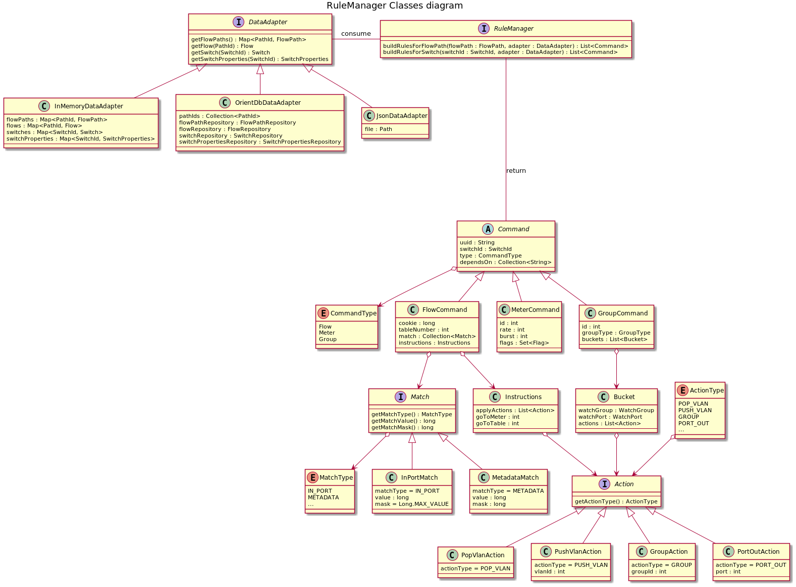
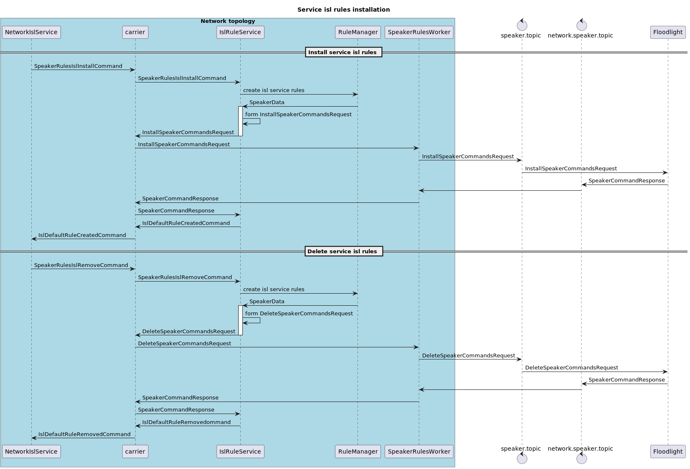

# Implementation details for RuleManager library

Facade of RuleManager lib is implemented as an interface with the following methods:
1. buildRulesForSwitch(SwitchId switchId, DataAdapter adapter)
2. buildRulesForPath(FlowPath flowPath, boolean filterOutUsedSharedRules, DataAdapter adapter)
3. buildRulesForYFlow(List<FlowPath> flowPaths, DataAdapter adapter)
4. buildIslServiceRules(SwitchId switchId, int port, DataAdapter adapter)

Different adapter implementations may query database or read a file under the hood. Each operation should use a separate adapter because they may cache data for better performance. All required parameters are provided as constructor params and filled by the calling component.

To generate service rules, generators hierarchy (similar to the current SwitchManager implementation) is used, but the logic is moved from Floodlight to the RuleManager lib, and the result formatted using a custom Command format. To generate flow-related rules, the similar way of generating is introduced. A custom Command format is similar to the OpenFlow format to simplify translation in the speaker.

From floodlight perspective, 3 new SpeakerCommands added: InstallSpeakerCommandsRequest, ModifySpeakerCommandsRequest and DeleteSpeakerCommandsRequest. Each request contains a collection of Commands of the same type (install/modify/delete). Commands inside the collection may have dependencies on each other. Requests should be sent to the speaker one by one. Floodlight should build a dependency tree, check it for errors (missing dependency, cycles etc), split collection to execution stages according to the dependency, translate custom Commands into loxigen OpenFlow representation, send it to devices, and process the results. 

RuleManager returns a collection of Commands. The calling component (Flow-HS/SwitchManager/Network) is responsible for encapsulating and sending these commands into Floodlight in correct order with the correct batch options.

