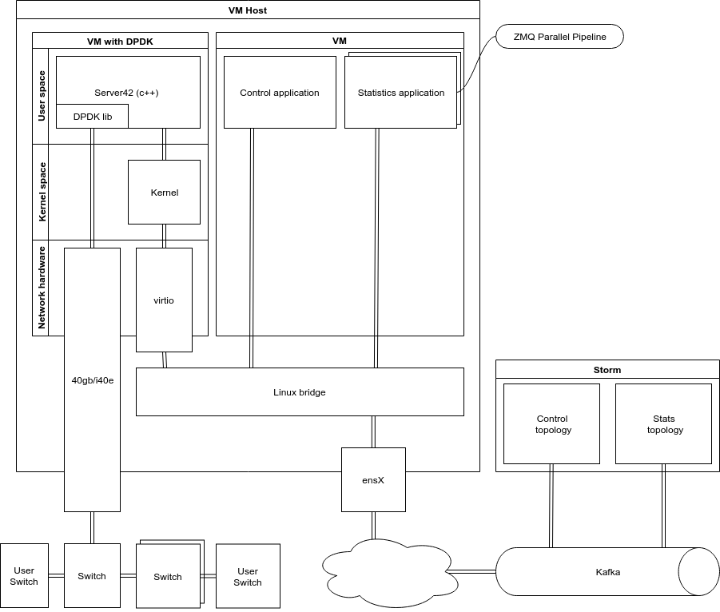
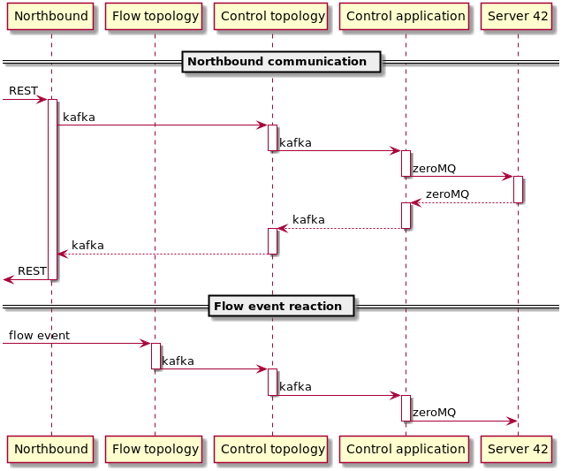
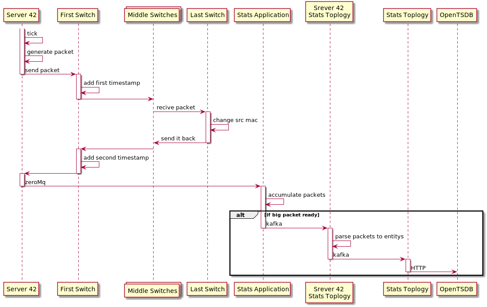

# Server 42 Project mk 1

## Description

In April, we had a long and hard discussion related to a big problem:
how to minimize PACKET_IN PACKET_OUT OpenFlow instruction on Floodlight.
This instruction makes a huge load on Floodlight and lowers our ability
to make a truly scalable controller.

Even a solution with multi Floodlight does not fit our requirements, since
we want to generate and parse a massive bunch of packets per second.
One of the issues is to send two packets per second for each flow
in both directions for sub-second latency measurement.
In the future, we want a lot of features from that project, and its first name
"Telemetry server" does not fit. So, for now, its name is Server 42.

## First feature - Latency measurement for flow
### Description
We want to know that traffic flows through a user flow
in sub-second perspective and have latency in our OpenTSDB database.

To implement this use case, we create an application based on
the real fast packet crafting and parsing solution - [DPDK](https://doc.dpdk.org/guides/linux_gsg/index.html).
DPDK allows us creating 18m packet per second,
because it does not use Linux network kernel drivers.

Server 42 written in C++ contains a minimum code for generating and parsing packets.
The workflow is as follows:

1. Create a packet and send it to a switch.
2. On the switch, add the server timestamp and mix the packet to a customer traffic on flow.
3. Hook the packet on the last switch and send it back to flow.
4. When the packet appears on the first switch, add another timestamp
   and redirect the packet to Server 42.
5. Server 42 parses the packet to check if flow is alive
   and its round trip latency.
6. Send parsed information to OpenTSDB.

### Requirements
*TBD*
### Hardware
*TBD*
### Deployment diagram



- The Server 42 application is written in C++ and DPDK library.
  It creates/parses packets and sends that information to the Stats application.
- The Stats application is written in Java.
  It collects information from Server 42, packs all messages to a big(1mb)
  Kafka message, and sends it to the Stats Topology through the Kafka queue.
  It must support more than one copy for scaling.
- Stats storm topology is written in Java. It gets a big data packet from Stats
  parses it, and puts the information to OpenTSDB.
- Control application is written in Java. It a control plane application
  for adding/removing flow on Server 42 and for providing other control features.
- Control storm topology is written in Java. It gets a request from NB
  and FROM other topologies. Also, it adds new OpenFlow rules to switches through 
  Floodlight and reads the list of the Server 42 instances from the config file.
  
#### DPDK setup
- <https://doc.dpdk.org/guides/linux_gsg/linux_drivers.html>
- <https://pktgen-dpdk.readthedocs.io/en/latest/getting_started.html>
#### DPDK core binding
VM with Server 42 must be bound to minimum 4 dedicated hardware CPUs in one NUMA group.
- CPU0 control plane
- CPU1 packet generation and send
- CPU2 packet receive and send to CPU3
- CPU3 send to stats app

### Communication
All communication between Control/Stat applications and storm topologies is operated
by Kafka with Google protocol buffers. The communication with Server 42
is handled by ZeroMQ as transport and Google protocol buffers.
### Seq diagram
#### Control Plane

#### Packet and Stats processing

### API
#### Server 42 API

Based on [Google Protobuf](https://developers.google.com/protocol-buffers/docs/proto3)

##### Flow

###### Common Types
```
message Flow {
  string flow_id = 1;
    enum EncapsulationType {
        VLAN = 0;
        VXVLAN = 1;
      }
  EncapsulationType encapsulation_type = 2;
  int64 tunnel_id = 3;
}
```

##### Command packet
```
message CommandPacket {
    enum Type {
        ADD_FLOW = 0;
        REMOVE_FLOW = 1;
        CLEAR_FLOWS = 2;
        LIST_FLOWS = 3;
        PUSH_SETTINGS = 4;
      }
  Type type = 1;
  optional google.protobuf.Any command = 2;
}
```
[google.protobuf.Any](https://developers.google.com/protocol-buffers/docs/proto3#any)

The command must be one of the following:

###### Add Flow
```
message AddFlow {
  Flow flow = 1;
}
```
###### Remove Flow
```
message RemoveFlow {
  Flow flow = 1;
}
```
###### Clear Flows

Payload not allowed here.

###### List Flows
```
message ListFlows {
  repeated Flow flow = 1;
}
```
###### Push settings

```
message PushSettings {
  int32 packet_generation_interval_in_ms = 1;
}
```

#### Stats API
```
message FlowLatencyPacket {
    bytes flow_id = 1;
    int64 t0 = 2;
    int64 t1 = 3;
    uint64 packet_id = 4;
}

message FlowLatencyPacketBucket {
    repeated FlowLatencyPacket packet = 1;
}

```

#### NB API
- enable/disable all flow
- enable/disable all flow per switch/server42 instances/POP
- get list of enabled flows
- enable/disable flow
- push settings
- list server42 instances(POP)
- add/remove server42 instances(POP)
- enable/disable feature for new flows

#### Control API
The same as NB and:
- react on flow update/create/delete

### Packet Format and mac limitation
Dst mac must be real address of a device

*TBD* - format
### Rules on a switch
Rules for switches are similar to a current round trip latency in the isl feature or the new table-based design.

*TBD* - list of rules
### Monitoring
All Server 42 applications must have a Prometheus endpoint
to collect statistics and other telemetry information.

### Plan
#### Common tasks [2d-2w]
- Investigate Prometheus endpoints in java applications [1d-1w]
- Investigate Protobuf in java application \ storm [1d-1w]
#### Server 42 [3w]
- Generate, clone, send packets [1w]
- Parse packets [1w]
  - Send collected data to stats
- Control Plane [1w]
  - Send Prometheus stats to control application
#### Control application [5d]
- Get control instructions [3d]
- Response on control instruction requests[2d]
- Prometheus endpoint [?]
  - Get Prometheus stats from server 42 and provide with Prometheus endpoint
#### Control topology [9w]
- Get control instructions [3d]
- Response on control instruction requests [2d]
- Prometheus endpoint [?]
- Sync all flow on startup [2w]
- React to the create/delete/reroute/update flow [2w]
- Design switch rules [2w]
- Update FL to handle commands that install switch rules [1w]
- Install rules on switches after startup [1w]
#### Switch manager topology [3w]
- [refactoring] Create a common interface for fix/remove a different types of rules [2w?]
- Send to FL command to install all rules necessary for work [1w]
#### Stats applications [3d]
- Pack data from Server 42 to a big packet [2d]
- Send data to Kafka [1d]
- Prometheus endpoint [?]
#### Stats topology [1w]
- Get a big packet of telemetry info [2d]
- Send information to OpenTSDB [3d]
#### Deploy
- Write Jenkins jobs to deploy applications on the host machine [?]
#### Tests
- All code must be covered with unit tests 
- All functions must be covered with functional tests
- Modify/create an all-in-one deployment to fit that functionality [2w\?]


### High load spike
I created two DPDK applications as a proof of concept. They can generate/process
18m packet per second, what is 18 times more than we need.
The first application Server 42 generates packets and send them
to a second echo-server application.
An echo-server application receives packets, modifies them, and sends them back
to Server 42 in order to emulate a real switch behavior.
Spike code located on src directory and uses python3.7. Please don't build and run that on your working machine. Use VMs instead.


### Zero downtime deployment
That is tricky because we use a pass-through PCI device that connects directly to a VM with DPDK.
To solve that, I propose to use two network cards and two links to switches.
In such a setup, we can run a new VM with DPDK on free Ethernet device
and then shut down a VM with old code. To separate old VMs with new VMs,
I propose to use Linux network namespaces. That gives us the ability
not to play with IP:PORT for each service. One of the advantages of this approach
is that we don't need to create a complex code in applications, what simplifies
the entire codebase. Also, if Kilda users don't need ZDD, they just don't set up it. 
