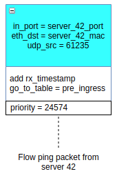
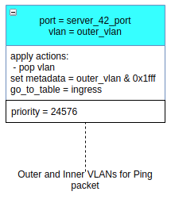
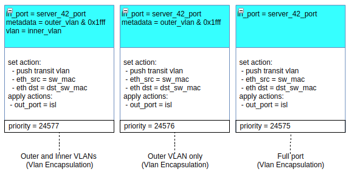
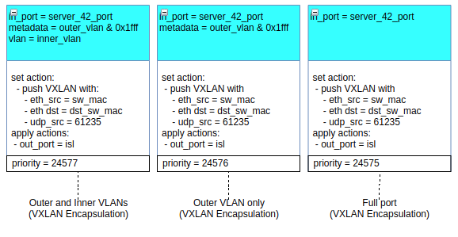
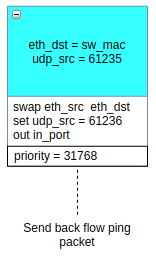
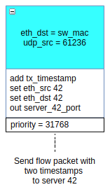
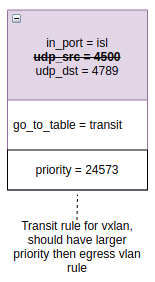

# Round Trip Flow Ping With Latency 

## Goal

Have ability to ping flow from one end to another and back with round trip latency measurement.  

## Kilda OF Rules

There are 5 new OF rules will be added:
* Input Rule - send packet from server 42 port to Pre Ingress Table
* Pre Ingress Rule - match be outer Vlan and send packet to Ingress Table (Only for QinQ Flows) 
* Ingress Rule - send packet to next switch
* Turning Rule - send packet from last flow switch back to first
* Catch Rule - send packet from first switch back to Server 42

Transit VXLAN rule will be changed.

NOTE: Pinging of One Switch Flow has no meaning so One Switch Flows would not affected.

## Input Rule

Quantity: One rule per switch<br/>
Table: Input

Purposes:
 * match Ping packet from Server 42 port
 * add first time stamp to the packet
 * send packet to Ingress table 



NOTE: `61235` is Kilda reserved UDP port for forward ping packets.

```
[FLOW_ID5]
    ofp_version      = 4
    ControllerGroup  = Management
    Priority         = 24574
    Cookie           = 80000000000000XX
    [MATCHFIELDS]
        OFPXMT_OFB_IN_PORT = XX (server 42 port)
        OFPXMT_OFB_ETH_DST = XX:XX:XX:XX:XX:XX (server 42 mac)
        OFPXMT_OFB_ETH_TYPE = 0x800
        OFPXMT_OFB_IP_PROTO = 17
        OFPXMT_OFB_UDP_SRC = 61235 (RTL forward ping UPD port)
    [INSTRUCTIONS]
        [OFPIT_APPLY_ACTIONS]
             [ACTIONS]
                [OFPAT_EXPERIMENTER]
                    [SET_COPY_FIELD]
                        n_bits = 64
                        src_offset = 0
                        dst_offset = XXX (offset in packet for first timestamp)
                        src_oxm = NOVI_OXM_RX_TIMESTAMP
                        dst_oxm = NOVI_OXM_PKT_OFFSET
                [OFPAT_GO_TO_TABLE]
                    table_id = 1 (pre-ingress table)
```

## Pre Ingress Rule

Quantity: One rule per QinQ Flow<br/>
Table: Pre Ingress

Purposes:
 * match packet by outer Vlan
 * send in to Ingres table
 
The only difference from other QinQ rules is in matching by Server 42 Port (other rules match packet by customer port).

 

```
[FLOW_ID5]
    ofp_version      = 4
    ControllerGroup  = Management
    Priority         = 24576
    [MATCHFIELDS]
        OFPXMT_OFB_IN_PORT = XX (server 42 port)
        OFPXMT_OFB_VLAN = XXXX (outer VLAN)
    [INSTRUCTIONS]
        [OFPIT_APPLY_ACTIONS]
             [ACTIONS]
                [OFPAT_POP_VLAN]
                [OFPAT_WRITE_METADATA]
                    value = 0xXXXXX (VLAN)
                    mask = 0x1FFFF
                [OFPAT_GO_TO_TABLE]
                    table_id = 2 (ingress table)
```

## Ingress Rule

Quantity: One rule per Flow<br/>
Table: Ingress

Purposes:
 * match packet by vlan
 * push transit encapsulation (vlan or VXLAN)
 * set `ETH_DST` equal to mac address of egress switch (to turn packet back on last switch)
 * set `ETH_SRC` equal to mac address of ingress switch (to swap `ETH_SRC` and `ETH_DST` on last switch)
 * set `UDP_SRC` equal to `61235` to mark packet as RTL Ping (Only for VXLAN encapsulation)
 
For Vlan encapsulation we do not need to set `UDP_SRC` port because it will be set by Server 42
 
  

```
[FLOW_ID5]
    ofp_version      = 4
    ControllerGroup  = Management
    Priority         = 24577
    [MATCHFIELDS]
        OFPXMT_OFB_IN_PORT = XX (server 42 port)
        OFPXMT_OFB_METADATA = XXXX (outer VLAN)
        OFPXMT_OFB_VLAN = XXXX (inner VLAN)
    [INSTRUCTIONS]
        [OFPIT_APPLY_ACTIONS]
             [ACTIONS]
                [OFPAT_PUSH_VLAN]
                    vlan = YYYY (transit vlan)
                [OFPAT_SET_FIELD]
                    eth_src = XX:XX:XX:XX:XX:XX (src switch mac)
                    eth_dst = YY:YY:YY:YY:YY:YY (dst switch mac)
                [OFPAT_OUTPUT] (sent to the next switch)
                    port = YY
                    mlen = 65535
```

VXLAN encapsulation wraps ethernet frame to another frame, so we have to set `UDP_SRC` port in this case 



## Turning Rule

Quantity: One rule per Switch<br/>
Table: Input

Purposes of this rule are:
 * match Ping packet on egress switch
 * replace `ETH_SRC` and `ETH_DST` by NoviFlow swap field action
 * set `UDP_SRC` equal to `61236` to mark Ping packet as packet which was send back from Egress switch to Ingress
 * send packet back to `IN_PORT`
 


 ```
 [FLOW_ID5]
     ofp_version      = 4
     ControllerGroup  = Management
     Priority         = 31768
     Cookie           = 80000000000000XX
     [MATCHFIELDS]
         OFPXMT_OFB_ETH_DST = XX:XX:XX:XX:XX:XX (switch mac)
         OFPXMT_OFB_ETH_TYPE = 0x800
         OFPXMT_OFB_IP_PROTO = 17
         OFPXMT_OFB_UDP_SRC = 61235 (RTL forward ping UPD port)
     [INSTRUCTIONS]
         [OFPIT_APPLY_ACTIONS]
              [ACTIONS]
                 [OFPAT_EXPERIMENTER]
                     [SWAP_FIELDS]
                         src_field = ETH_SRC
                         dst_field = ETH_DST
                 [OFPAT_SET_FIELD]
                     udp_src = 61236 (RTL reverse ping UPD port)
                 [OFPAT_OUTPUT] (sent packet back)
                     port = IN_PORT
                     mlen = 65535
 ```
 
## Catch Rule

Quantity: One rule per Switch<br/>
Table: Input

Purposes of this rule are:
 * match Ping packet which is returning back to Ingress switch
 * add second time stamp to the packet
 * set `ETH_SRC` and `ETH_DST` which Server 42 need
 * send packet into Server 42 Port
 
 

 ```
 [FLOW_ID5]
     ofp_version      = 4
     ControllerGroup  = Management
     Priority         = 24577
     Cookie           = 80000000000000XX
     [MATCHFIELDS]
         OFPXMT_OFB_ETH_DST = XX:XX:XX:XX:XX:XX (switch mac)
         OFPXMT_OFB_ETH_TYPE = 0x800
         OFPXMT_OFB_IP_PROTO = 17
         OFPXMT_OFB_UDP_SRC = 61236 (RTL reverse ping UPD port)
     [INSTRUCTIONS]
         [OFPIT_APPLY_ACTIONS]
             [ACTIONS]
                 [OFPAT_EXPERIMENTER]
                     [SET_COPY_FIELD]
                         n_bits = 64
                         src_offset = 0
                         dst_offset = XXX (offset in packet for second timestamp)
                         src_oxm = NOVI_OXM_TX_TIMESTAMP
                         dst_oxm = NOVI_OXM_PKT_OFFSET
                 [OFPAT_SET_FIELD]
                     eth_src = XX:XX:XX:XX:XX:XX (server 42 mac)
                     eth_dst = YY:YY:YY:YY:YY:YY (server 42 mac)
                 [OFPAT_OUTPUT] (sent packet to server 42)
                     port = XX (server 42 port)
                     mlen = 65535
 ```

## Changing of Transit VXLAN rule

At this moment during VXLAN encapsulation Kilda set `UDP_SRC` port equal to `4500` just to set
some value into blank field. Transit VXLAN rules match packet by this port but it is redundant match.
Ping Feature needs to put `61235` and `61236` into `UDP_SRC` field.
That is why matching by `UDP_SRC` will be removed from Transit VXLAN rules.



## Summary
 
Aggregated list of rules is available as [diagram](all_rules_diagram.png) and as [table](all_rules_table.pdf).