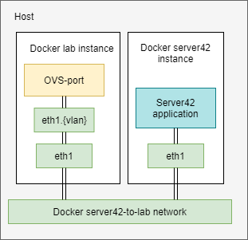

Server42 to Test lab connection.

# Problem
Server42 creates a local loop with eth-pair for emulating a connection to switches. Unfortunately, we don't check traffic generated by server42 with the rules installed on switches, which is a terrible for testing and development.

# Solution
Add to our [test-lab](https://github.com/telstra/open-kilda/blob/develop/docs/design/test-lab/test-lab.md) the ability to get traffic from server42. For that, we need to add another docker network into docker-compose just for the server42 traffic. Next, connect lab-instance to the new network, add an interface to strip transport VLAN from traffic, and add this interface as the port to OVS switch with the correct port number. 

# List of affected components

- docker-compose: add a new network for server42-server to lab connection, add a new environment variable with that network name
- floodlight: enable kilda swap field experimenter
- lab-api: add the ability to connect a lab instance to the new network
- lab-instance: add a new interface which connects the new network to OVS switch and strips server42 transport VLAN
- server42-server: connect the application to the correct interface  
